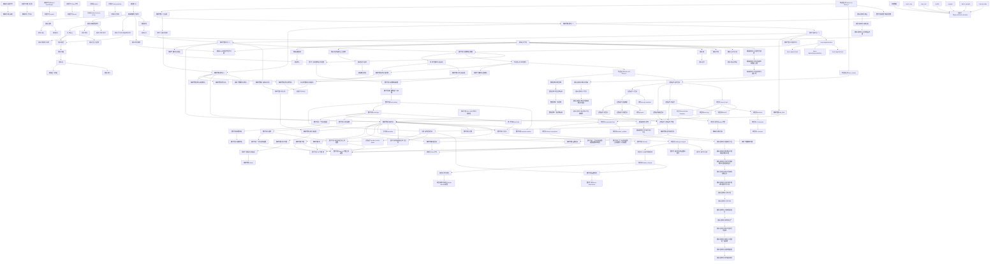

```mermaid
graph TD
1["数理逻辑/一阶逻辑"] --> 0["数理逻辑/一阶逻辑演算"]
2["数理逻辑/命题逻辑演算"] --> 1["数理逻辑/一阶逻辑"]
3["数理逻辑/命题逻辑"] --> 2["数理逻辑/命题逻辑演算"]
5["朴素集合论/naive-set-theory-2"] --> 3["数理逻辑/命题逻辑"]
5["朴素集合论/naive-set-theory-2"] --> 6["点集拓扑/拓扑空间"]
7["朴素集合论/zorn_lemma"] --> 6["点集拓扑/拓扑空间"]
9["点集拓扑/子空间"] --> 8["点集拓扑/连续映射"]
6["点集拓扑/拓扑空间"] --> 9["点集拓扑/子空间"]
12["数学分析/real-number"] --> 11["点集拓扑/度量空间"]
13["点集拓扑/点集拓扑(代理)"] --> 11["点集拓扑/度量空间"]
8["点集拓扑/连续映射"] --> 14["点集拓扑/紧空间"]
11["点集拓扑/度量空间"] --> 15["点集拓扑/product-metric-space"]
14["点集拓扑/紧空间"] --> 13["点集拓扑/点集拓扑(代理)"]
16["点集拓扑/连通空间"] --> 13["点集拓扑/点集拓扑(代理)"]
17["点集拓扑/乘积空间"] --> 13["点集拓扑/点集拓扑(代理)"]
18["点集拓扑/序拓扑"] --> 13["点集拓扑/点集拓扑(代理)"]
8["点集拓扑/连续映射"] --> 16["点集拓扑/连通空间"]
6["点集拓扑/拓扑空间"] --> 17["点集拓扑/乘积空间"]
6["点集拓扑/拓扑空间"] --> 18["点集拓扑/序拓扑"]
20["概率论/高斯分布"] --> 19["概率论/联合高斯"]
23["机器学习/随机过程"] --> 22["概率论/马尔可夫"]
25["抽象代数/对偶空间"] --> 24["概率论/Dirac分布"]
26["抽象代数/函数空间"] --> 24["概率论/Dirac分布"]
28["测度论/积空间sigma代数"] --> 27["概率论/随机过程"]
30["抽象代数/向量空间"] --> 29["抽象代数/代数"]
32["抽象代数/群论(循环群)"] --> 31["抽象代数/环论(有限环)"]
34["抽象代数/环论(一)"] --> 33["抽象代数/环论(二)"]
35["抽象代数/同态映射"] --> 33["抽象代数/环论(二)"]
31["抽象代数/环论(有限环)"] --> 36["抽象代数/环论(杂)"]
37["抽象代数/环论(多项式环)"] --> 36["抽象代数/环论(杂)"]
39["朴素集合论/naive-set-theory-1"] --> 38["抽象代数/二元运算"]
41["抽象代数/群论(二)"] --> 40["抽象代数/群论(杂)"]
32["抽象代数/群论(循环群)"] --> 40["抽象代数/群论(杂)"]
30["抽象代数/向量空间"] --> 25["抽象代数/对偶空间"]
42["抽象代数/拓扑向量空间"] --> 25["抽象代数/对偶空间"]
44["抽象代数/域论(域拓展)"] --> 43["抽象代数/形式导数"]
45["抽象代数/群论(一)"] --> 41["抽象代数/群论(二)"]
35["抽象代数/同态映射"] --> 41["抽象代数/群论(二)"]
46["抽象代数/群论(幂运算)"] --> 32["抽象代数/群论(循环群)"]
47["朴素集合论/初等数论"] --> 32["抽象代数/群论(循环群)"]
46["抽象代数/群论(幂运算)"] --> 48["抽象代数/环论(幂运算)"]
41["抽象代数/群论(二)"] --> 49["抽象代数/群论(群作用)"]
50["抽象代数/群论(置换群)"] --> 49["抽象代数/群论(群作用)"]
30["抽象代数/向量空间"] --> 51["抽象代数/格"]
33["抽象代数/环论(二)"] --> 52["抽象代数/环论(商域)"]
34["抽象代数/环论(一)"] --> 53["抽象代数/abs_field"]
45["抽象代数/群论(一)"] --> 34["抽象代数/环论(一)"]
41["抽象代数/群论(二)"] --> 54["抽象代数/群论(高等群论)"]
56["抽象代数/域论(有限域)"] --> 55["抽象代数/Galois"]
57["数学分析/实数构造/自然数"] --> 45["抽象代数/群论(一)"]
38["抽象代数/二元运算"] --> 45["抽象代数/群论(一)"]
41["抽象代数/群论(二)"] --> 30["抽象代数/向量空间"]
33["抽象代数/环论(二)"] --> 30["抽象代数/向量空间"]
53["抽象代数/abs_field"] --> 30["抽象代数/向量空间"]
58["抽象代数/abs_field|带绝对值的域"] --> 30["抽象代数/向量空间"]
42["抽象代数/拓扑向量空间"] --> 59["抽象代数/抽象导数"]
13["点集拓扑/点集拓扑(代理)"] --> 42["抽象代数/拓扑向量空间"]
34["抽象代数/环论(一)"] --> 61["抽象代数/环论(有序环)"]
33["抽象代数/环论(二)"] --> 37["抽象代数/环论(多项式环)"]
36["抽象代数/环论(杂)"] --> 44["抽象代数/域论(域拓展)"]
30["抽象代数/向量空间"] --> 44["抽象代数/域论(域拓展)"]
43["抽象代数/形式导数"] --> 56["抽象代数/域论(有限域)"]
62["数学分析/实数构造/整数"] --> 46["抽象代数/群论(幂运算)"]
41["抽象代数/群论(二)"] --> 63["抽象代数/群论(群列)"]
38["抽象代数/二元运算"] --> 35["抽象代数/同态映射"]
47["朴素集合论/初等数论"] --> 50["抽象代数/群论(置换群)"]
30["抽象代数/向量空间"] --> 26["抽象代数/函数空间"]
42["抽象代数/拓扑向量空间"] --> 26["抽象代数/函数空间"]
8["点集拓扑/连续映射"] --> 65["流形/prepare"]
9["点集拓扑/子空间"] --> 66["流形/smooth-manifold"]
6["点集拓扑/拓扑空间"] --> 68["测度论/class-of-sets"]
70["测度论/almost-everywhere"] --> 69["测度论/Lebesgue-integral"]
72["测度论/Stieltjes_integral"] --> 71["测度论/符号测度"]
73["测度论/measurable-mapping"] --> 28["测度论/积空间sigma代数"]
74["测度论/三大积分收敛定理"] --> 72["测度论/Stieltjes_integral"]
68["测度论/class-of-sets"] --> 73["测度论/measurable-mapping"]
76["测度论/measure"] --> 75["测度论/L-S-measure"]
73["测度论/measurable-mapping"] --> 77["测度论/measurable-func"]
78["数学分析/converge"] --> 77["测度论/measurable-func"]
68["测度论/class-of-sets"] --> 79["测度论/semi-ring"]
69["测度论/Lebesgue-integral"] --> 74["测度论/三大积分收敛定理"]
77["测度论/measurable-func"] --> 70["测度论/almost-everywhere"]
77["测度论/measurable-func"] --> 80["测度论/random_variable"]
71["测度论/符号测度"] --> 82["测度论/绝对连续与Radon-Nikodým定理"]
68["测度论/class-of-sets"] --> 76["测度论/measure"]
75["测度论/L-S-measure"] --> 83["测度论/L-measure"]
68["测度论/class-of-sets"] --> 84["测度论/Borel-R"]
18["点集拓扑/序拓扑"] --> 84["测度论/Borel-R"]
86["机器学习/diffusion-inpainting(1)"] --> 85["机器学习/repaint"]
49["抽象代数/群论(群作用)"] --> 87["机器学习/SE(3)"]
89["机器学习/Dirac分布"] --> 88["机器学习/fourier"]
39["朴素集合论/naive-set-theory-1"] --> 7["朴素集合论/zorn_lemma"]
62["数学分析/实数构造/整数"] --> 47["朴素集合论/初等数论"]
47["朴素集合论/初等数论"] --> 5["朴素集合论/naive-set-theory-2"]
30["抽象代数/向量空间"] --> 92["复分析/derivative"]
30["抽象代数/向量空间"] --> 96["数学分析/有限维赋范线性空间"]
11["点集拓扑/度量空间"] --> 96["数学分析/有限维赋范线性空间"]
29["抽象代数/代数"] --> 97["数学分析/Rn-代数-格"]
51["抽象代数/格"] --> 97["数学分析/Rn-代数-格"]
96["数学分析/有限维赋范线性空间"] --> 97["数学分析/Rn-代数-格"]
99["数学分析/非负级数"] --> 98["数学分析/级数"]
101["数学分析/赋范向量空间上的级数"] --> 100["数学分析/banach代数上的级数"]
29["抽象代数/代数"] --> 100["数学分析/banach代数上的级数"]
102["数学分析/一些标准的级数"] --> 100["数学分析/banach代数上的级数"]
101["数学分析/赋范向量空间上的级数"] --> 100["数学分析/banach代数上的级数"]
103["数学分析/一些标准的级数|指数级数的收敛性"] --> 100["数学分析/banach代数上的级数"]
104["数学分析/一些标准的级数|正弦级数与余弦级数"] --> 100["数学分析/banach代数上的级数"]
106["数学分析/实数次幂"] --> 105["数学分析/实数(代理)"]
98["数学分析/级数"] --> 102["数学分析/一些标准的级数"]
78["数学分析/converge"] --> 107["数学分析/一些标准极限"]
109["数学分析/无穷小"] --> 108["数学分析/derivate"]
12["数学分析/real-number"] --> 78["数学分析/converge"]
107["数学分析/一些标准极限"] --> 106["数学分析/实数次幂"]
78["数学分析/converge"] --> 99["数学分析/非负级数"]
30["抽象代数/向量空间"] --> 110["数学分析/范数"]
69["测度论/Lebesgue-integral"] --> 111["数学分析/复值可测函数的L积分"]
30["抽象代数/向量空间"] --> 109["数学分析/无穷小"]
112["数学分析/funct-limit"] --> 109["数学分析/无穷小"]
30["抽象代数/向量空间"] --> 101["数学分析/赋范向量空间上的级数"]
98["数学分析/级数"] --> 101["数学分析/赋范向量空间上的级数"]
78["数学分析/converge"] --> 112["数学分析/funct-limit"]
12["数学分析/real-number"] --> 114["数学分析/complex-number"]
30["抽象代数/向量空间"] --> 114["数学分析/complex-number"]
115["数学分析/实数构造/广义实数"] --> 12["数学分析/real-number"]
11["点集拓扑/度量空间"] --> 116["数学分析/函数序列"]
72["测度论/Stieltjes_integral"] --> 116["数学分析/函数序列"]
69["测度论/Lebesgue-integral"] --> 117["数学分析/平方可积"]
116["数学分析/函数序列"] --> 118["数学分析/Stone–Weierstrass"]
120["计算机/netbird"] --> 119["计算机/netbird-reverse-proxy"]
122["计算机/Turing-machine"] --> 121["计算机/复杂类"]
126["linear-algebra/matrix"] --> 125["linear-algebra/rank"]
34["抽象代数/环论(一)"] --> 126["linear-algebra/matrix"]
126["linear-algebra/matrix"] --> 128["linear-algebra/diagonalization"]
126["linear-algebra/matrix"] --> 129["linear-algebra/norm"]
131["故事/纯粹理性批判"] --> 130["故事/固执"]
133["故事/经济基础与上层建筑"] --> 132["故事/性别与权利"]
130["故事/固执"] --> 134["故事/改变"]
136["故事/货币代理"] --> 135["故事/1844年经济学哲学手稿"]
137["故事/绝对精神"] --> 135["故事/1844年经济学哲学手稿"]
136["故事/货币代理"] --> 138["故事/金融交易"]
140["故事/作为意志和表象的世界"] --> 139["故事/期望"]
141["故事/安全"] --> 139["故事/期望"]
141["故事/安全"] --> 142["故事/狡猾的小说家"]
131["故事/纯粹理性批判"] --> 143["故事/实践理性批判"]
144["故事/时间"] --> 131["故事/纯粹理性批判"]
143["故事/实践理性批判"] --> 141["故事/安全"]
136["故事/货币代理"] --> 133["故事/经济基础与上层建筑"]
138["故事/金融交易"] --> 145["故事/外汇"]
143["故事/实践理性批判"] --> 146["故事/拥有"]
136["故事/货币代理"] --> 147["故事/税"]
147["故事/税"] --> 148["故事/房价"]
150["故事/货币与行政"] --> 149["故事/政治机构图"]
130["故事/固执"] --> 151["故事/变化"]
153["故事/幸福"] --> 152["故事/爱"]
136["故事/货币代理"] --> 154["故事/价格"]
155["故事/货币"] --> 136["故事/货币代理"]
156["故事/资本论/货币或商品流通"] --> 136["故事/货币代理"]
131["故事/纯粹理性批判"] --> 140["故事/作为意志和表象的世界"]
131["故事/纯粹理性批判"] --> 137["故事/绝对精神"]
136["故事/货币代理"] --> 150["故事/货币与行政"]
141["故事/安全"] --> 158["故事/安全与道德"]
132["故事/性别与权利"] --> 159["故事/神圣叙事"]
152["故事/爱"] --> 160["故事/爱与幸福"]
161["故事/劳动"] --> 155["故事/货币"]
152["故事/爱"] --> 162["故事/孩子"]
131["故事/纯粹理性批判"] --> 161["故事/劳动"]
143["故事/实践理性批判"] --> 163["故事/判断力批判"]
139["故事/期望"] --> 153["故事/幸福"]
165["故事/资本论/不变资本和可变资本"] --> 164["故事/资本论/剩余价值率"]
167["故事/资本论/所谓原始积累"] --> 166["故事/资本论/现代殖民理论"]
168["故事/资本论/交换过程"] --> 156["故事/资本论/货币或商品流通"]
170["故事/资本论/剩余价值转化为资本"] --> 169["故事/资本论/资本主义积累的一般规律"]
172["故事/资本论/劳动力的价值或价格转化为工资"] --> 171["故事/资本论/计时工资"]
174["故事/资本论/机器和大工业"] --> 173["故事/资本论/绝对剩余价值和相对剩余价值"]
176["故事/资本论/货币转化为资本"] --> 175["故事/资本论/劳动过程和价值增殖过程"]
175["故事/资本论/劳动过程和价值增殖过程"] --> 165["故事/资本论/不变资本和可变资本"]
178["故事/资本论/相对剩余价值的概念"] --> 177["故事/资本论/协作"]
169["故事/资本论/资本主义积累的一般规律"] --> 167["故事/资本论/所谓原始积累"]
179["故事/资本论/分工和工场手工业"] --> 174["故事/资本论/机器和大工业"]
136["故事/货币代理"] --> 176["故事/资本论/货币转化为资本"]
180["故事/资本论/商品"] --> 168["故事/资本论/交换过程"]
182["故事/资本论/工资的国民差异"] --> 181["故事/资本论/简单再生产"]
171["故事/资本论/计时工资"] --> 183["故事/资本论/计件工资"]
173["故事/资本论/绝对剩余价值和相对剩余价值"] --> 184["故事/资本论/劳动力价格和剩余价值的量的变化"]
181["故事/资本论/简单再生产"] --> 170["故事/资本论/剩余价值转化为资本"]
183["故事/资本论/计件工资"] --> 182["故事/资本论/工资的国民差异"]
177["故事/资本论/协作"] --> 179["故事/资本论/分工和工场手工业"]
185["故事/资本论/剩余价值率的各种公式"] --> 172["故事/资本论/劳动力的价值或价格转化为工资"]
187["故事/资本论/工作日"] --> 186["故事/资本论/剩余价值率和剩余价值量"]
184["故事/资本论/劳动力价格和剩余价值的量的变化"] --> 185["故事/资本论/剩余价值率的各种公式"]
186["故事/资本论/剩余价值率和剩余价值量"] --> 178["故事/资本论/相对剩余价值的概念"]
164["故事/资本论/剩余价值率"] --> 187["故事/资本论/工作日"]
189["数学分析/实数构造/有理数"] --> 188["数学分析/实数构造/实数"]
48["抽象代数/环论(幂运算)"] --> 188["数学分析/实数构造/实数"]
62["数学分析/实数构造/整数"] --> 189["数学分析/实数构造/有理数"]
52["抽象代数/环论(商域)"] --> 189["数学分析/实数构造/有理数"]
188["数学分析/实数构造/实数"] --> 115["数学分析/实数构造/广义实数"]
39["朴素集合论/naive-set-theory-1"] --> 57["数学分析/实数构造/自然数"]
33["抽象代数/环论(二)"] --> 62["数学分析/实数构造/整数"]
61["抽象代数/环论(有序环)"] --> 62["数学分析/实数构造/整数"]
191["原始数据"] --> 190["机器学习/pytorch/torch.utils.data"]
192["batch_size"] --> 190["机器学习/pytorch/torch.utils.data"]
193["drop_last"] --> 190["机器学习/pytorch/torch.utils.data"]
194["shuffle"] --> 190["机器学习/pytorch/torch.utils.data"]
195["sampler"] --> 190["机器学习/pytorch/torch.utils.data"]
196["batch_sampler"] --> 190["机器学习/pytorch/torch.utils.data"]
197["batched data"] --> 190["机器学习/pytorch/torch.utils.data"]
```
