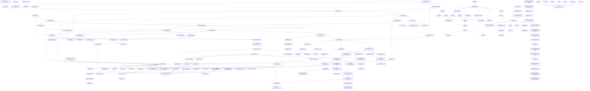

```mermaid
graph TD
1["数理逻辑/一阶逻辑"] --> 0["数理逻辑/一阶逻辑演算"]
2["数理逻辑/命题逻辑演算"] --> 1["数理逻辑/一阶逻辑"]
3["数理逻辑/命题逻辑"] --> 2["数理逻辑/命题逻辑演算"]
5["朴素集合论/naive-set-theory-2"] --> 3["数理逻辑/命题逻辑"]
5["朴素集合论/naive-set-theory-2"] --> 6["点集拓扑/拓扑空间"]
7["朴素集合论/zorn_lemma"] --> 6["点集拓扑/拓扑空间"]
9["点集拓扑/子空间"] --> 8["点集拓扑/连续映射"]
6["点集拓扑/拓扑空间"] --> 9["点集拓扑/子空间"]
12["数学分析/real-number"] --> 11["点集拓扑/度量空间"]
13["点集拓扑/点集拓扑(代理)"] --> 11["点集拓扑/度量空间"]
8["点集拓扑/连续映射"] --> 14["点集拓扑/紧空间"]
11["点集拓扑/度量空间"] --> 15["点集拓扑/product-metric-space"]
14["点集拓扑/紧空间"] --> 13["点集拓扑/点集拓扑(代理)"]
16["点集拓扑/连通空间"] --> 13["点集拓扑/点集拓扑(代理)"]
17["点集拓扑/乘积空间"] --> 13["点集拓扑/点集拓扑(代理)"]
18["点集拓扑/序拓扑"] --> 13["点集拓扑/点集拓扑(代理)"]
8["点集拓扑/连续映射"] --> 16["点集拓扑/连通空间"]
6["点集拓扑/拓扑空间"] --> 17["点集拓扑/乘积空间"]
6["点集拓扑/拓扑空间"] --> 18["点集拓扑/序拓扑"]
20["抽象代数/向量空间"] --> 19["抽象代数/代数"]
22["抽象代数/群论(循环群)"] --> 21["抽象代数/环论(有限环)"]
24["抽象代数/环论(一)"] --> 23["抽象代数/环论(二)"]
25["抽象代数/同态映射"] --> 23["抽象代数/环论(二)"]
21["抽象代数/环论(有限环)"] --> 26["抽象代数/环论(杂)"]
27["抽象代数/环论(多项式环)"] --> 26["抽象代数/环论(杂)"]
29["朴素集合论/naive-set-theory-1"] --> 28["抽象代数/二元运算"]
31["抽象代数/群论(二)"] --> 30["抽象代数/群论(杂)"]
22["抽象代数/群论(循环群)"] --> 30["抽象代数/群论(杂)"]
20["抽象代数/向量空间"] --> 32["抽象代数/对偶空间"]
33["抽象代数/拓扑向量空间"] --> 32["抽象代数/对偶空间"]
35["抽象代数/域论(域拓展)"] --> 34["抽象代数/形式导数"]
36["抽象代数/群论(一)"] --> 31["抽象代数/群论(二)"]
25["抽象代数/同态映射"] --> 31["抽象代数/群论(二)"]
37["抽象代数/群论(幂运算)"] --> 22["抽象代数/群论(循环群)"]
38["朴素集合论/初等数论"] --> 22["抽象代数/群论(循环群)"]
37["抽象代数/群论(幂运算)"] --> 39["抽象代数/环论(幂运算)"]
31["抽象代数/群论(二)"] --> 40["抽象代数/群论(群作用)"]
41["抽象代数/群论(置换群)"] --> 40["抽象代数/群论(群作用)"]
20["抽象代数/向量空间"] --> 42["抽象代数/格"]
23["抽象代数/环论(二)"] --> 43["抽象代数/环论(商域)"]
24["抽象代数/环论(一)"] --> 44["抽象代数/abs_field"]
36["抽象代数/群论(一)"] --> 24["抽象代数/环论(一)"]
31["抽象代数/群论(二)"] --> 45["抽象代数/群论(高等群论)"]
47["抽象代数/域论(有限域)"] --> 46["抽象代数/Galois"]
48["数学分析/实数构造/自然数"] --> 36["抽象代数/群论(一)"]
28["抽象代数/二元运算"] --> 36["抽象代数/群论(一)"]
31["抽象代数/群论(二)"] --> 20["抽象代数/向量空间"]
23["抽象代数/环论(二)"] --> 20["抽象代数/向量空间"]
44["抽象代数/abs_field"] --> 20["抽象代数/向量空间"]
49["抽象代数/abs_field|带绝对值的域"] --> 20["抽象代数/向量空间"]
33["抽象代数/拓扑向量空间"] --> 50["抽象代数/抽象导数"]
13["点集拓扑/点集拓扑(代理)"] --> 33["抽象代数/拓扑向量空间"]
24["抽象代数/环论(一)"] --> 52["抽象代数/环论(有序环)"]
23["抽象代数/环论(二)"] --> 27["抽象代数/环论(多项式环)"]
26["抽象代数/环论(杂)"] --> 35["抽象代数/域论(域拓展)"]
20["抽象代数/向量空间"] --> 35["抽象代数/域论(域拓展)"]
34["抽象代数/形式导数"] --> 47["抽象代数/域论(有限域)"]
53["数学分析/实数构造/整数"] --> 37["抽象代数/群论(幂运算)"]
31["抽象代数/群论(二)"] --> 54["抽象代数/群论(群列)"]
28["抽象代数/二元运算"] --> 25["抽象代数/同态映射"]
38["朴素集合论/初等数论"] --> 41["抽象代数/群论(置换群)"]
20["抽象代数/向量空间"] --> 55["抽象代数/函数空间"]
33["抽象代数/拓扑向量空间"] --> 55["抽象代数/函数空间"]
8["点集拓扑/连续映射"] --> 57["流形/prepare"]
9["点集拓扑/子空间"] --> 58["流形/smooth-manifold"]
61["机器学习/diffusion-inpainting(1)"] --> 60["机器学习/repaint"]
40["抽象代数/群论(群作用)"] --> 62["机器学习/SE(3)"]
64["机器学习/Dirac分布"] --> 63["机器学习/fourier"]
67["机器学习/随机过程"] --> 66["机器学习/马尔可夫"]
32["抽象代数/对偶空间"] --> 64["机器学习/Dirac分布"]
55["抽象代数/函数空间"] --> 64["机器学习/Dirac分布"]
68["测度论与概率论/积空间sigma代数"] --> 67["机器学习/随机过程"]
29["朴素集合论/naive-set-theory-1"] --> 7["朴素集合论/zorn_lemma"]
53["数学分析/实数构造/整数"] --> 38["朴素集合论/初等数论"]
38["朴素集合论/初等数论"] --> 5["朴素集合论/naive-set-theory-2"]
20["抽象代数/向量空间"] --> 70["复分析/derivative"]
20["抽象代数/向量空间"] --> 74["数学分析/有限维赋范线性空间"]
11["点集拓扑/度量空间"] --> 74["数学分析/有限维赋范线性空间"]
19["抽象代数/代数"] --> 75["数学分析/Rn-代数-格"]
42["抽象代数/格"] --> 75["数学分析/Rn-代数-格"]
74["数学分析/有限维赋范线性空间"] --> 75["数学分析/Rn-代数-格"]
77["数学分析/非负级数"] --> 76["数学分析/级数"]
79["数学分析/赋范向量空间上的级数"] --> 78["数学分析/banach代数上的级数"]
19["抽象代数/代数"] --> 78["数学分析/banach代数上的级数"]
80["数学分析/一些标准的级数"] --> 78["数学分析/banach代数上的级数"]
79["数学分析/赋范向量空间上的级数"] --> 78["数学分析/banach代数上的级数"]
81["数学分析/一些标准的级数|指数级数的收敛性"] --> 78["数学分析/banach代数上的级数"]
82["数学分析/一些标准的级数|正弦级数与余弦级数"] --> 78["数学分析/banach代数上的级数"]
84["数学分析/实数次幂"] --> 83["数学分析/实数(代理)"]
76["数学分析/级数"] --> 80["数学分析/一些标准的级数"]
86["数学分析/converge"] --> 85["数学分析/一些标准极限"]
88["数学分析/无穷小"] --> 87["数学分析/derivate"]
12["数学分析/real-number"] --> 86["数学分析/converge"]
85["数学分析/一些标准极限"] --> 84["数学分析/实数次幂"]
86["数学分析/converge"] --> 77["数学分析/非负级数"]
20["抽象代数/向量空间"] --> 89["数学分析/范数"]
91["测度论与概率论/Lebesgue-integral"] --> 90["数学分析/复值可测函数的L积分"]
20["抽象代数/向量空间"] --> 88["数学分析/无穷小"]
92["数学分析/funct-limit"] --> 88["数学分析/无穷小"]
20["抽象代数/向量空间"] --> 79["数学分析/赋范向量空间上的级数"]
76["数学分析/级数"] --> 79["数学分析/赋范向量空间上的级数"]
86["数学分析/converge"] --> 92["数学分析/funct-limit"]
12["数学分析/real-number"] --> 94["数学分析/complex-number"]
20["抽象代数/向量空间"] --> 94["数学分析/complex-number"]
95["数学分析/实数构造/广义实数"] --> 12["数学分析/real-number"]
11["点集拓扑/度量空间"] --> 96["数学分析/函数序列"]
97["测度论与概率论/Stieltjes_integral"] --> 96["数学分析/函数序列"]
91["测度论与概率论/Lebesgue-integral"] --> 98["数学分析/平方可积"]
96["数学分析/函数序列"] --> 99["数学分析/Stone–Weierstrass"]
101["计算机/netbird"] --> 100["计算机/netbird-reverse-proxy"]
103["计算机/Turing-machine"] --> 102["计算机/复杂类"]
107["linear-algebra/matrix"] --> 106["linear-algebra/rank"]
24["抽象代数/环论(一)"] --> 107["linear-algebra/matrix"]
107["linear-algebra/matrix"] --> 109["linear-algebra/diagonalization"]
107["linear-algebra/matrix"] --> 110["linear-algebra/norm"]
112["故事/纯粹理性批判"] --> 111["故事/固执"]
114["故事/经济基础与上层建筑"] --> 113["故事/性别与权利"]
111["故事/固执"] --> 115["故事/改变"]
117["故事/货币代理"] --> 116["故事/1844年经济学哲学手稿"]
118["故事/绝对精神"] --> 116["故事/1844年经济学哲学手稿"]
120["故事/作为意志和表象的世界"] --> 119["故事/期望"]
121["故事/安全"] --> 119["故事/期望"]
121["故事/安全"] --> 122["故事/狡猾的小说家"]
112["故事/纯粹理性批判"] --> 123["故事/实践理性批判"]
124["故事/时间"] --> 112["故事/纯粹理性批判"]
123["故事/实践理性批判"] --> 121["故事/安全"]
117["故事/货币代理"] --> 114["故事/经济基础与上层建筑"]
123["故事/实践理性批判"] --> 125["故事/拥有"]
117["故事/货币代理"] --> 126["故事/税"]
126["故事/税"] --> 127["故事/房价"]
129["故事/货币与行政"] --> 128["故事/政治机构图"]
111["故事/固执"] --> 130["故事/变化"]
132["故事/幸福"] --> 131["故事/爱"]
117["故事/货币代理"] --> 133["故事/价格"]
134["故事/货币"] --> 117["故事/货币代理"]
135["故事/资本论/货币或商品流通"] --> 117["故事/货币代理"]
112["故事/纯粹理性批判"] --> 120["故事/作为意志和表象的世界"]
112["故事/纯粹理性批判"] --> 118["故事/绝对精神"]
117["故事/货币代理"] --> 129["故事/货币与行政"]
121["故事/安全"] --> 137["故事/安全与道德"]
113["故事/性别与权利"] --> 138["故事/神圣叙事"]
131["故事/爱"] --> 139["故事/爱与幸福"]
140["故事/劳动"] --> 134["故事/货币"]
131["故事/爱"] --> 141["故事/孩子"]
112["故事/纯粹理性批判"] --> 140["故事/劳动"]
123["故事/实践理性批判"] --> 142["故事/判断力批判"]
119["故事/期望"] --> 132["故事/幸福"]
6["点集拓扑/拓扑空间"] --> 143["测度论与概率论/class-of-sets"]
144["测度论与概率论/almost-everywhere"] --> 91["测度论与概率论/Lebesgue-integral"]
97["测度论与概率论/Stieltjes_integral"] --> 145["测度论与概率论/符号测度"]
146["测度论与概率论/measurable-mapping"] --> 68["测度论与概率论/积空间sigma代数"]
147["测度论与概率论/三大积分收敛定理"] --> 97["测度论与概率论/Stieltjes_integral"]
143["测度论与概率论/class-of-sets"] --> 146["测度论与概率论/measurable-mapping"]
149["测度论与概率论/measure"] --> 148["测度论与概率论/L-S-measure"]
146["测度论与概率论/measurable-mapping"] --> 150["测度论与概率论/measurable-func"]
86["数学分析/converge"] --> 150["测度论与概率论/measurable-func"]
143["测度论与概率论/class-of-sets"] --> 151["测度论与概率论/semi-ring"]
91["测度论与概率论/Lebesgue-integral"] --> 147["测度论与概率论/三大积分收敛定理"]
150["测度论与概率论/measurable-func"] --> 144["测度论与概率论/almost-everywhere"]
150["测度论与概率论/measurable-func"] --> 152["测度论与概率论/random_variable"]
145["测度论与概率论/符号测度"] --> 154["测度论与概率论/绝对连续与Radon-Nikodým定理"]
143["测度论与概率论/class-of-sets"] --> 149["测度论与概率论/measure"]
148["测度论与概率论/L-S-measure"] --> 155["测度论与概率论/L-measure"]
143["测度论与概率论/class-of-sets"] --> 156["测度论与概率论/Borel-R"]
18["点集拓扑/序拓扑"] --> 156["测度论与概率论/Borel-R"]
158["故事/资本论/不变资本和可变资本"] --> 157["故事/资本论/剩余价值率"]
159["故事/资本论/交换过程"] --> 135["故事/资本论/货币或商品流通"]
161["故事/资本论/劳动力的价值或价格转化为工资"] --> 160["故事/资本论/计时工资"]
163["故事/资本论/机器和大工业"] --> 162["故事/资本论/绝对剩余价值和相对剩余价值"]
165["故事/资本论/货币转化为资本"] --> 164["故事/资本论/劳动过程和价值增殖过程"]
164["故事/资本论/劳动过程和价值增殖过程"] --> 158["故事/资本论/不变资本和可变资本"]
167["故事/资本论/相对剩余价值的概念"] --> 166["故事/资本论/协作"]
168["故事/资本论/分工和工场手工业"] --> 163["故事/资本论/机器和大工业"]
117["故事/货币代理"] --> 165["故事/资本论/货币转化为资本"]
169["故事/资本论/商品"] --> 159["故事/资本论/交换过程"]
160["故事/资本论/计时工资"] --> 170["故事/资本论/计件工资"]
162["故事/资本论/绝对剩余价值和相对剩余价值"] --> 171["故事/资本论/劳动力价格和剩余价值的量的变化"]
170["故事/资本论/计件工资"] --> 172["故事/资本论/工资的国民差异"]
166["故事/资本论/协作"] --> 168["故事/资本论/分工和工场手工业"]
173["故事/资本论/剩余价值率的各种公式"] --> 161["故事/资本论/劳动力的价值或价格转化为工资"]
175["故事/资本论/工作日"] --> 174["故事/资本论/剩余价值率和剩余价值量"]
174["故事/资本论/剩余价值率和剩余价值量"] --> 167["故事/资本论/相对剩余价值的概念"]
157["故事/资本论/剩余价值率"] --> 175["故事/资本论/工作日"]
177["数学分析/实数构造/有理数"] --> 176["数学分析/实数构造/实数"]
39["抽象代数/环论(幂运算)"] --> 176["数学分析/实数构造/实数"]
53["数学分析/实数构造/整数"] --> 177["数学分析/实数构造/有理数"]
43["抽象代数/环论(商域)"] --> 177["数学分析/实数构造/有理数"]
176["数学分析/实数构造/实数"] --> 95["数学分析/实数构造/广义实数"]
29["朴素集合论/naive-set-theory-1"] --> 48["数学分析/实数构造/自然数"]
23["抽象代数/环论(二)"] --> 53["数学分析/实数构造/整数"]
52["抽象代数/环论(有序环)"] --> 53["数学分析/实数构造/整数"]
179["原始数据"] --> 178["机器学习/pytorch/torch.utils.data"]
180["batch_size"] --> 178["机器学习/pytorch/torch.utils.data"]
181["drop_last"] --> 178["机器学习/pytorch/torch.utils.data"]
182["shuffle"] --> 178["机器学习/pytorch/torch.utils.data"]
183["sampler"] --> 178["机器学习/pytorch/torch.utils.data"]
184["batch_sampler"] --> 178["机器学习/pytorch/torch.utils.data"]
185["batched data"] --> 178["机器学习/pytorch/torch.utils.data"]
```
