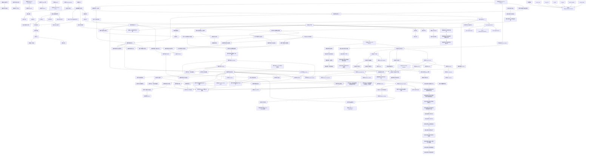

```mermaid
graph TD
1["数理逻辑/一阶逻辑"] --> 0["数理逻辑/一阶逻辑演算"]
2["数理逻辑/命题逻辑演算"] --> 1["数理逻辑/一阶逻辑"]
3["数理逻辑/命题逻辑"] --> 2["数理逻辑/命题逻辑演算"]
5["朴素集合论/naive-set-theory-2"] --> 3["数理逻辑/命题逻辑"]
5["朴素集合论/naive-set-theory-2"] --> 6["点集拓扑/拓扑空间"]
7["朴素集合论/zorn_lemma"] --> 6["点集拓扑/拓扑空间"]
9["点集拓扑/子空间"] --> 8["点集拓扑/连续映射"]
6["点集拓扑/拓扑空间"] --> 9["点集拓扑/子空间"]
12["数学分析/real-number"] --> 11["点集拓扑/度量空间"]
13["点集拓扑/点集拓扑(代理)"] --> 11["点集拓扑/度量空间"]
8["点集拓扑/连续映射"] --> 14["点集拓扑/紧空间"]
11["点集拓扑/度量空间"] --> 15["点集拓扑/product-metric-space"]
14["点集拓扑/紧空间"] --> 13["点集拓扑/点集拓扑(代理)"]
16["点集拓扑/连通空间"] --> 13["点集拓扑/点集拓扑(代理)"]
17["点集拓扑/乘积空间"] --> 13["点集拓扑/点集拓扑(代理)"]
18["点集拓扑/序拓扑"] --> 13["点集拓扑/点集拓扑(代理)"]
8["点集拓扑/连续映射"] --> 16["点集拓扑/连通空间"]
6["点集拓扑/拓扑空间"] --> 17["点集拓扑/乘积空间"]
6["点集拓扑/拓扑空间"] --> 18["点集拓扑/序拓扑"]
20["概率论/高斯分布"] --> 19["概率论/联合高斯"]
22["机器学习/随机过程"] --> 21["概率论/马尔可夫"]
24["抽象代数/对偶空间"] --> 23["概率论/Dirac分布"]
25["抽象代数/函数空间"] --> 23["概率论/Dirac分布"]
27["测度论/积空间sigma代数"] --> 26["概率论/随机过程"]
29["抽象代数/向量空间"] --> 28["抽象代数/代数"]
31["抽象代数/群论(循环群)"] --> 30["抽象代数/环论(有限环)"]
33["抽象代数/环论(一)"] --> 32["抽象代数/环论(二)"]
34["抽象代数/同态映射"] --> 32["抽象代数/环论(二)"]
30["抽象代数/环论(有限环)"] --> 35["抽象代数/环论(杂)"]
36["抽象代数/环论(多项式环)"] --> 35["抽象代数/环论(杂)"]
38["朴素集合论/naive-set-theory-1"] --> 37["抽象代数/二元运算"]
40["抽象代数/群论(二)"] --> 39["抽象代数/群论(杂)"]
31["抽象代数/群论(循环群)"] --> 39["抽象代数/群论(杂)"]
29["抽象代数/向量空间"] --> 24["抽象代数/对偶空间"]
41["抽象代数/拓扑向量空间"] --> 24["抽象代数/对偶空间"]
43["抽象代数/域论(域拓展)"] --> 42["抽象代数/形式导数"]
44["抽象代数/群论(一)"] --> 40["抽象代数/群论(二)"]
34["抽象代数/同态映射"] --> 40["抽象代数/群论(二)"]
45["抽象代数/群论(幂运算)"] --> 31["抽象代数/群论(循环群)"]
46["朴素集合论/初等数论"] --> 31["抽象代数/群论(循环群)"]
45["抽象代数/群论(幂运算)"] --> 47["抽象代数/环论(幂运算)"]
40["抽象代数/群论(二)"] --> 48["抽象代数/群论(群作用)"]
49["抽象代数/群论(置换群)"] --> 48["抽象代数/群论(群作用)"]
29["抽象代数/向量空间"] --> 50["抽象代数/格"]
32["抽象代数/环论(二)"] --> 51["抽象代数/环论(商域)"]
33["抽象代数/环论(一)"] --> 52["抽象代数/abs_field"]
44["抽象代数/群论(一)"] --> 33["抽象代数/环论(一)"]
40["抽象代数/群论(二)"] --> 53["抽象代数/群论(高等群论)"]
55["抽象代数/域论(有限域)"] --> 54["抽象代数/Galois"]
56["数学分析/实数构造/自然数"] --> 44["抽象代数/群论(一)"]
37["抽象代数/二元运算"] --> 44["抽象代数/群论(一)"]
40["抽象代数/群论(二)"] --> 29["抽象代数/向量空间"]
32["抽象代数/环论(二)"] --> 29["抽象代数/向量空间"]
52["抽象代数/abs_field"] --> 29["抽象代数/向量空间"]
57["抽象代数/abs_field|带绝对值的域"] --> 29["抽象代数/向量空间"]
41["抽象代数/拓扑向量空间"] --> 58["抽象代数/抽象导数"]
13["点集拓扑/点集拓扑(代理)"] --> 41["抽象代数/拓扑向量空间"]
33["抽象代数/环论(一)"] --> 60["抽象代数/环论(有序环)"]
32["抽象代数/环论(二)"] --> 36["抽象代数/环论(多项式环)"]
35["抽象代数/环论(杂)"] --> 43["抽象代数/域论(域拓展)"]
29["抽象代数/向量空间"] --> 43["抽象代数/域论(域拓展)"]
42["抽象代数/形式导数"] --> 55["抽象代数/域论(有限域)"]
61["数学分析/实数构造/整数"] --> 45["抽象代数/群论(幂运算)"]
40["抽象代数/群论(二)"] --> 62["抽象代数/群论(群列)"]
37["抽象代数/二元运算"] --> 34["抽象代数/同态映射"]
46["朴素集合论/初等数论"] --> 49["抽象代数/群论(置换群)"]
29["抽象代数/向量空间"] --> 25["抽象代数/函数空间"]
41["抽象代数/拓扑向量空间"] --> 25["抽象代数/函数空间"]
8["点集拓扑/连续映射"] --> 64["流形/prepare"]
9["点集拓扑/子空间"] --> 65["流形/smooth-manifold"]
6["点集拓扑/拓扑空间"] --> 67["测度论/class-of-sets"]
69["测度论/almost-everywhere"] --> 68["测度论/Lebesgue-integral"]
71["测度论/Stieltjes_integral"] --> 70["测度论/符号测度"]
72["测度论/measurable-mapping"] --> 27["测度论/积空间sigma代数"]
73["测度论/三大积分收敛定理"] --> 71["测度论/Stieltjes_integral"]
67["测度论/class-of-sets"] --> 72["测度论/measurable-mapping"]
75["测度论/measure"] --> 74["测度论/L-S-measure"]
72["测度论/measurable-mapping"] --> 76["测度论/measurable-func"]
77["数学分析/converge"] --> 76["测度论/measurable-func"]
67["测度论/class-of-sets"] --> 78["测度论/semi-ring"]
68["测度论/Lebesgue-integral"] --> 73["测度论/三大积分收敛定理"]
76["测度论/measurable-func"] --> 69["测度论/almost-everywhere"]
76["测度论/measurable-func"] --> 79["测度论/random_variable"]
70["测度论/符号测度"] --> 81["测度论/绝对连续与Radon-Nikodým定理"]
67["测度论/class-of-sets"] --> 75["测度论/measure"]
74["测度论/L-S-measure"] --> 82["测度论/L-measure"]
67["测度论/class-of-sets"] --> 83["测度论/Borel-R"]
18["点集拓扑/序拓扑"] --> 83["测度论/Borel-R"]
85["机器学习/diffusion-inpainting(1)"] --> 84["机器学习/repaint"]
48["抽象代数/群论(群作用)"] --> 86["机器学习/SE(3)"]
88["机器学习/Dirac分布"] --> 87["机器学习/fourier"]
38["朴素集合论/naive-set-theory-1"] --> 7["朴素集合论/zorn_lemma"]
61["数学分析/实数构造/整数"] --> 46["朴素集合论/初等数论"]
46["朴素集合论/初等数论"] --> 5["朴素集合论/naive-set-theory-2"]
29["抽象代数/向量空间"] --> 91["复分析/derivative"]
29["抽象代数/向量空间"] --> 95["数学分析/有限维赋范线性空间"]
11["点集拓扑/度量空间"] --> 95["数学分析/有限维赋范线性空间"]
28["抽象代数/代数"] --> 96["数学分析/Rn-代数-格"]
50["抽象代数/格"] --> 96["数学分析/Rn-代数-格"]
95["数学分析/有限维赋范线性空间"] --> 96["数学分析/Rn-代数-格"]
98["数学分析/非负级数"] --> 97["数学分析/级数"]
100["数学分析/赋范向量空间上的级数"] --> 99["数学分析/banach代数上的级数"]
28["抽象代数/代数"] --> 99["数学分析/banach代数上的级数"]
101["数学分析/一些标准的级数"] --> 99["数学分析/banach代数上的级数"]
100["数学分析/赋范向量空间上的级数"] --> 99["数学分析/banach代数上的级数"]
102["数学分析/一些标准的级数|指数级数的收敛性"] --> 99["数学分析/banach代数上的级数"]
103["数学分析/一些标准的级数|正弦级数与余弦级数"] --> 99["数学分析/banach代数上的级数"]
105["数学分析/实数次幂"] --> 104["数学分析/实数(代理)"]
97["数学分析/级数"] --> 101["数学分析/一些标准的级数"]
77["数学分析/converge"] --> 106["数学分析/一些标准极限"]
108["数学分析/无穷小"] --> 107["数学分析/derivate"]
12["数学分析/real-number"] --> 77["数学分析/converge"]
106["数学分析/一些标准极限"] --> 105["数学分析/实数次幂"]
77["数学分析/converge"] --> 98["数学分析/非负级数"]
29["抽象代数/向量空间"] --> 109["数学分析/范数"]
68["测度论/Lebesgue-integral"] --> 110["数学分析/复值可测函数的L积分"]
29["抽象代数/向量空间"] --> 108["数学分析/无穷小"]
111["数学分析/funct-limit"] --> 108["数学分析/无穷小"]
29["抽象代数/向量空间"] --> 100["数学分析/赋范向量空间上的级数"]
97["数学分析/级数"] --> 100["数学分析/赋范向量空间上的级数"]
77["数学分析/converge"] --> 111["数学分析/funct-limit"]
12["数学分析/real-number"] --> 113["数学分析/complex-number"]
29["抽象代数/向量空间"] --> 113["数学分析/complex-number"]
114["数学分析/实数构造/广义实数"] --> 12["数学分析/real-number"]
11["点集拓扑/度量空间"] --> 115["数学分析/函数序列"]
71["测度论/Stieltjes_integral"] --> 115["数学分析/函数序列"]
68["测度论/Lebesgue-integral"] --> 116["数学分析/平方可积"]
115["数学分析/函数序列"] --> 117["数学分析/Stone–Weierstrass"]
119["计算机/netbird"] --> 118["计算机/netbird-reverse-proxy"]
121["计算机/Turing-machine"] --> 120["计算机/复杂类"]
125["linear-algebra/matrix"] --> 124["linear-algebra/rank"]
33["抽象代数/环论(一)"] --> 125["linear-algebra/matrix"]
125["linear-algebra/matrix"] --> 127["linear-algebra/diagonalization"]
125["linear-algebra/matrix"] --> 128["linear-algebra/norm"]
130["故事/纯粹理性批判"] --> 129["故事/固执"]
132["故事/经济基础与上层建筑"] --> 131["故事/性别与权利"]
129["故事/固执"] --> 133["故事/改变"]
135["故事/货币代理"] --> 134["故事/1844年经济学哲学手稿"]
136["故事/绝对精神"] --> 134["故事/1844年经济学哲学手稿"]
135["故事/货币代理"] --> 137["故事/金融交易"]
139["故事/作为意志和表象的世界"] --> 138["故事/期望"]
140["故事/安全"] --> 138["故事/期望"]
140["故事/安全"] --> 141["故事/狡猾的小说家"]
130["故事/纯粹理性批判"] --> 142["故事/实践理性批判"]
143["故事/时间"] --> 130["故事/纯粹理性批判"]
142["故事/实践理性批判"] --> 140["故事/安全"]
135["故事/货币代理"] --> 132["故事/经济基础与上层建筑"]
137["故事/金融交易"] --> 144["故事/外汇"]
142["故事/实践理性批判"] --> 145["故事/拥有"]
135["故事/货币代理"] --> 146["故事/税"]
146["故事/税"] --> 147["故事/房价"]
149["故事/货币与行政"] --> 148["故事/政治机构图"]
129["故事/固执"] --> 150["故事/变化"]
152["故事/幸福"] --> 151["故事/爱"]
135["故事/货币代理"] --> 153["故事/价格"]
154["故事/货币"] --> 135["故事/货币代理"]
155["故事/资本论/货币或商品流通"] --> 135["故事/货币代理"]
130["故事/纯粹理性批判"] --> 139["故事/作为意志和表象的世界"]
130["故事/纯粹理性批判"] --> 136["故事/绝对精神"]
135["故事/货币代理"] --> 149["故事/货币与行政"]
140["故事/安全"] --> 157["故事/安全与道德"]
131["故事/性别与权利"] --> 158["故事/神圣叙事"]
151["故事/爱"] --> 159["故事/爱与幸福"]
160["故事/劳动"] --> 154["故事/货币"]
151["故事/爱"] --> 161["故事/孩子"]
130["故事/纯粹理性批判"] --> 160["故事/劳动"]
142["故事/实践理性批判"] --> 162["故事/判断力批判"]
138["故事/期望"] --> 152["故事/幸福"]
164["故事/资本论/不变资本和可变资本"] --> 163["故事/资本论/剩余价值率"]
166["故事/资本论/所谓原始积累"] --> 165["故事/资本论/现代殖民理论"]
167["故事/资本论/交换过程"] --> 155["故事/资本论/货币或商品流通"]
169["故事/资本论/剩余价值转化为资本"] --> 168["故事/资本论/资本主义积累的一般规律"]
171["故事/资本论/劳动力的价值或价格转化为工资"] --> 170["故事/资本论/计时工资"]
173["故事/资本论/机器和大工业"] --> 172["故事/资本论/绝对剩余价值和相对剩余价值"]
175["故事/资本论/货币转化为资本"] --> 174["故事/资本论/劳动过程和价值增殖过程"]
174["故事/资本论/劳动过程和价值增殖过程"] --> 164["故事/资本论/不变资本和可变资本"]
177["故事/资本论/相对剩余价值的概念"] --> 176["故事/资本论/协作"]
168["故事/资本论/资本主义积累的一般规律"] --> 166["故事/资本论/所谓原始积累"]
178["故事/资本论/分工和工场手工业"] --> 173["故事/资本论/机器和大工业"]
135["故事/货币代理"] --> 175["故事/资本论/货币转化为资本"]
179["故事/资本论/商品"] --> 167["故事/资本论/交换过程"]
181["故事/资本论/工资的国民差异"] --> 180["故事/资本论/简单再生产"]
170["故事/资本论/计时工资"] --> 182["故事/资本论/计件工资"]
172["故事/资本论/绝对剩余价值和相对剩余价值"] --> 183["故事/资本论/劳动力价格和剩余价值的量的变化"]
180["故事/资本论/简单再生产"] --> 169["故事/资本论/剩余价值转化为资本"]
182["故事/资本论/计件工资"] --> 181["故事/资本论/工资的国民差异"]
176["故事/资本论/协作"] --> 178["故事/资本论/分工和工场手工业"]
184["故事/资本论/剩余价值率的各种公式"] --> 171["故事/资本论/劳动力的价值或价格转化为工资"]
186["故事/资本论/工作日"] --> 185["故事/资本论/剩余价值率和剩余价值量"]
183["故事/资本论/劳动力价格和剩余价值的量的变化"] --> 184["故事/资本论/剩余价值率的各种公式"]
185["故事/资本论/剩余价值率和剩余价值量"] --> 177["故事/资本论/相对剩余价值的概念"]
163["故事/资本论/剩余价值率"] --> 186["故事/资本论/工作日"]
188["数学分析/实数构造/有理数"] --> 187["数学分析/实数构造/实数"]
47["抽象代数/环论(幂运算)"] --> 187["数学分析/实数构造/实数"]
61["数学分析/实数构造/整数"] --> 188["数学分析/实数构造/有理数"]
51["抽象代数/环论(商域)"] --> 188["数学分析/实数构造/有理数"]
187["数学分析/实数构造/实数"] --> 114["数学分析/实数构造/广义实数"]
38["朴素集合论/naive-set-theory-1"] --> 56["数学分析/实数构造/自然数"]
32["抽象代数/环论(二)"] --> 61["数学分析/实数构造/整数"]
60["抽象代数/环论(有序环)"] --> 61["数学分析/实数构造/整数"]
190["原始数据"] --> 189["机器学习/pytorch/torch.utils.data"]
191["batch_size"] --> 189["机器学习/pytorch/torch.utils.data"]
192["drop_last"] --> 189["机器学习/pytorch/torch.utils.data"]
193["shuffle"] --> 189["机器学习/pytorch/torch.utils.data"]
194["sampler"] --> 189["机器学习/pytorch/torch.utils.data"]
195["batch_sampler"] --> 189["机器学习/pytorch/torch.utils.data"]
196["batched data"] --> 189["机器学习/pytorch/torch.utils.data"]
```