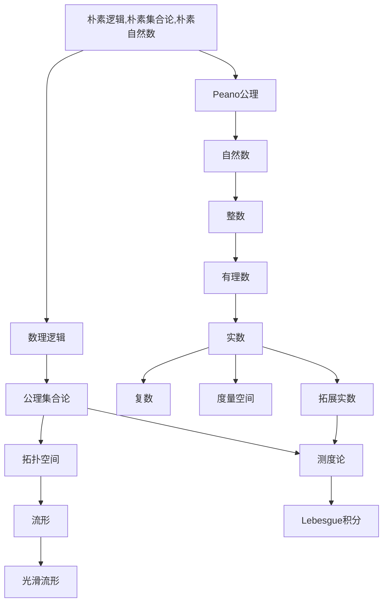

```mermaid
graph TD
朴素逻辑,朴素集合论,朴素自然数 --> 数理逻辑 --> 公理集合论
朴素逻辑,朴素集合论,朴素自然数 --> Peano公理 --> 自然数 --> 整数 --> 有理数 --> 实数 --> 复数
实数 --> 度量空间
实数 --> 拓展实数 --> 测度论
公理集合论 --> 拓扑空间 --> 流形 --> 光滑流形
公理集合论 --> 测度论 --> Lebesgue积分
```
