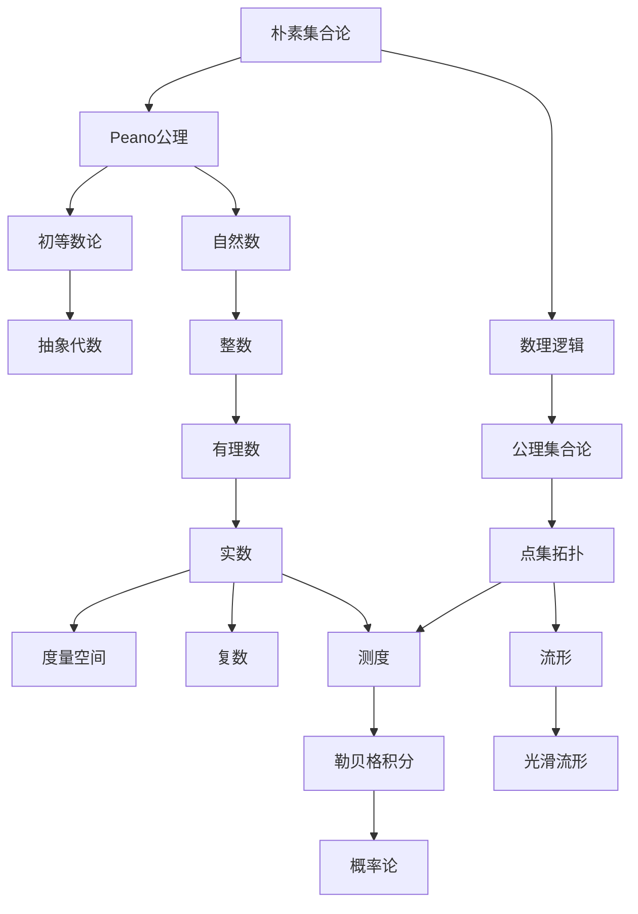

```mermaid
graph TD;
朴素集合论-->Peano公理-->初等数论
初等数论-->抽象代数
Peano公理-->自然数
自然数-->整数
整数-->有理数
有理数-->实数
实数-->度量空间
实数-->复数
实数-->测度
朴素集合论 --> 数理逻辑 --> 公理集合论
公理集合论 --> 点集拓扑 --> 测度 --> 勒贝格积分 --> 概率论
点集拓扑-->流形 --> 光滑流形
```
