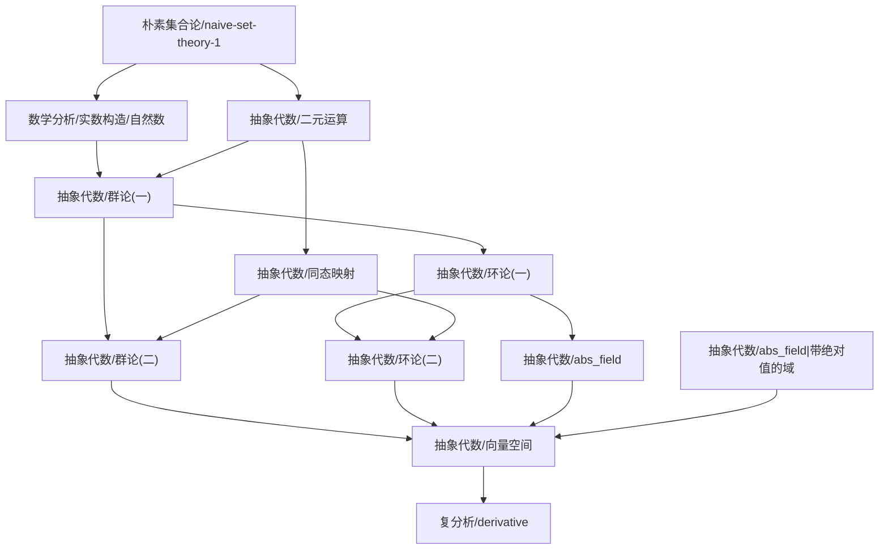

```mermaid
graph TD
1["抽象代数/向量空间"] --> 0["复分析/derivative"]
3["抽象代数/群论(二)"] --> 1["抽象代数/向量空间"]
4["抽象代数/环论(二)"] --> 1["抽象代数/向量空间"]
5["抽象代数/abs_field"] --> 1["抽象代数/向量空间"]
6["抽象代数/abs_field|带绝对值的域"] --> 1["抽象代数/向量空间"]
7["抽象代数/群论(一)"] --> 3["抽象代数/群论(二)"]
8["抽象代数/同态映射"] --> 3["抽象代数/群论(二)"]
9["抽象代数/环论(一)"] --> 4["抽象代数/环论(二)"]
8["抽象代数/同态映射"] --> 4["抽象代数/环论(二)"]
9["抽象代数/环论(一)"] --> 5["抽象代数/abs_field"]
7["抽象代数/群论(一)"] --> 9["抽象代数/环论(一)"]
10["数学分析/实数构造/自然数"] --> 7["抽象代数/群论(一)"]
11["抽象代数/二元运算"] --> 7["抽象代数/群论(一)"]
12["朴素集合论/naive-set-theory-1"] --> 10["数学分析/实数构造/自然数"]
12["朴素集合论/naive-set-theory-1"] --> 11["抽象代数/二元运算"]
11["抽象代数/二元运算"] --> 8["抽象代数/同态映射"]
```