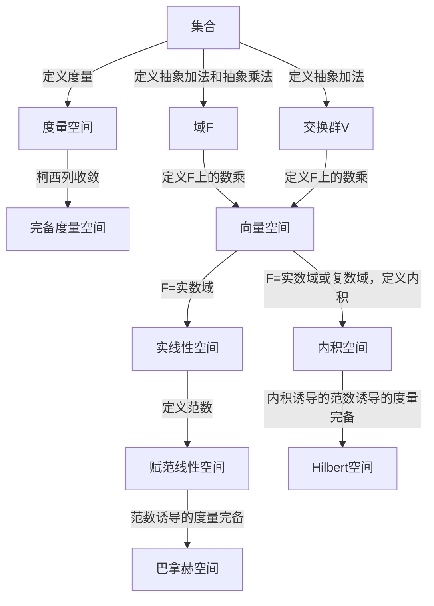

- [向量空间](#向量空间)
    - [向量空间的性质](#向量空间的性质)
- [度量空间](#度量空间)
- [赋范线性空间](#赋范线性空间)
    - [赋范线性空间的性质](#赋范线性空间的性质)
- [内积空间](#内积空间)
    - [内积空间的性质](#内积空间的性质)
- [Hilbert 空间](#hilbert-空间)
    - [Hilbert 空间的性质](#hilbert-空间的性质)

## 向量空间

F 是一个域，V 是一个交换群
定义数乘运算

$$
\sigma: F \times V \rightarrow V
$$

将$a \sigma v$记作$av$

如果$\sigma$满足以下条件，则称 V 是 F 上的向量空间, 或称线性空间。

- $(a+b)v = av + bv$
- $a(bv) = (ab)v$
- $a(u+v) = au + av$
- $1v = v$

若对于$S=\{v_i|i \in I\}$有：从$S$中取 k 个不同的向量，如果这 k 个向量的线性组合为 0,则这 k 个向量的系数全为 0，则称$S$线性无关。

如果$V$中任一向量都可以被$S\sub V$中的有限个向量线性表出，则称$V$有$S$生成。如果$S$线性无关，则称$S$为$V$的基。如果$S$是一个有限集，则称$V$是有限维向量空间。

对于$U\sub V$,如果$\sigma$限制在$U$上后，$U$仍然满足向量空间的定义，即$\sigma:<F,U> \rightarrow U$,则称$U$是$V$的子空间。

对于同一个域 F 上的向量空间$V$和$V'$,若$L:V \rightarrow V'$，满足$L(av+bw)=aL(v)+bL(w)$，则称$L$是线性映射。若$V=V'$，则称$L$是$V$上的线性变换。

Let $V$ and $V'$ be vector spaces over the same field $F$. A map $\phi: V \to V'$ is an $\textbf{isomorphism}$ if $\phi$ is a one-to-one map, $\phi[V] = V'$, and furthermore

$$\phi(\alpha + \beta) = \phi(\alpha) + \phi(\beta) \quad \text{and} \quad \phi(a\alpha) = a\phi(\alpha)$$

for all $\alpha, \beta \in V$ and all $a \in F$. 即两个同一个域上的向量空间上存在一个双射，且这个双射满足线性映射的定义，则称这两个向量空间同构。

线性变换的特征向量 $v\not=0$, 和特征值$\lambda$：

$$
L(v)=\lambda v \Leftrightarrow (L-\lambda I)(v)=0 \Leftrightarrow \text{Ker}(L-\lambda I) \neq \{0\}
$$

#### 向量空间的性质

1. $0v=0$
2. $a0=0$
3. $(-a)v = -(av) = a(-v)$
4. $v_1,v_2,...,v_n \in V$线性无关$\Leftrightarrow$ 不存在$v_i$能被其余向量线性表出
5. $v_1,v_2,...,v_n \in V$线性无关$\Leftrightarrow$ $i\in[n],v_i$不能被其前面的向量线性表出
6. 若有限集$S$生成了$V$,则存在$U\sub S$使得 U 是 V 的基。所一有限维向量空间有有限基
7. 若$V$是一个有限维向量空间，$S\sub V$为线性无关的有限集合，则 $S$可以扩充为$V$的基。且$r < n$,$r=|S|$ ,n 为 V 的基的基数
8. 有限维向量空间的所有基的基数相同，因此把基的基数称为向量空间的维数，记作$\dim(V)$
9. 子空间的交仍然是子空间
10. 由集合 S 里的有限个元素的线性组合得到的集合是 V 的一个子空间
11. 在同一个域 F 上的向量空间的直和仍是 F 上的向量空间
12. 对于任意一个域$F$,$F^n$是$F$上的向量空间，且$\dim(F^n)=n$
13. B 是有限维向量空间的基 $\Leftrightarrow$ V 中的任意向量都可以被 B 中的元素唯一线性表出
14. 任意有限维向量空间$<F,V>$ (在群意义上)都同构于 $<F,F^n>$
15. 线性映射 $L:V\rightarrow V'$ 的核是 V 的子空间，像$L(V)$是$V'$的子空间。若$V$是有限维的，则$\dim(V)=\dim(\text{Ker}(L))+\dim(\text{Im}(L))$,其中$\text{Im}(L)=L(V)$
16. 线性映射的线性组合仍然是线性映射
17. 一个线性变换的不同特征值的特征向量是线性无关的
18. 若$V$是有限维的，则一个线性变换$\phi:V\rightarrow V$最多有$n=\dim(V)$个不同的特征值

## 度量空间

在集合$X$上定义一个函数$d:X \times X \rightarrow R+$,满足以下条件，则称$d$为$X$上的度量，$(X,d)$为度量空间。

- 正定性：$d(x,y)=0 \Leftrightarrow x=y$
- 对称性：$d(x,y)=d(y,x)$
- 三角不等式：$d(x,y) \leq d(x,z)+d(z,y)$

## 赋范线性空间

实线性(向量)空间：实数域上的向量空间

在实线性空间$V$上定义一个函数$||.||:V \rightarrow R+$,满足以下条件，则称$||.||$为$V$上的范数，$(V,||.||)$为赋范线性空间。

- 正定性：$||v||=0 \Leftrightarrow v=0$
- 齐次性：$||av||=|a|||v||$
- 三角不等式：$||v+w|| \leq ||v||+||w||$

如果$V$是赋范线性空间是完备的，则称$V$是巴拿赫(Banach)空间。

#### 赋范线性空间的性质

1. 范数可以诱导度量$d(v,w)=||v-w||$
2. 赋范线性空间都是度量空间

## 内积空间

F 为$\mathbb{R}$或$\mathbb{C}$，$V$是 F 上的向量空间，$\langle .,. \rangle:V \times V \rightarrow \mathbb{F}$，满足以下条件，则称$\langle .,. \rangle$为$V$上的内积，$(V,\langle .,. \rangle)$为内积空间。

- 共轭对称：$\langle v,w \rangle = \overline{\langle w,v \rangle}$
- 正定性：$\langle v,v \rangle \geq 0$ and $\langle v,v \rangle = 0 \Leftrightarrow v=0$
- 线性性：$\langle av+bw,z \rangle = a\langle v,z \rangle + b\langle w,z \rangle$

内积空间空间$V$的子空间$U$的正交补$U^{\perp}=\{v \in V | \forall u \in U, \langle v,u \rangle = 0\}$是$V$的子空间

正交投影：$V$是内积空间，$U$是$V$的子空间，$v \in V$，若$v=u+w$，其中$u \in U$，$w \in U^{\perp}$，则称$u$为$v$在$U$上的正交投影。

#### 内积空间的性质

1. 正交投影若存在则唯一
2. 内积可以诱导范数$||v||=\sqrt{\langle v,v \rangle}$
3. 内积空间可以诱导赋范线性空间
4. 内积空间可以诱导度量空间
5. 有限维内积空间可以通过施密特正交化得到正交基。
6. 内积空间中，柯西-施瓦茨不等式：$|\langle v,w \rangle| \leq ||v|| \cdot ||w||$, 可通过正交分解来证明。
7. 正交 $\Rightarrow$ 线性无关

在内积空间上，内积$\xrightarrow{induce}$范数$\xrightarrow{induce}$度量

## Hilbert 空间

完备内积空间为 Hilbert 空间。

#### Hilbert 空间的性质

1. Hilbert 的投影存在。
