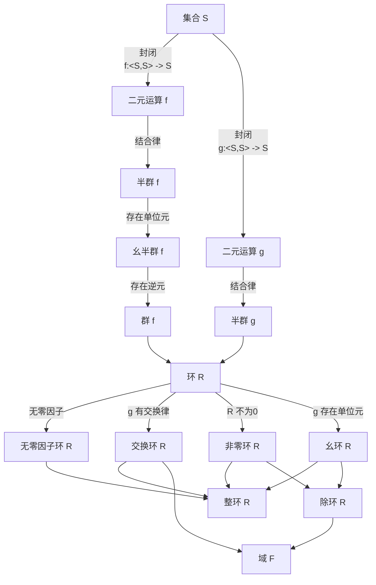

- [群环域定义图](#群环域定义图)

## 群环域定义图

```mermaid
graph TD
    A[集合 S] -->|封闭<br>f:&lt;S,S&gt; -> S| B[二元运算 f]
    B -->|结合律| C[半群 f]
    C -->|存在单位元| D[幺半群 f]
    D -->|存在逆元| E[群 f]
    A -->|封闭<br>g:&lt;S,S&gt; -> S| F[二元运算 g]
    F -->|结合律| G[半群 g]
    E --> H[环 R]
    G --> H
    H -->|无零因子| L[无零因子环 R]
    H -->|g 有交换律| I[交换环 R]
    H -->|R 不为0| J[非零环 R]
    H -->|g 存在单位元| K[幺环 R]
    I --> M[整环 R]
    L --> M
    J --> M
    K --> M
    J --> N[除环 R]
    K --> N
    I --> O[域 F]
    N --> O
```
