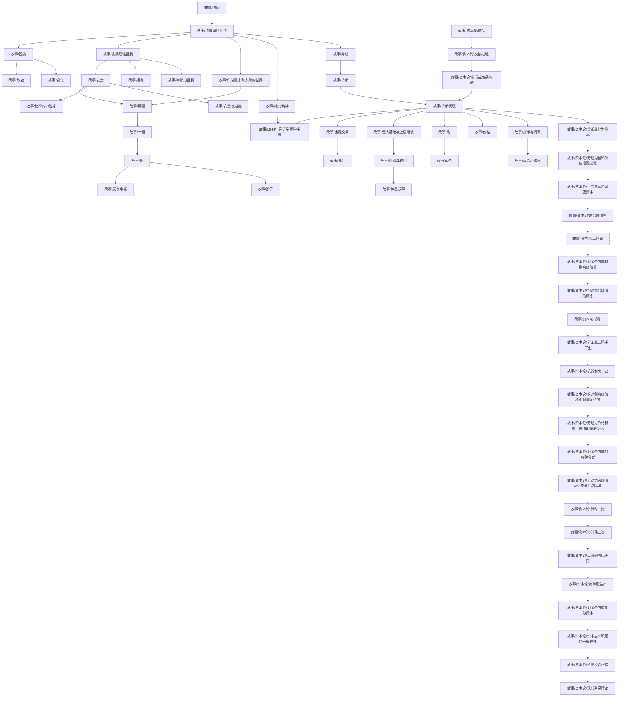

```mermaid
graph TD
1["故事/纯粹理性批判"] --> 0["故事/固执"]
3["故事/经济基础与上层建筑"] --> 2["故事/性别与权利"]
0["故事/固执"] --> 4["故事/改变"]
6["故事/货币代理"] --> 5["故事/1844年经济学哲学手稿"]
7["故事/绝对精神"] --> 5["故事/1844年经济学哲学手稿"]
6["故事/货币代理"] --> 8["故事/金融交易"]
10["故事/作为意志和表象的世界"] --> 9["故事/期望"]
11["故事/安全"] --> 9["故事/期望"]
11["故事/安全"] --> 12["故事/狡猾的小说家"]
1["故事/纯粹理性批判"] --> 13["故事/实践理性批判"]
14["故事/时间"] --> 1["故事/纯粹理性批判"]
13["故事/实践理性批判"] --> 11["故事/安全"]
6["故事/货币代理"] --> 3["故事/经济基础与上层建筑"]
8["故事/金融交易"] --> 15["故事/外汇"]
13["故事/实践理性批判"] --> 16["故事/拥有"]
6["故事/货币代理"] --> 17["故事/税"]
17["故事/税"] --> 18["故事/房价"]
20["故事/货币与行政"] --> 19["故事/政治机构图"]
0["故事/固执"] --> 21["故事/变化"]
23["故事/幸福"] --> 22["故事/爱"]
6["故事/货币代理"] --> 24["故事/价格"]
25["故事/货币"] --> 6["故事/货币代理"]
26["故事/资本论/货币或商品流通"] --> 6["故事/货币代理"]
1["故事/纯粹理性批判"] --> 10["故事/作为意志和表象的世界"]
1["故事/纯粹理性批判"] --> 7["故事/绝对精神"]
6["故事/货币代理"] --> 20["故事/货币与行政"]
11["故事/安全"] --> 28["故事/安全与道德"]
2["故事/性别与权利"] --> 29["故事/神圣叙事"]
22["故事/爱"] --> 30["故事/爱与幸福"]
31["故事/劳动"] --> 25["故事/货币"]
22["故事/爱"] --> 32["故事/孩子"]
1["故事/纯粹理性批判"] --> 31["故事/劳动"]
13["故事/实践理性批判"] --> 33["故事/判断力批判"]
9["故事/期望"] --> 23["故事/幸福"]
35["故事/资本论/不变资本和可变资本"] --> 34["故事/资本论/剩余价值率"]
37["故事/资本论/所谓原始积累"] --> 36["故事/资本论/现代殖民理论"]
38["故事/资本论/交换过程"] --> 26["故事/资本论/货币或商品流通"]
40["故事/资本论/剩余价值转化为资本"] --> 39["故事/资本论/资本主义积累的一般规律"]
42["故事/资本论/劳动力的价值或价格转化为工资"] --> 41["故事/资本论/计时工资"]
44["故事/资本论/机器和大工业"] --> 43["故事/资本论/绝对剩余价值和相对剩余价值"]
46["故事/资本论/货币转化为资本"] --> 45["故事/资本论/劳动过程和价值增殖过程"]
45["故事/资本论/劳动过程和价值增殖过程"] --> 35["故事/资本论/不变资本和可变资本"]
48["故事/资本论/相对剩余价值的概念"] --> 47["故事/资本论/协作"]
39["故事/资本论/资本主义积累的一般规律"] --> 37["故事/资本论/所谓原始积累"]
49["故事/资本论/分工和工场手工业"] --> 44["故事/资本论/机器和大工业"]
6["故事/货币代理"] --> 46["故事/资本论/货币转化为资本"]
50["故事/资本论/商品"] --> 38["故事/资本论/交换过程"]
52["故事/资本论/工资的国民差异"] --> 51["故事/资本论/简单再生产"]
41["故事/资本论/计时工资"] --> 53["故事/资本论/计件工资"]
43["故事/资本论/绝对剩余价值和相对剩余价值"] --> 54["故事/资本论/劳动力价格和剩余价值的量的变化"]
51["故事/资本论/简单再生产"] --> 40["故事/资本论/剩余价值转化为资本"]
53["故事/资本论/计件工资"] --> 52["故事/资本论/工资的国民差异"]
47["故事/资本论/协作"] --> 49["故事/资本论/分工和工场手工业"]
55["故事/资本论/剩余价值率的各种公式"] --> 42["故事/资本论/劳动力的价值或价格转化为工资"]
57["故事/资本论/工作日"] --> 56["故事/资本论/剩余价值率和剩余价值量"]
54["故事/资本论/劳动力价格和剩余价值的量的变化"] --> 55["故事/资本论/剩余价值率的各种公式"]
56["故事/资本论/剩余价值率和剩余价值量"] --> 48["故事/资本论/相对剩余价值的概念"]
34["故事/资本论/剩余价值率"] --> 57["故事/资本论/工作日"]
```
