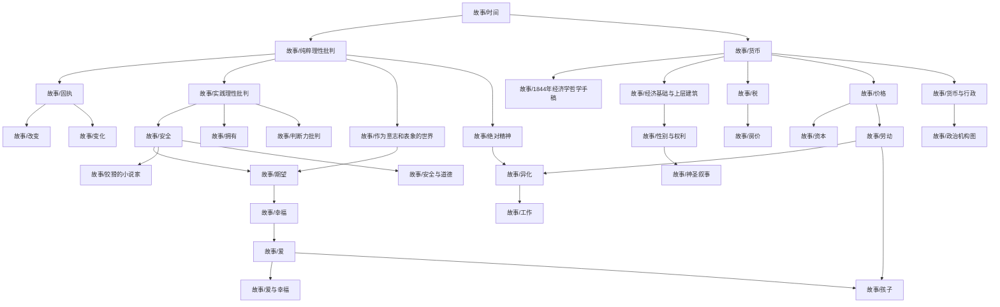

```mermaid
graph TD
1["故事/劳动"] --> 0["故事/异化"]
2["故事/绝对精神"] --> 0["故事/异化"]
4["故事/纯粹理性批判"] --> 3["故事/固执"]
6["故事/经济基础与上层建筑"] --> 5["故事/性别与权利"]
8["故事/价格"] --> 7["故事/资本"]
3["故事/固执"] --> 9["故事/改变"]
11["故事/货币"] --> 10["故事/1844年经济学哲学手稿"]
13["故事/作为意志和表象的世界"] --> 12["故事/期望"]
14["故事/安全"] --> 12["故事/期望"]
14["故事/安全"] --> 15["故事/狡猾的小说家"]
4["故事/纯粹理性批判"] --> 16["故事/实践理性批判"]
17["故事/时间"] --> 4["故事/纯粹理性批判"]
16["故事/实践理性批判"] --> 14["故事/安全"]
11["故事/货币"] --> 6["故事/经济基础与上层建筑"]
16["故事/实践理性批判"] --> 18["故事/拥有"]
11["故事/货币"] --> 19["故事/税"]
19["故事/税"] --> 20["故事/房价"]
22["故事/货币与行政"] --> 21["故事/政治机构图"]
3["故事/固执"] --> 23["故事/变化"]
25["故事/幸福"] --> 24["故事/爱"]
11["故事/货币"] --> 8["故事/价格"]
4["故事/纯粹理性批判"] --> 13["故事/作为意志和表象的世界"]
4["故事/纯粹理性批判"] --> 2["故事/绝对精神"]
11["故事/货币"] --> 22["故事/货币与行政"]
14["故事/安全"] --> 27["故事/安全与道德"]
5["故事/性别与权利"] --> 28["故事/神圣叙事"]
0["故事/异化"] --> 29["故事/工作"]
24["故事/爱"] --> 30["故事/爱与幸福"]
17["故事/时间"] --> 11["故事/货币"]
24["故事/爱"] --> 31["故事/孩子"]
1["故事/劳动"] --> 31["故事/孩子"]
8["故事/价格"] --> 1["故事/劳动"]
16["故事/实践理性批判"] --> 32["故事/判断力批判"]
12["故事/期望"] --> 25["故事/幸福"]
```
