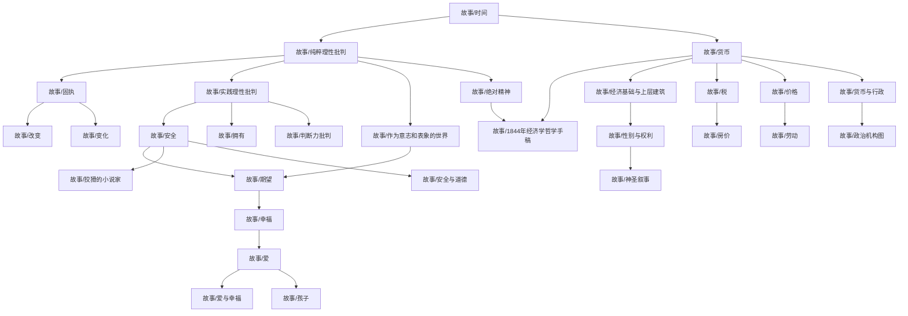

```mermaid
graph TD
1["故事/纯粹理性批判"] --> 0["故事/固执"]
3["故事/经济基础与上层建筑"] --> 2["故事/性别与权利"]
0["故事/固执"] --> 4["故事/改变"]
6["故事/货币"] --> 5["故事/1844年经济学哲学手稿"]
7["故事/绝对精神"] --> 5["故事/1844年经济学哲学手稿"]
9["故事/作为意志和表象的世界"] --> 8["故事/期望"]
10["故事/安全"] --> 8["故事/期望"]
10["故事/安全"] --> 11["故事/狡猾的小说家"]
1["故事/纯粹理性批判"] --> 12["故事/实践理性批判"]
13["故事/时间"] --> 1["故事/纯粹理性批判"]
12["故事/实践理性批判"] --> 10["故事/安全"]
6["故事/货币"] --> 3["故事/经济基础与上层建筑"]
12["故事/实践理性批判"] --> 14["故事/拥有"]
6["故事/货币"] --> 15["故事/税"]
15["故事/税"] --> 16["故事/房价"]
18["故事/货币与行政"] --> 17["故事/政治机构图"]
0["故事/固执"] --> 19["故事/变化"]
21["故事/幸福"] --> 20["故事/爱"]
6["故事/货币"] --> 22["故事/价格"]
1["故事/纯粹理性批判"] --> 9["故事/作为意志和表象的世界"]
1["故事/纯粹理性批判"] --> 7["故事/绝对精神"]
6["故事/货币"] --> 18["故事/货币与行政"]
10["故事/安全"] --> 24["故事/安全与道德"]
2["故事/性别与权利"] --> 25["故事/神圣叙事"]
20["故事/爱"] --> 26["故事/爱与幸福"]
13["故事/时间"] --> 6["故事/货币"]
20["故事/爱"] --> 27["故事/孩子"]
22["故事/价格"] --> 28["故事/劳动"]
12["故事/实践理性批判"] --> 29["故事/判断力批判"]
8["故事/期望"] --> 21["故事/幸福"]
```
