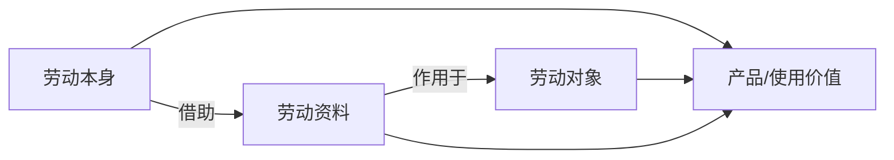

## 前置

- [[故事/纯粹理性批判]]

---

## 定义

- **劳动**：将主观意图转化为客观实在的过程；人通过劳动把体力和智力物化于自然界，并在人与自然之间进行物质变换，是人类维持自身存在的基本方式。
- **对象化**：劳动是主体的对象化。

## 性质

1. 劳动体现人超越本能的创造能力：能够预先设定目的并加以实现。
2. 在劳动中，人的感官和思维得到发展，逐步意识到自己作为主体区别于自然。
3. 劳动在现实展开中具有社会性，往往以协作进行，从而构成人类社会关系的基础。
4. 劳动首先是人和自然之间的过程：人以自身活动引起、调整和控制人与自然的物质变换；作用于外在自然时，也改变自身的自然。
5. **观念先行**：最蹩脚的建筑师也比最灵巧的蜜蜂高明之处在于，结果在过程开始时已在表象中观念地存在着。
6. 劳动者不仅使自然物发生形式变化，还在其中实现自己的目的；目的作为规律决定活动的方式和方法，意志须服从这一目的（表现为注意力）。劳动越不能吸引劳动者，越需要这种意志。

### 简单要素

劳动过程的简单要素：**有目的的活动（劳动本身）**、**劳动对象**、**劳动资料**。

| 范畴     | 含义                                                             |
| -------- | ---------------------------------------------------------------- |
| 劳动对象 | 劳动所加工的物；最初包括土地（及水）等天然存在者                 |
| 原料     | 已被以前劳动滤过的劳动对象；一切原料都是劳动对象，反之不然       |
| 劳动资料 | 劳动者置于自己与对象之间、用来把活动传导到对象上的物或物的综合体 |
| 生产资料 | 从产品角度看的劳动资料 + 劳动对象                                |
| 生产劳动 | 从产品角度看的劳动本身                                           |

1. **天然对象 vs 原料**：捕获的鱼、砍伐的树木、开采的矿石是天然劳动对象；已开采正在洗的矿石是原料。
2. **劳动资料**：劳动者直接掌握的通常是资料而非对象；自然物可延长人的肢体。土地是原始食物仓与劳动资料库；稍有发展的过程已需要经过加工的资料。
3. **广义资料**：不直接加入过程、但为过程所必需的物质条件（立足之地、厂房、运河、道路等）亦属劳动过程的资料。

### 产品与角色变换

1. 人的活动借助资料使对象发生预定变化；**过程消失在产品中**。劳动物化了，对象被加工了：劳动者方面曾以动的形式表现的东西，在产品方面作为静的属性存在。
2. 产品退出过程时，另一些使用价值作为生产资料进入过程；**同一使用价值既是这种劳动的产品，又是那种劳动的生产资料**——产品既是结果，又是条件。
3. **辅助材料**：被资料消费（煤、机油）；加在原料上使原料变化（氯、颜料）；或帮助劳动进行（照明、取暖）。化学工业中主辅材料区别可消失。
4. 同一产品可在不同过程中充当不同原料，或在同一过程中既是资料又是原料；亦可成为半成品/中间成品，经一系列形态变化直至完成的生活资料或劳动资料。
5. 一个使用价值表现为原料、资料还是产品，**完全取决于它在劳动过程中的地位**。
6. 产品作为生产资料进入新过程，便丧失产品性质，只作为活劳动的物质因素起作用；
7. **活劳动**抓住死的生产资料，使它们由可能的使用价值变为现实起作用的使用价值——有目的地消费它们以形成新产品。

### 生产消费与个人消费

- **生产消费**：劳动吞食对象与资料；产物是与消费者不同的产品。
- **个人消费**：把产品当作 活的个人 的生活资料来消费；产物是消费者本身。

### 一般规定

劳动过程（就其简单抽象要素而言）是：

- 制造使用价值的有目的的活动；
- 为人类需要而占有自然物；
- 人与自然之间物质变换的一般条件；
