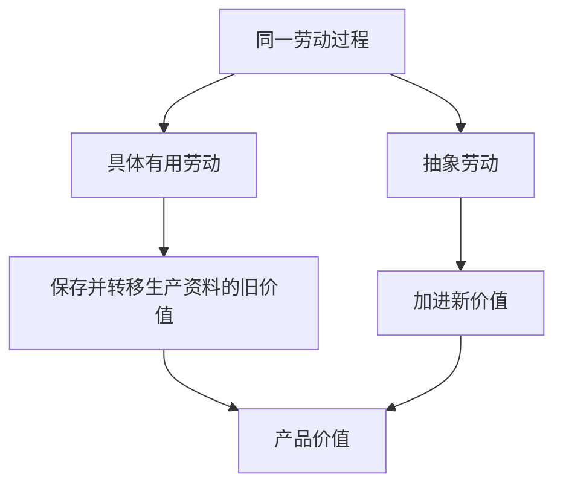
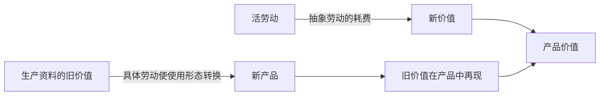

## 前置

- [[故事/资本论/劳动过程和价值增殖过程]]

---

上一章已经说明：同一个劳动过程一方面转移生产资料的旧价值，另一方面创造新价值；当劳动越过劳动力价值的补偿点，便形成剩余价值。本章进一步考察这两种作用，并据此把预付资本区分为**不变资本**与**可变资本**。

## 劳动的二重作用

- **具体有用劳动**：劳动的特殊生产形式，如纺纱、织布、打铁。它把生产资料变成新的使用价值，并把生产资料的旧价值保存、转移到产品中。
- **抽象劳动**：撇开具体形式后的一般人类劳动力耗费。它按持续时间形成新价值。
- **劳动的二重性决定劳动的二重作用**：工人并不是同时劳动两次。同一次劳动，就其质而言是具体有用劳动，转移旧价值；就其量而言是抽象劳动，创造新价值。

1. 工人只有以某种具体方式劳动，才能把生产资料变成产品。纺纱劳动把棉花变成棉纱，也正是在这一形态变换中，棉花和纱锭的价值转移到棉纱中。
2. 但工人不论纺纱还是做木工，只要耗费了一定量的社会劳动时间，就会加进一定量的新价值。因此，创造新价值的不是劳动的特殊内容，而是抽象劳动的量。
3. 简言之：

   $$
   \text{劳动的质（具体形式）}\longrightarrow\text{保存、转移旧价值}
   $$

   $$
   \text{劳动的量（持续时间）}\longrightarrow\text{创造新价值}
   $$

## 保存旧价值与创造新价值

下面三种情形说明，劳动保存价值与创造价值是两种不同的作用。

1. **劳动生产力变化，生产资料价值不变**
   1. 假定技术进步前，纺纱工人在时间 $t$ 内加工棉花 $Q$；生产力提高为原来的 $k$ 倍后，同一时间可以加工 $kQ$，其中 $k>1$。
   2. 同样时间 $t$ 内的抽象劳动所创造的新价值并未增加；但由于加工的棉花增加为原来的 $k$ 倍，转入产品的棉花价值也增加为 $k$ 倍。
   3. 对单位棉花来说，吸收的新劳动减少到原来的 $1/k$；但就时间 $t$ 内的总产品来说，保存的原料旧价值增加了。
   4. 所以，生产力改变的是单位时间内形成的使用价值量以及随之转移的旧价值量，不会仅凭自身增加同一时间所创造的新价值。

2. **生产资料价值变化，劳动生产力不变**
   1. 假定工人仍以时间 $t$ 加工棉花 $Q$，但棉花的单位价值由 $p$ 变为 $kp$ 或 $p/k$。
   2. 工人加进的劳动时间相同，因而新价值相同；转移到棉纱中的棉花价值却随棉花自身价值而变化。
   3. 这再次表明：旧价值的转移量与新价值的创造量并非同一个量。

3. **生产条件与生产资料价值都不变**
   1. 劳动时间由 $t$ 延长为 $kt$ 时，新创造的价值增加为 $k$ 倍；同时消耗的原料、转移的机器损耗以及保存的旧价值也增加为 $k$ 倍。
   2. 二者在这种条件下成比例，并不意味着旧价值是由新劳动创造的。

## 生产资料的价值如何转移

价值不能脱离使用价值而独立存在。生产资料的旧使用价值形态在劳动过程中消失，并以新产品的使用价值形态出现；它原有的价值也随之转移到产品中。

1. **原料与辅助材料**
   - 棉花成为棉纱的实体，染料表现为产品的属性，煤和润滑油在生产中消耗掉。
   - 它们失去原来的独立使用形态，并把自身价值一次或逐步转给产品。

2. **劳动资料**
   - 工具、机器、厂房等在单次生产中保持独立形态，可以反复参加许多劳动过程。
   - 它们每次都作为整体发挥作用，却只按损耗程度把部分价值转给当期产品。
   - 若一台机器的价值为 $C$，平均使用期限为 $T$，且损耗均匀，则每个单位期间向产品转移的价值为 $C/T$。

   $$
   \text{当期转移价值}
   =
   \text{劳动资料原有价值}
   \times
   \text{当期损耗比例}
   $$

   因此，劳动资料是**全部进入劳动过程，但只部分进入价值形成过程**。

3. **正常生产损耗**
   - 假定投入棉花 $Q+L$ 时，正常且不可避免地有 $L$ 成为飞花，只有 $Q$ 形成棉纱。
   - 损耗的 $L$ 虽然没有成为产品实体，却是生产棉纱 $Q$ 的必要条件，其价值仍计入棉纱。
   - 在这个意义上，生产资料是**全部进入价值形成过程，但只部分进入劳动过程**。若废料还能成为独立的新产品，其价值则须另行计算。

4. **价值转移的上限**
   - 生产资料转给产品的价值，不能超过它在劳动过程中因使用价值耗损而失去的价值。
   - 一台机器无论多么有用，都不能转移超过自身原有价值的价值。
   - 土地、风、水等未经劳动形成、因而本身没有价值的自然条件，可以参与形成使用价值，却没有旧价值可转移。

生产资料的价值只是从旧躯体转到新躯体，因而是**再现**，不是再生产。真正生产出来的是新使用价值，以及由活劳动形成的新价值。

## 劳动力与新价值

劳动力与生产资料不同。工人劳动的每一时刻，在以具体形式保存旧价值的同时，也以抽象劳动形成新价值。

假定工人劳动 6 小时创造的价值，恰好等于劳动力的日价值，那么这 6 小时创造的新价值只是补偿资本家购买劳动力的预付。若工作日继续到 12 小时，后 6 小时创造的价值便超过劳动力自身价值，成为剩余价值。

```mermaid
gantt
    title 12小时工作日中新价值的形成
    dateFormat X
    axisFormat %s小时

    section 新价值
    必要劳动：补偿劳动力价值 :done, necessary, 0, 6s
    剩余劳动：形成剩余价值   :crit, surplus, after necessary, 6s
```

产品价值可以写为：

$$
W=c+v+m
$$

其中：

- $c$：生产资料转移到产品中的旧价值；
- $v$：活劳动新创造并用于补偿劳动力价值的部分；
- $m$：活劳动超过补偿点后创造的剩余价值。

## 不变资本与可变资本

- **不变资本 $c$**：转化为原料、辅助材料和劳动资料的资本部分。它在生产过程中不改变自身价值量，只把已有价值转移到产品中。
- **可变资本 $v$**：转化为劳动力的资本部分。劳动力的使用不仅再生产自身价值的等价物，还能生产超过该等价物的剩余价值 $m$，因此这部分资本发生量的变化。

| 比较             | 不变资本 $c$             | 可变资本 $v$           |
| ---------------- | ------------------------ | ---------------------- |
| 购买对象         | 生产资料                 | 劳动力                 |
| 劳动过程中的角色 | 客观因素                 | 主观因素               |
| 价值运动         | 旧价值转移、再现         | 创造新价值             |
| 生产后的价值量   | 总量不因其生产职能而增加 | 再生产 $v$，并产生 $m$ |
| 与剩余价值的关系 | 不创造剩余价值           | 是剩余价值的源泉       |

这里的“不变”与“可变”，指的是两部分资本在**所考察的生产过程中的职能**，而不是说生产资料的市场价值永远不变，也不是说二者的数量比例固定。

## 两种不会取消职能区别的变化

1. **不变资本组成部分的价值会涨跌**
   1. 棉花歉收会提高生产棉花所需的社会必要劳动时间，使库存棉花及棉纱中相应的价值一同提高。
   2. 新发明若使同类机器可以用较少劳动生产出来，旧机器便会贬值，转移到产品中的价值也随之减少。
   3. 这些变化发生在棉花或机器作为商品被生产和再生产的条件中，而不是发生在它们作为生产资料执行职能的过程中。它们在当前过程中仍然只转移已有价值，不创造额外价值。

2. **不变资本与可变资本的比例会变化**
   1. 技术革新可能使一个工人借助昂贵机器加工过去十个工人才能加工的原料。
   2. 此时生产资料的价值量增加，预付劳动力的资本减少，即 $c/v$ 上升。
   3. 这种变化只改变两部分资本的数量关系，并不改变二者的职能：生产资料仍转移旧价值，劳动力仍创造新价值与剩余价值。
