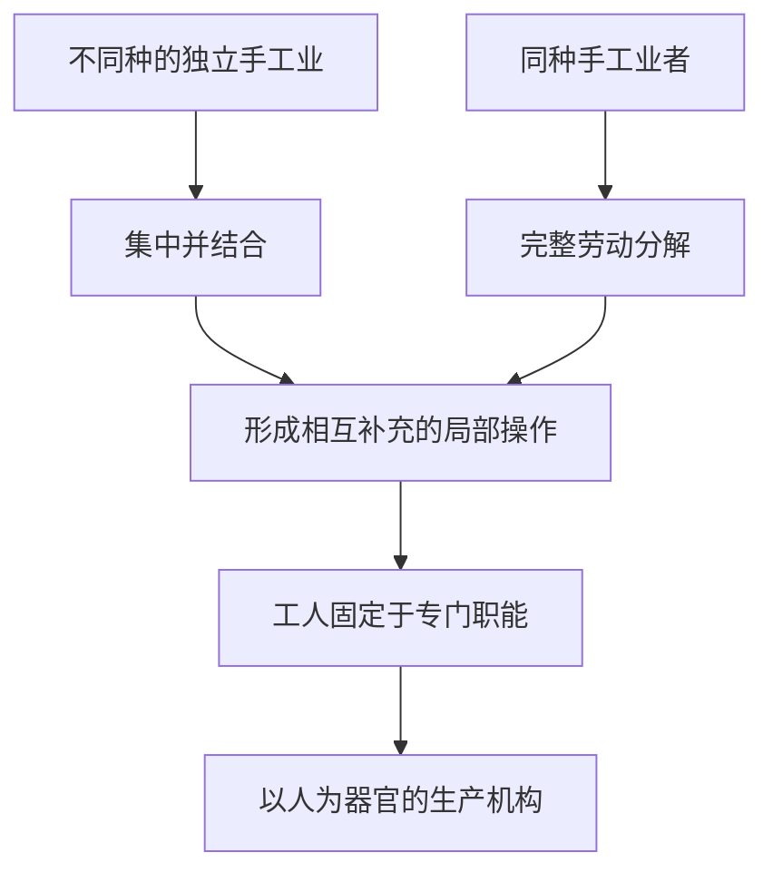

## 前置

- [[故事/资本论/协作]]

---

以分工为基础的协作，在工场手工业中取得了典型形态。它没有立即抛弃手工业，而是把手工业者和手工操作重新组织起来：完整的劳动被分解为局部职能，分散的劳动者被结合为一个由资本指挥的生产机构。生产力由此提高，工人也越来越片面地依附于这个机构。

## 工场手工业的二重起源

工场手工业由手工业形成，有两条方向相反的路径。

### 不同手工业的结合

第一条路径，是把原来彼此独立、共同制造一种成品的不同手工业者，集中到同一个资本家的工场中。

起初，这只是现成手工业者之间的简单协作。随着生产不断重复：

- 各类手工业者只从事成品生产中的一部分工作；
- 他们逐渐失去全面从事原有手工业的能力；
- 各种手工业被改造成相互补充的局部操作；
- 每种操作成为特定工人的固定职能。

原来独立的手工业由此丧失独立性，成为同一个生产机构的器官。

### 同种手工业的分解

第二条路径，是把许多从事同一种手工业的人集中起来，再把每个人原本独立完成的完整劳动分解为不同操作。

每个手工业者起初仍独自完成商品所需的全部操作。为了在一定期限内提供大量成品，资本开始把这些操作分开：

- 原来由同一个人依次完成的操作，被安排给不同工人；
- 时间上先后进行的劳动，变成空间上并列进行的劳动；
- 每个工人不断重复一种局部操作；
- 偶然的分工逐渐固定为系统的分工。

两条路径的出发点相反，终点却相同：一方面把过去分开的手工业结合起来，另一方面又在生产过程内部引进和发展分工，最终形成一个以人为器官的生产机构。

### 工场手工业仍以手工业为基础

工场手工业虽然重新组织了劳动，却没有摆脱手工业的技术基础。每一个局部过程仍靠工人操纵工具完成，生产结果仍取决于工人的力量、熟练、速度和准确性。

因此：

- 生产过程的分解，同手工业活动被分成局部操作是一致的，尚未成为对过程的科学分解；
- 手工熟练仍是基础，工人的劳动力因而被固定成终身执行一种局部职能的器官；
- 这种分工是协作的一种特殊形式，它的许多生产优势仍来自协作的一般性质。

## 局部工人及其工具

**局部工人**终身从事一种简单操作，把整个身体训练成这种操作的自动而片面的器官。由许多局部工人组成的结合劳动体，就是工场手工业的**总体工人**。

### 专门化怎样提高生产力

同独立手工业相比，局部工人能在更短时间内完成更多同类操作，原因包括：

- 不断重复有限动作，能够积累最省力、最快捷的操作诀窍；
- 注意力长期集中于同一操作，使局部劳动方法不断完善；
- 多代工人在同一工场共同劳动，使经验迅速积累和传承；
- 不再频繁改变位置、操作和工具，减少了劳动过程中的空隙；
- 已经形成的劳动速度可以持续更长时间。

| 比较维度 | 独立手工业者         | 工场手工业的局部工人   |
| -------- | -------------------- | ---------------------- |
| 操作范围 | 依次完成多种操作     | 终身重复一种局部操作   |
| 劳动中断 | 经常换位置、换工具   | 转换空隙大幅减少       |
| 技艺形态 | 综合而完整           | 片面但高度熟练         |
| 工具形态 | 一种工具兼顾多种用途 | 工具适应特定操作       |
| 产品性质 | 可以独立完成商品     | 只完成共同产品的一部分 |

这种提高也有界限。活动的变换本来可以恢复和刺激精力，持续的单调劳动则会削弱注意力和活力。因此，生产率的提高有时来自减少非生产耗费，有时也来自在同一时间内加强劳动力支出，即提高劳动强度。

### 工具的分化和专门化

劳动分解以后，同一种工具必须适应不同局部操作的特殊困难，于是出现两种变化：

- **工具分化**：同类工具形成适合不同用途的固定形式；
- **工具专门化**：每种特殊工具只有在专门局部工人手中才能充分发挥作用。

机器可以由许多简单工具结合而成。工场手工业对工具的简化、改进和多样化，因而为机器生产创造了一个物质条件。

## 工场手工业的两种基本形式

工场手工业的组织取决于制品本身的性质。制品或者由独立的局部产品机械组合而成，或者必须依次经过一系列相互关联的阶段。

| 基本形式             | 制品结构               | 生产联系                             |
| -------------------- | ---------------------- | ------------------------------------ |
| **混成的工场手工业** | 独立部件最终组合为整体 | 局部劳动彼此相对独立，最后装配       |
| **有机的工场手工业** | 原料依次经过连续阶段   | 前一操作的结果直接成为后一操作的起点 |

### 混成的工场手工业

成品由许多独立部件组成。各部件可以由不同局部工人分别制造，最后才结合成一个整体。

由于部件之间主要是外在的组合关系，局部工人未必需要集中在同一工场。他们可以分散劳动，为同一资本家生产。这种分散并不使他们恢复为独立手工业者：他们仍只生产局部部件，并受资本支配。

### 有机的工场手工业

成品必须顺序经过许多相互联系的过程。工场把原本分散的操作集中起来，缩短不同阶段之间的空间距离，减少产品转移所耗费的时间和劳动。

从一件制品看，各阶段仍按时间先后发生；从整个工场看，许多制品同时处于不同阶段。原来时间上的顺序由此转化为空间上的并存。

在连续生产中，每个局部工人的结果都是下一个工人的劳动对象。工人之间形成直接依赖：任何一环过慢，都会影响其他环节。因此，各环节必须保持连续性、划一性、规则性和秩序性。

### 工人小组的固定比例

不同操作需要的时间不同，同一时间内产生的局部产品数量也不同。为了让生产连续进行，各类局部工人的人数必须保持一定比例。

设某类局部操作在单位时间内产出 $q_i$，要使各环节速度一致，从事该操作的工人人数 $n_i$ 须满足：

$$
n_1q_1=n_2q_2=\cdots=n_kq_k
$$

于是，分工不仅形成生产过程的质的划分，也形成工人数量上的规则和比例。生产规模确定以后，扩大规模通常必须让各类工人按相同比例成倍增加。

## 总体工人的构成

工场手工业最有代表性的“机器”，不是机械装置，而是由许多局部工人结合成的总体工人。

一个完整劳动过程可能分别要求体力、灵巧、速度或注意力。同一个人难以同等具备所有素质。操作分离以后，工人按照各自特长被分类和分组，总体工人因而能够同时拥有并经济地使用不同生产能力。

单个工人的片面性甚至缺陷，在总体工人中会成为一种“优点”：只要他能像机器部件一样准确执行自己的局部职能即可。

### 劳动力的等级与贬值

不同操作有简单和复杂、低级和高级之分，需要的教育程度不同，劳动力价值也不同。工场手工业因此同时发展出：

- 劳动力的等级制度；
- 与之对应的工资等级；
- 熟练工人和非熟练工人的区分。

手工业生产排斥完全没有受过训练的人，而工场手工业把简单操作固定为专门职能，第一次系统地造成非熟练工人。对非熟练工人，学习费用几乎消失；对熟练工人，局部职能的简化也会降低学习费用。

劳动力的培养费用下降，会缩短再生产劳动力所需的必要劳动时间，降低劳动力价值，并扩大剩余劳动的范围。分工提高生产力的同时，也成为生产相对剩余价值的手段。

## 工场内部分工与社会分工

单从劳动本身看，分工可以分成三个层次：

| 层次     | 含义                     |
| -------- | ------------------------ |
| 一般分工 | 社会生产划分为大类       |
| 特殊分工 | 大类进一步划分为种和亚种 |
| 个别分工 | 单个工场内部的分工       |

### 社会分工的形成

社会分工也有两个方向相反的起点。

一方面，共同体内部最初按生理差别形成自然分工。随着共同体扩大及交换发展，原本属于同一整体的职能逐渐分离并独立，最后只有通过商品交换才能重新发生联系。

另一方面，不同共同体由于自然环境不同，拥有不同生产资料、生活资料和生产方式。交换不是先创造这些差别，而是把原来互不依赖的生产领域联系起来，使它们成为社会总生产中互相依赖的部门。

因此，一条路径使原来非独立的东西独立起来，另一条路径使原来独立的东西相互依赖。城乡分离是一切以商品交换为媒介的发达社会分工的基础。

### 分工的物质前提与相互作用

一定数量的工人同时集中，是工场内部分工的物质前提；人口数量和人口密度，则是社会分工的物质前提。

人口密度不是单纯的地理密度。交通工具越发达，分散的人口越能频繁联系，经济意义上的人口密度也越高。

工场分工以已经发展到一定程度的商品生产、商品流通和社会分工为前提，又反过来推动社会分工：

- 专门工具的增加，使制造工具的行业进一步分化；
- 商品的不同生产阶段可以独立为不同部门；
- 同一部门会按原料和产品形式分化出新行业；
- 地域分工随着市场范围扩大而发展。

### 两种分工的本质区别

工场内部分工和社会分工虽然相互联系，却不是同一种关系在不同尺度上的简单重复。

| 比较维度       | 工场内部分工                 | 社会分工                       |
| -------------- | ---------------------------- | ------------------------------ |
| 联系媒介       | 不同劳动力出卖给同一资本家   | 不同生产者之间买卖商品         |
| 局部劳动的产品 | 局部工人不生产独立商品       | 各生产者的产品作为商品存在     |
| 生产资料       | 集中在一个资本家手中         | 分散在互不依赖的商品生产者手中 |
| 比例调节       | 事先、有计划地规定各类工人数 | 价值规律通过市场波动事后调节   |
| 支配力量       | 资本家在工场内的权威         | 独立生产者之间的竞争           |
| 基本形态       | 有计划的组织与专制           | 无计划的社会联系与无政府状态   |

工场内，各操作的固定比例像铁的规律一样预先起作用；社会上，不同部门的比例不断被打破，再由价格和竞争迫使生产重新趋向平衡。

资本主义社会因而同时存在两种相反现象：工场内部是资本有计划的专制，社会总体却由竞争进行无计划调节。二者相互制约。

## 工场手工业的资本主义性质

工场手工业的分工，使同时使用较多工人从一般条件变成技术必要。每一种职能所需的人数由分工规定，扩大生产又必须按既定比例增加各组工人。

随着可变资本增加，共同生产条件也要扩大。劳动生产力提高后，同量劳动在一定时间内加工的原料更多，因此原料投入往往比工人人数增长得更快。zwzw

### 社会生产力表现为资本生产力

工场中的总体工人属于资本。不同劳动结合产生的生产力，也就表现为资本的生产力。

简单协作大体没有改变个人的劳动方式；工场手工业却把完整劳动能力分割开来，使工人变成某种局部劳动的自动工具。局部工人离开总体机构，便不能独立生产商品；而这个总体机构只在资本家的工场中存在。

工人最初因为没有生产资料而把劳动力卖给资本；分工发展以后，他的个人劳动力只有卖给资本、进入资本组织的结合劳动，才能发挥生产作用。资本对劳动的支配因此获得了新的技术基础。

### 生产智力同工人分离

独立生产者虽然规模有限，却同时运用自己的知识、判断和意志。在工场手工业中，这些能力不再要求每个工人具备，而只对整个工场是必要的。

局部工人失去的生产智力，集中到同他们对立的资本一边：

- 在简单协作中，资本家开始代表总体劳动的统一和意志；
- 在工场手工业中，工人被发展为畸形的局部工人；
- 在大工业中，科学将作为独立生产能力同劳动进一步分离。

因此，总体工人以及资本在社会生产力上的富有，以单个工人在个人生产力上的贫乏为条件。

### 对工人的片面塑造

终身从事少数简单操作，会使专门技能以牺牲智力、身体活力和社会能力为代价。工场手工业一方面把片面的专长发展成技艺，另一方面又把“没有任何发展”本身变成一种专长。它不仅把劳动分配给不同个人，还把个人本身分割为劳动的片断。

这种组织具有二重性质：

- 它通过质的分工和量的比例发展社会劳动生产力，是社会经济形成过程中的历史进步；
- 它通过降低劳动力价值、加强纪律并使工人片面化，为资本生产相对剩余价值，是文明而精巧的剥削手段。

## 工场手工业的内在矛盾

工场手工业创造的生产需要，最终同它狭隘的手工业技术基础发生矛盾。

它最完善的产物之一，是生产劳动工具和复杂机械装置的工场。对工具生产的进一步分工，最终生产出机器；机器又反过来使手工业活动不再成为社会生产的支配原则。

机器一方面消除工人终身固定于某种局部手工职能的技术基础，另一方面也消除工场手工业的手工业基础对资本统治施加的限制。工场手工业由此为超越自身的机器大工业准备了条件。
