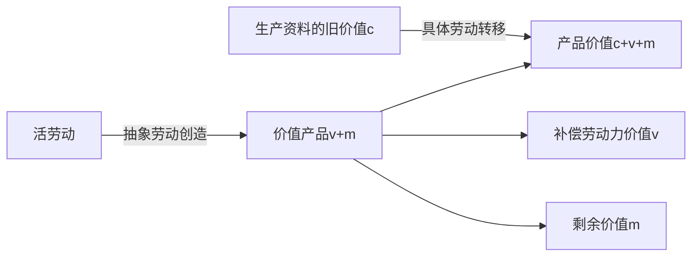
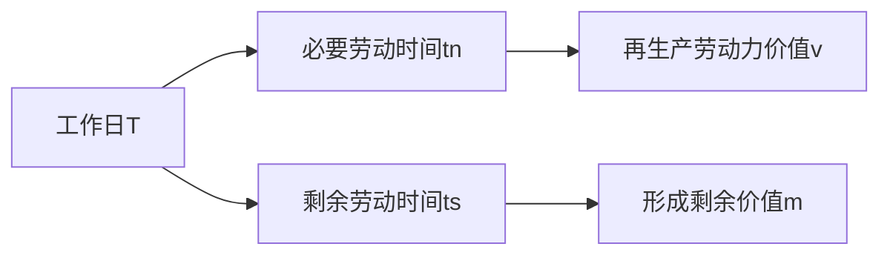
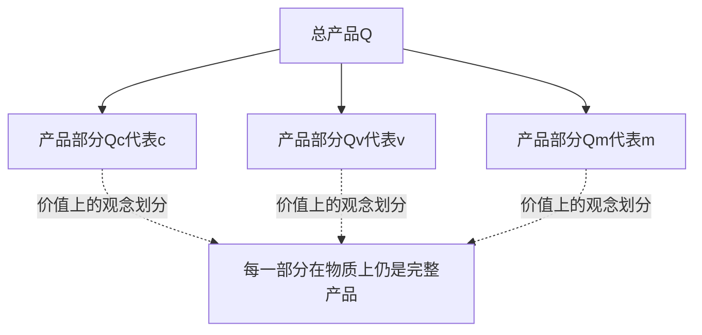
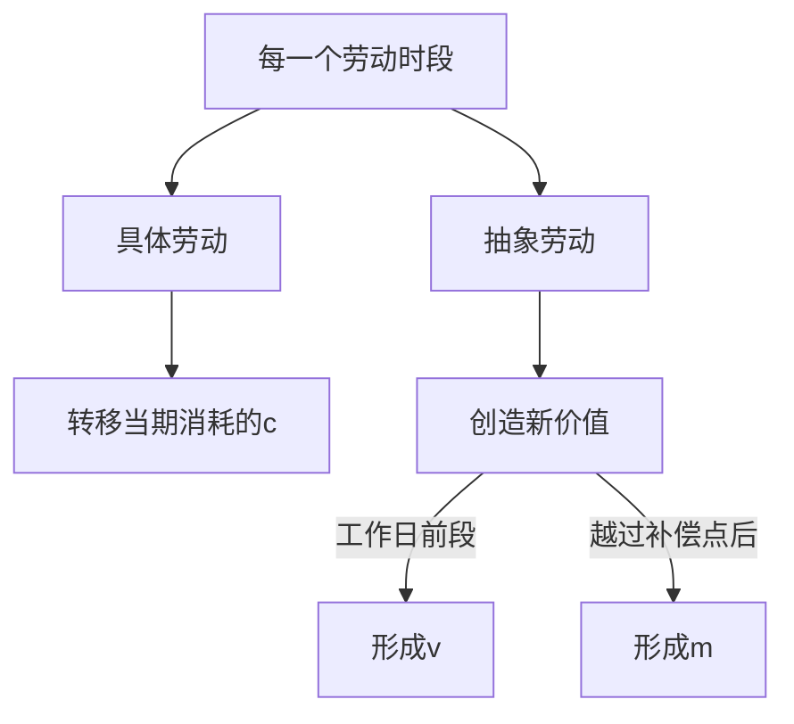

## 前置

- [[故事/资本论/不变资本和可变资本]]

---

上一章把预付资本区分为不变资本与可变资本：生产资料只把旧价值转移到产品中，劳动力则创造新价值。本章进一步追问：新价值中有多少补偿劳动力价值，又有多少成为剩余价值？二者的比例就是剩余价值率。

## 记号与价值构成

- $C$：预付资本；
- $c$：转化为生产资料的不变资本；
- $v$：转化为劳动力的可变资本；
- $m$：生产过程中形成的剩余价值；
- $C'$：生产结束后已经增殖的资本。

生产开始时：

$$
C=c+v
$$

生产结束后，产品价值为：

$$
C'=c+v+m
$$

于是资本的增殖额为：

$$
C'-C=m
$$

这里的 $c$ 只包括本期实际消耗并转移到产品中的生产资料价值。机器、厂房等仍保留在原来形态中的价值没有进入本期产品价值，不应重复计入。

## 产品价值与价值产品

- **产品价值**：产品中包含的全部价值，即 $c+v+m$。
- **价值产品**：本期活劳动新创造的价值，即 $v+m$。

不变资本 $c$ 只是旧价值的再现，并不是生产过程中新创造的价值。因此，为了单独考察价值增殖，可以在分析中暂时令 $c=0$：

$$
c+v+m\longrightarrow v+m
$$

这只是把不发生量变的常量抽去，并不表示生产可以没有生产资料。生产资料仍是劳动过程的物质条件，只是它们的价值大小不决定活劳动创造多少新价值。

## 劳动力的剥削程度

工人的工作日可以分为两个部分：

- **必要劳动时间 $t_n$**：工人再生产自身劳动力价值 $v$ 所需的时间；这段时间内耗费的劳动称为必要劳动。
- **剩余劳动时间 $t_s$**：超过必要劳动时间后继续为资本家劳动的时间；这段时间内耗费的劳动称为剩余劳动，并形成剩余价值 $m$。

$$
T=t_n+t_s
$$

其中 $T$ 为工作日总长度。

**剩余价值率**是剩余价值与可变资本之比：

$$
m'=\frac{m}{v}
$$

由于 $v$ 与 $m$ 分别是必要劳动和剩余劳动的物化形式，所以：

$$
m'=\frac{m}{v}=\frac{t_s}{t_n}
$$

同一种关系在这里有两种表现：

| 表现形式 | 分子               | 分母               | 比率      |
| -------- | ------------------ | ------------------ | --------- |
| 物化劳动 | 剩余价值 $m$       | 可变资本 $v$       | $m/v$     |
| 流动劳动 | 剩余劳动时间 $t_s$ | 必要劳动时间 $t_n$ | $t_s/t_n$ |

因此，剩余价值率准确表现劳动力受资本剥削的**程度**。它并不直接表示剥削的绝对量；相同的剩余价值率可以对应不同长度的必要劳动和剩余劳动。

## 剩余价值率与利润率

剩余价值只由可变资本的运动产生，因此考察剥削程度时，应当把 $m$ 与 $v$ 相比，而不是与全部预付资本相比。

$$
\text{剩余价值率}= \frac{m}{v}
$$

$$
\text{利润率}= \frac{m}{c+v}
$$

| 比率      | 衡量对象               | 分母包含什么     | 结果                   |
| --------- | ---------------------- | ---------------- | ---------------------- |
| $m/v$     | 可变资本的增殖程度     | 仅劳动力价值     | 直接表现剥削程度       |
| $m/(c+v)$ | 全部预付资本的增殖程度 | 生产资料与劳动力 | 掩盖剩余价值的直接来源 |

不变资本是可变资本发挥作用的必要物质条件，但这不改变剩余价值只来自活劳动的事实。利润率具有重要意义，却属于后续对资本整体运动的分析。

## 产品价值在产品各部分上的表现

产品价值的不同组成部分，也可以观念地表现为总产品的相应部分。

设同一种商品的总产品量为 $Q$，单位商品价值为：

$$
w=\frac{c+v+m}{Q}
$$

那么，总产品可以按价值组成划分为：

$$
Q_c=\frac{c}{w},\qquad
Q_v=\frac{v}{w},\qquad
Q_m=\frac{m}{w}
$$

并且：

$$
Q=Q_c+Q_v+Q_m
$$

- $Q_c$：代表所消耗不变资本价值的产品部分；
- $Q_v$：代表劳动力补偿价值的产品部分；
- $Q_m$：代表剩余价值的产品部分。

这种划分不是说 $Q_c$ 中没有新劳动，也不是说 $Q_v$ 与 $Q_m$ 没有消耗生产资料。从物质上看，每一件产品都由生产资料和劳动共同形成；这里只是把总产品作为同质的价值承担者，按其价值组成作概念上的分配。

## “最后一小时”谬误

西尼耳根据工厂主的说法，把工作日依次解释为：先补偿生产资料，再补偿工资，最后一个劳动时段才生产利润。由此推论，只要缩短这最后一段时间，利润就会全部消失。

这个论证混淆了两种不同的划分：

1. **产品价值的组成**：$c+v+m$；
2. **工作日中新价值的形成**：$v+m$。

工人并不是先用一段时间生产棉花和机器的价值，再用另一段时间生产工资，最后才生产剩余价值。在每一个劳动时段内：

- 具体劳动都在把当期消耗的生产资料价值转移到产品中；
- 抽象劳动都在形成新的价值。

假定工作日缩短 $\Delta t$，且生产条件不变：

- 原料消耗和机器损耗会随产量减少，并不存在一段必须先完整补偿全部 $c$ 的固定时间；
- 若被缩短的是剩余劳动时间，则剩余价值随之减少；
- 只有当 $\Delta t$ 覆盖全部 $t_s$ 时，剩余劳动与剩余价值才会归零。

所以，“最后一小时”并不神秘。它与其他劳动时段一样，同时转移旧价值并创造新价值；区别只在于它位于劳动力价值补偿点之后，因而其中的新价值表现为剩余价值。

## 剩余产品

- **剩余产品**：总产品中代表剩余价值 $m$ 的产品部分，即 $Q_m$。
- **必要产品**：总产品中代表劳动力价值 $v$ 的产品部分，即 $Q_v$。

因为同种产品的单位价值相同：

$$
\frac{Q_m}{Q_v}
=
\frac{m}{v}
=
\frac{t_s}{t_n}
$$

剩余产品的相对量，不是用它同全部产品相比，而是用它同必要产品相比。这与剩余价值率不用剩余价值同全部资本相比，而只同可变资本相比，是同一个道理。

必要劳动与剩余劳动之和构成整个工作日：

$$
T=t_n+t_s
$$

资本主义生产以剩余价值为直接目的，因此它所关心的不只是产品的绝对数量，更是剩余产品相对于必要产品的比例。
