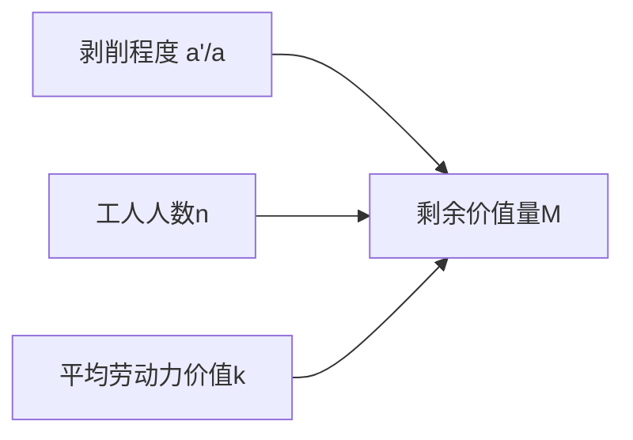

## 前置

- [[故事/资本论/工作日]]

---

上一章考察了工作日的界限。本章继续假定劳动力价值以及再生产劳动力所需的必要劳动时间是已知常量，进一步追问：资本家取得的**剩余价值量**由哪些因素决定？

## 剩余价值量的决定因素

- $M$：一个资本家取得的剩余价值总量；
- $m$：一个工人平均每天提供的剩余价值；
- $v$：购买一个劳动力每天预付的可变资本；
- $V$：预付的可变资本总额；
- $k$：一个平均劳动力的价值；
- $a'/a$：一个平均劳动力受剥削的程度，即剩余劳动与必要劳动之比；
- $n$：同时使用的工人人数。

当劳动力价值已定时，一个工人的剩余价值量由剩余价值率决定；全部工人的剩余价值量，则等于单个工人的剩余价值乘以工人人数：

$$
M=\frac{m}{v}V
$$

又因为 $v=k$、$V=kn$，并且 $m/v=a'/a$，所以：

$$
M=k\cdot\frac{a'}{a}\cdot n
$$

因此，剩余价值量由以下因素共同决定：

- 单个劳动力受剥削的程度；
- 同时受剥削的劳动力数量。

这个规律以平均劳动力价值不变为前提，并把资本家所使用的不同工人化为平均工人来考察。

在一定量剩余价值的生产中，一种因素的减少，可以由另一种因素按相同比例增加来补偿。

所以，在一定限度内，资本所能榨取的劳动供给并不直接取决于工人的供给：较少工人可以通过更长的工作日提供同量剩余劳动。

提高剩余价值率或延长工作日，不可能无限补偿工人人数的减少。因为一天最多24小时，假设再生产劳动力所需的社会必要劳动时间为$t$小时，则剩余价值率最多为 $\frac{24-t}{t}$；时间的界限，也就是资本以提高剥削程度来补偿工人人数减少的绝对界限。

当剩余价值率和劳动力价值已定时：

$$
M=m'V
$$

因此：

$$
M\propto V
$$

可变资本越大，资本推动的活劳动越多，所生产的新价值和剩余价值也越大。

## 货币转化为资本的最低限额

不是任何一个货币额或价值额都能转化为资本。货币所有者必须拥有足够的预付资本，才能既占有他人的剩余劳动，又摆脱亲自劳动的必要，并把剩余价值的一部分重新转化为资本。

假定：

- 一个工人每天需要 8 小时必要劳动来再生产自己的生活资料；
- 资本家把工作日延长到 12 小时，从每个工人处取得 4 小时剩余劳动。

| 目标                                               | 所需剩余劳动 | 所需工人人数 |
| -------------------------------------------------- | ------------ | ------------ |
| 资本家只维持与工人相同的生活                       | 8 小时       | 2 人         |
| 资本家生活比工人好一倍，并把一半剩余价值重新资本化 | 32 小时      | 8 人         |

在第一种情况下，生产目的只是维持资本家的生活，还不是财富的持续增加。第二种情况下，资本家每天消费相当于 16 小时劳动的价值；因为剩余价值的一半还要重新资本化，总剩余劳动须达到 32 小时，即需要 8 名工人各提供 4 小时剩余劳动。

因此，货币所有者只有拥有超过一定最低限额的价值额，才能真正成为资本家。这个限额：

- 随资本主义生产的发展阶段而变化；
- 在同一阶段也随各生产部门的技术条件而不同；
- 超出个人财力时，会推动国家补助和享有垄断权的公司出现，后者是现代股份公司的前驱。

中世纪行会限制每个师傅可雇用的人数，正是在阻止手工业师傅越过这一界限而变成资本家。这也说明：单纯的量变达到一定点，会转化为质的区别。

## 资本对劳动的指挥与强制

随着生产过程展开，资本家与雇佣工人的关系也发生进一步变化：

- **资本成为对劳动的指挥权**：资本家监督工人有规则地、以应有的强度工作。
- **资本成为强制关系**：它迫使工人超出维持自身生活所需的范围，提供更多劳动。
- **资本起初不必改变生产方式**：即使不改变既有的具体生产方法，也可以通过延长工作日生产剩余价值。

### 生产关系的颠倒

| 劳动过程的观点             | 价值增殖过程的观点                     |
| -------------------------- | -------------------------------------- |
| 工人使用生产资料           | 生产资料使用工人                       |
| 生产资料是活动的手段和材料 | 工人成为资本生活过程的酵母             |
| 工人加工劳动对象           | 资本借生产资料吸收活劳动               |
| 停工意味着劳动过程暂停     | 停工意味着资本不能增殖，是“纯粹的损失” |

生产资料一旦成为资本的物质形态，便表现为榨取他人劳动和剩余劳动的手段。夜间停用的熔炉、厂房和机器不能吸收活劳动，于是资本产生了要求劳动力做夜工的冲动。
