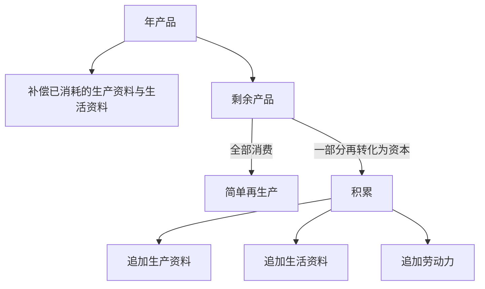

## 前置

- [[故事/资本论/简单再生产]]

---

## 积累：剩余价值再转化为资本

假定预付资本 $K$ 分成不变资本 $c$ 与可变资本 $v$，剩余价值率为 $m'$。年产品价值为 $c+v+m$，其中 $m=v\cdot m'$。剩余价值一经实现为货币，便与原预付一样，可以再分成生产资料和劳动力。

原有资本继续增殖；每一个追加资本又生产自己的追加剩余价值。循环由圆变成螺旋。

资本积累绝不是账面上数字的增加，而是物质要素与社会关系的同步再生产。剩余价值要转化为新资本，前提是上一期的剩余劳动已预先创造出追加的生产资料与生活资料；同时，资本主义体制持续把工人阶级维持在无产状态，从而确保追加劳动力的稳定供给。一旦资本将这批追加的劳动力与现成的生产资料重新融合，剩余价值向资本的转化便完成了闭环。

```mermaid
gantt
    title 原预付资本在积累中近于消失
    dateFormat X
    axisFormat %s

    section 开端
    原预付K :done, a1, 0, 4s

    section 一次积累后
    原预付K :done, a2, 0, 4s
    资本化剩余价值 :crit, b2, after a2, 2s

    section 再积累后
    原预付K :done, a3, 0, 4s
    资本化剩余价值 :crit, b3, after a3, 6s

    section 生产的巨流中
    原预付K :done, a4, 0, 4s
    资本化剩余价值 :crit, b4, after a4, 20s
```

原预付 $K$ 的来源，政治经济学还可以说成是所有者本人或其祖先的劳动。第一个追加资本却不同：它的每一个价值原子都来自别人的无酬劳动。合并追加劳动力的生产资料，以及维持这种劳动力的生活资料，都不过是资本家阶级每年从工人阶级那里夺取的贡品。

在生产的巨流中，全部原预付资本与不断资本化的剩余价值比较起来，总是一个近于消失的量。
