```mermaid
gantt
    title 工作日与价值增殖过程剖析（12小时工作日示例）
    dateFormat  X
    axisFormat  %s 小时

    section 劳动的二重作用 (同时进行)
    具体劳动：转移生产资料旧价值 (贯穿全程)       :active, p1, 0, 12s
    抽象劳动：创造新价值 (贯穿全程)               :active, p2, 0, 12s

    section 新创造价值的划分 (时间先后)
    必要劳动：补偿劳动力自身价值 (等价交换)       :done, n1, 0, 6s
    剩余劳动：形成 ΔG (被资本家无偿占有)          :crit, r1, after n1, 6s
```

## 前置

- [[故事/资本论/货币转化为资本]]

---

资本家在市场上购得物的因素与人的因素（生产资料与劳动力）后，进入生产领域消费劳动力：让工人通过劳动消费生产资料。

工人在资本家监督下劳动，劳动属于资本家；监视使劳动正常进行、生产资料合乎目的地使用。

产品是资本家的所有物。劳动力在已卖出的时间内归买者使用；劳动并入同样属于资本家的死的要素，过程是归他所有的诸物之间的过程，产品亦归他所有。

---

---

## 从价值形成到价值增殖

1. **旧价值转移，不产生 $\Delta G$**
   1. 生产资料（原料、劳动资料的消耗部分）在劳动过程中改变使用形式，并入新产品。
   2. 就其价值而言：物化在生产资料中的社会必要劳动，**原封不动转入**产品。这是价值的承担者变换，不是价值量的增殖。
   3. 因此，产品中首先含有一笔**旧价值**。旧价值的单纯转移、合并，永远不能说明 $\Delta G$。

2. **活劳动创造新价值**
   1. 同一劳动过程有两个侧面：作为劳动过程，它是生产使用价值的有用劳动；作为价值形成过程，它只表现为劳动力在社会必要时间内的耗费。
   2. 活劳动不断由运动形式转为物的形式，把新的劳动时间凝结进产品。过去劳动与现在劳动在价值上无质的差别，只计量量。
   3. 故产品价值 $=$ 转入的旧价值 $+$ 活劳动新创造的价值。

3. **矛盾？**
   1. 假定流通中一切按价值进行：生产资料按其价值购入，劳动力亦按其价值购入（劳动力价值 $=$ 再生产劳动力所需生活资料的价值）。
   2. 若工人劳动的时间长度，恰好使新创造的价值等于劳动力价值，则：
      - 新价值补偿了购买劳动力的预付；
      - 旧价值补偿了购买生产资料的预付；
      - 产品价值 $=$ 预付价值总和，$\Delta G=0$。

4. **劳动力的价值与使用价值是两个量**
   1. 劳动力作为商品：
      - **价值**（交换价值）：由再生产它所必需的劳动时间决定；
      - **使用价值**：在已卖出的时限内所能提供的活劳动
   2. 二者不必相等。卖者实现劳动力的交换价值而让渡其使用价值，并不违反商品交换规律；买者支付日价值，即取得一天劳动的使用权。
   3. 因而价值形成可以超过补偿点：补偿劳动力价值之后的延长部分，形成 $\Delta G$，并随产品归资本家所有而被无偿占有。超过该点的价值形成过程，即是**价值增殖过程**；$G \to G'$ 在此完成。
   4. 全程仍可等价交换：按价值购买生产要素，按价值出售产品。增殖以流通为媒介（须在市场上购得劳动力），却在生产领域中进行。
