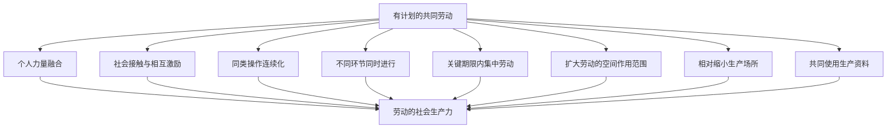
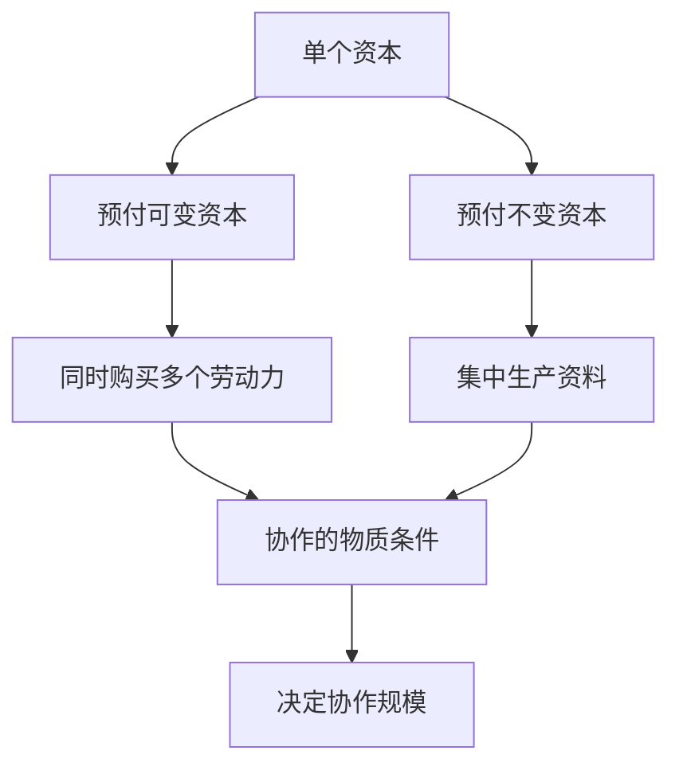
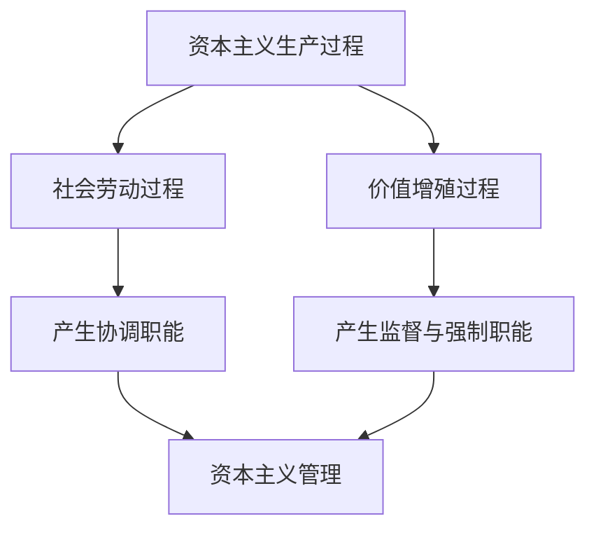

## 前置

- [[故事/资本论/相对剩余价值的概念]]

---

资本主义生产在同一资本同时雇用较多工人时真正开始。劳动者在同一资本的指挥下进入共同的劳动过程，生产规模随之扩大。最初看起来，这只是分散劳动在数量上的集中；但这种集中很快产生个人劳动所没有的社会生产力。

## 资本主义生产的起点

在资本主义协作的初始形态中：

- 多个工人在同一时间进入生产过程；
- 他们的劳动力由同一资本购买；
- 他们在同一资本的计划和指挥下劳动；
- 分散的个人劳动过程被纳入一个共同劳动过程。

从生产方法本身看，这一阶段未必立刻出现明显变化，原有劳动过程只是扩大了规模。但是，同一资本对多个劳动力的同时使用，已经构成资本主义生产在历史上和逻辑上的起点。

## 总工作日与社会平均劳动

设：

- $n$：同一资本同时使用的工人人数；
- $T$：一个工人的工作日；
- $T_c$：全部工人形成的总工作日。

则：

$$
T_c=nT
$$

就价值生产而言，总工作日首先只是各个工作日的总和。工人人数的增加本身不会改变剩余价值率；在劳动条件相同的情况下，剩余价值量仍由单个工人的剩余价值乘以工人人数决定。

但是，物化为价值的劳动不是某个工人的特殊劳动，而是社会平均劳动。个别工人的能力、速度和熟练程度会偏离平均水平；当同一资本同时使用较多工人时，这些偏差更容易在总工作日中相互抵销。

因此，集中使用多个劳动力使单个资本能够更稳定地推动社会平均劳动。价值规律和一般剩余价值率不再依赖某个工人是否恰好达到平均水平，而是在结合工作日中得到更可靠的实现。

## 共同使用生产资料

即使劳动方式不变，工人的集中也会改变劳动过程的物质条件。部分生产资料不再由分散的劳动者分别使用，而是由多人共同消费。

共同使用带来的节约，不是生产资料在交换中凭空增加价值，而是它们的使用价值得到更充分的利用：

- 共同设施的规模扩大，但其价值通常不会按作用范围同比增加；
- 生产资料转移的总价值分摊到更多产品上；
- 单位产品承担的不变资本价值减少；
- 商品单位价值因而下降。

设共同生产资料在一定期间转移的价值为 $C_f$，产品总量为 $Q$，则单位产品分担的价值为：

$$
c_u=\frac{C_f}{Q}
$$

当共同使用生产资料使 $Q$ 增加，而 $C_f$ 不按同一比例增加时，$c_u$ 就会下降。

这种节约一方面可能通过必要生活资料变便宜而降低劳动力价值；另一方面也会改变剩余价值同全部预付资本的比例。后一问题属于利润率分析，这里不展开。

## 协作与结合劳动的生产力

**协作**是许多人在同一生产过程中，或在不同但相互联系的生产过程中，有计划地共同劳动。

协作的结果不是个人力量的简单相加。结合劳动能够形成一种只有共同劳动才会出现的集体力，即**劳动的社会生产力**。

### 结合工作日的效果

| 协作机制   | 对劳动过程的作用                               |
| ---------- | ---------------------------------------------- |
| 力量融合   | 完成个人无法完成或只能低效完成的共同任务       |
| 社会接触   | 激发竞争心和精力，提高个人活动效率             |
| 操作连续化 | 使劳动对象更快地通过相互衔接的阶段             |
| 操作同时化 | 让不同环节并行，缩短总产品的完成时间           |
| 劳动集中   | 在由生产对象规定的期限内投入足够劳动           |
| 空间扩展   | 同时作用于范围更大的劳动对象                   |
| 空间收缩   | 集中劳动者、生产过程和生产资料，减少非生产费用 |
| 资料共用   | 降低单位产品分担的生产资料价值                 |

在这些情况下，结合工作日能生产比分散工作日总和更多的使用价值，或者以更少的劳动时间达到同样效果。劳动者通过有计划的共同活动突破个人局限，发挥出社会成员之间相互结合的能力。

## 协作的物质条件

劳动者只有在一起才能直接协作。在资本主义条件下，把他们集合起来的前提，是同一资本预先购买他们的劳动力，并提供共同使用的生产资料。

协作规模因此受两方面制约：

- 资本能够同时购买多少劳动力；
- 资本能够集中多少共同生产资料。

## 资本指挥的二重性

共同劳动需要协调。随着协作规模扩大，指挥、监督和调节成为劳动过程正常进行的必要条件。但在资本主义生产中，管理不仅服务于共同劳动，也服务于价值增殖。

| 管理的方面       | 产生原因                         | 主要职能                                       |
| ---------------- | -------------------------------- | ---------------------------------------------- |
| 一般管理职能     | 共同劳动需要协调                 | 统一计划、衔接活动、执行总体运动所需的公共职能 |
| 资本主义管理职能 | 劳动从属于资本并以价值增殖为目的 | 强化劳动、监督生产资料使用、压制劳动者反抗     |

资本主义管理的内容具有二重性，因为它所管理的过程本身也是二重的：

- 它是生产使用价值的社会劳动过程；
- 它是生产剩余价值的价值增殖过程。

这两种职能结合在资本的权威中，使资本主义管理在形式上具有专制性。随着协作规模扩大，资本家会把直接监督交给专门的管理人员，形成代表资本执行命令的管理层级。

资本家并不是因为承担一般协调职能才成为资本家；相反，因为生产资料和劳动力已经从属于资本，生产过程的最高指挥权才表现为资本的属性。

## 社会生产力为何表现为资本生产力

工人在市场上分别出售的是个人劳动力。资本支付的是各个劳动力的价值，而不是协作后形成的集体力的价值。

工人之间的职能联系只在他们进入生产过程后形成。此时，他们的劳动已经属于资本，劳动的统一表现为：

- 在观念上，是资本家的计划；
- 在实践中，是资本家的权威；
- 在结果上，是资本支配的总体生产力。

协作产生的社会生产力不需要资本额外支付报酬，却只能在资本建立的共同劳动条件中发挥出来。因此，它看起来不是劳动者结合产生的力量，而像是资本天然具有的生产力。

这里发生了关系的颠倒：资本只是把劳动者置于共同劳动的条件中，劳动者自己产生的社会力量却作为资本的力量同他们相对立。

## 协作的不同历史形式

协作并非资本主义独有。不同社会关系可以形成不同的协作形式：

| 协作形式     | 生产条件             | 劳动者之间的关系                   |
| ------------ | -------------------- | ---------------------------------- |
| 共同体协作   | 生产条件共同占有     | 个人尚未脱离共同体联系             |
| 强制协作     | 生产条件集中于统治者 | 以直接统治和人身从属为基础         |
| 资本主义协作 | 生产资料归资本所有   | 自由工人分别出售劳动力后被资本结合 |

资本主义协作的特殊性，不在于人们第一次共同劳动，而在于共同劳动以自由雇佣工人同资本之间的交换关系为前提。劳动者在流通中彼此独立，在生产中却作为总体劳动者的组成部分从属于资本。

## 协作的基本地位

资本主义协作是劳动过程隶属于资本后发生的首次现实变化。它使劳动过程从个人过程转化为社会过程，同时也使这种社会形式成为资本提高生产力、扩大剩余价值生产的方法。

简单协作未必构成一个独立的历史发展阶段。它可以存在于早期的大规模生产中，也可以与更复杂的分工和机器体系并存。但是，无论后来采用何种更发达的形式，生产都离不开劳动者之间的结合。

因此，协作始终是资本主义生产方式的基本形式。
