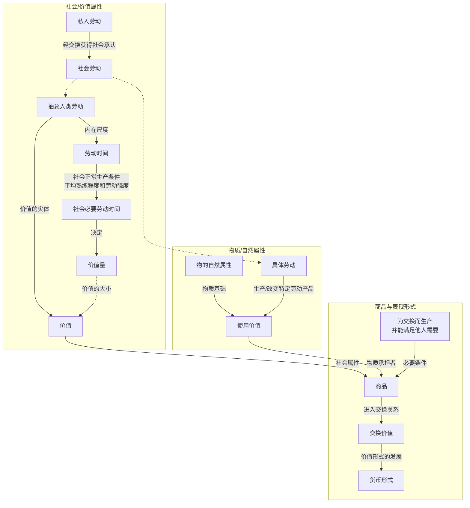

---

- **使用价值**：物的有用性，即一个外界对象依靠自身属性满足人的某种需要（无论是生活资料还是生产资料，无论是物质需要还是精神需要）的属性。它以物的自然属性为基础；对于劳动产品，具体劳动生产、改变或实现其特定的使用价值。
- **具体劳动**：在特殊的、具体的生产形式下进行的有用劳动（如木匠劳动、瓦匠劳动、纺纱劳动），它生产特定的使用价值。
- **抽象人类劳动**：商品生产者的具体劳动在交换关系中撇开其有用形式和差别，被还原为无差别的一般人类劳动。
- **劳动的二重性**：
  - 从劳动的特殊形式和有用效果看，是具体劳动，回答“怎样劳动、什么劳动”，形成使用价值；
  - 从无差别的人类劳动力耗费看，是抽象劳动，回答“劳动多少、劳动多久”，形成价值；
- **简单劳动**：一定社会中，每个没有专长的普通人平均具有的劳动力的耗费。其具体标准随国家和时代而变化，但在特定社会中是既定的。
- **复杂劳动**：经过训练、具有较高技能的劳动力的耗费，在价值形成中表现为自乘的或多倍的简单劳动。复杂劳动折算为简单劳动的比例，由生产者背后的社会过程决定。
- **价值**：凝结在商品中的、作为抽象人类劳动而存在的社会劳动。
- **价值量**：商品所包含的社会必要劳动量，其尺度是社会必要劳动时间。
- **交换价值**：一种使用价值同另一种使用价值相交换的量的关系或比例。
- **商品**：为交换而生产的、能够满足他人或社会需要的劳动产品。
  * **判定条件**：
    * 必须具有使用价值；
    * 必须是人类劳动的产品；
    * 必须以交换为目的而生产。
- **社会必要劳动时间**：在现有的社会正常生产条件下，在社会平均的劳动熟练程度和劳动强度下，制造某种使用价值所需要的劳动时间。
- **私人劳动与社会劳动**：商品生产者的劳动直接表现为私人劳动，只有其产品通过交换得到社会承认，这种劳动才被证明是社会总劳动的一部分。
- **(劳动)生产力**：劳动者生产使用价值的能力，通常表现为单位时间内生产的使用价值数量。它由工人的平均熟练程度、科学技术发展与应用水平、生产组织和自然条件等多种因素决定。

$$
\text{单位商品价值量} \propto \text{社会必要劳动时间} \propto \frac{1}{\text{社会劳动生产力}}
$$

$$
\text{一定劳动所新创造的价值量} \propto \text{社会承认的劳动时间} \times \text{相对劳动强度} \times \text{复杂劳动折算倍数}
$$

$$
\text{劳动生产力提高}
\Rightarrow
\begin{cases}
\text{同一时间生产的使用价值量增加} \\
\text{单位商品价值量下降} \\
\text{同一时间新创造的价值量不变}
\end{cases}
$$

$$
\text{复杂劳动}=\text{简单劳动}\times\text{社会确定的折算倍数}
$$

