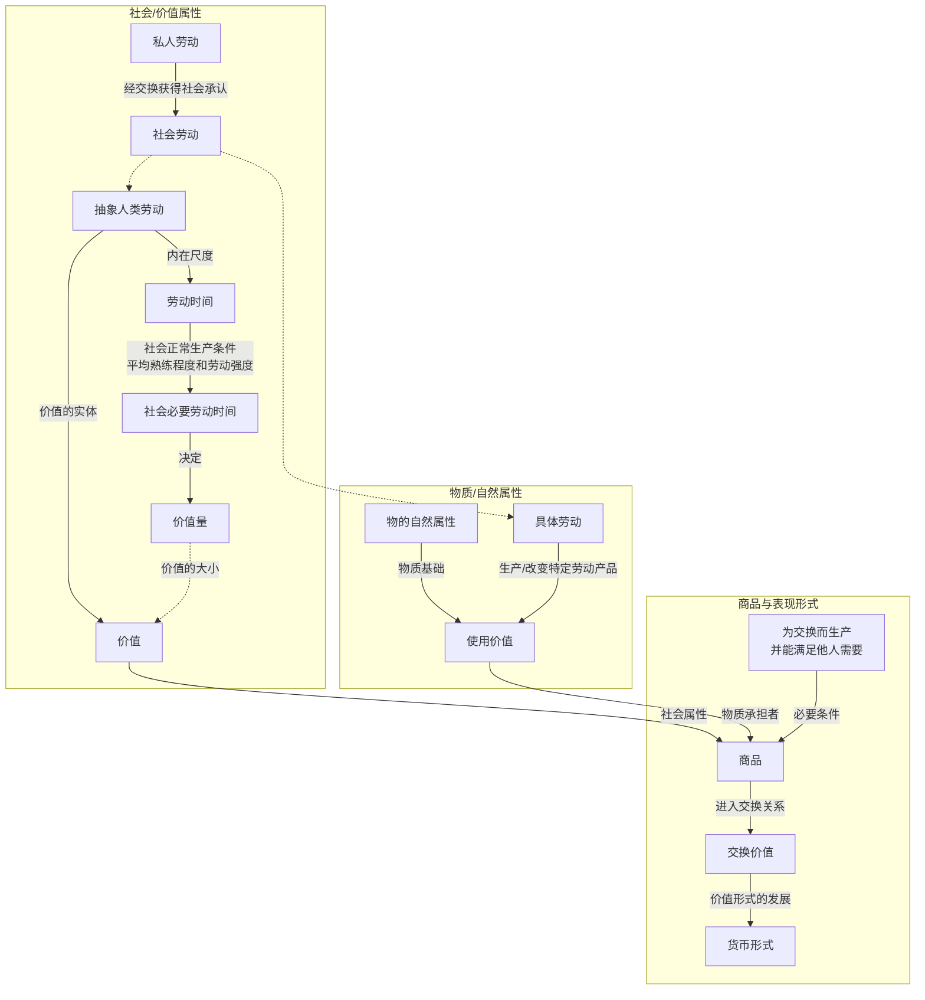
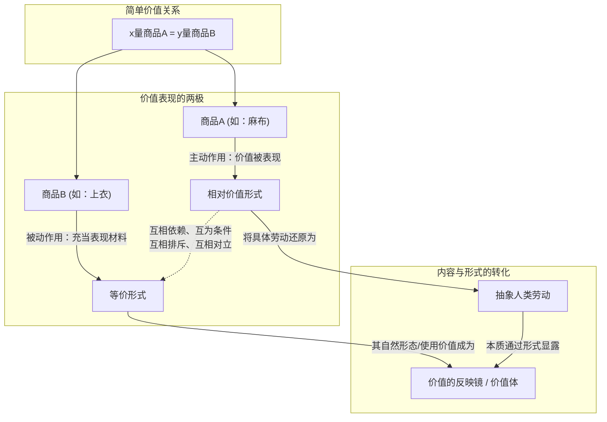

- **使用价值**：物的有用性，即一个外界对象依靠自身属性满足人的某种需要（无论是生活资料还是生产资料，无论是物质需要还是精神需要）的属性。它以物的自然属性为基础；对于劳动产品，具体劳动生产、改变或实现其特定的使用价值。
- **具体劳动**：在特殊的、具体的生产形式下进行的有用劳动（如木匠劳动、瓦匠劳动、纺纱劳动），它生产特定的使用价值。
- **抽象人类劳动**：商品生产者的具体劳动在交换关系中撇开其有用形式和差别，被还原为无差别的一般人类劳动。
- **劳动的二重性**：
  - 从劳动的特殊形式和有用效果看，是具体劳动，回答“怎样劳动、什么劳动”，形成使用价值；
  - 从无差别的人类劳动力耗费看，是抽象劳动，回答“劳动多少、劳动多久”，形成价值；
- **简单劳动**：一定社会中，每个没有专长的普通人平均具有的劳动力的耗费。其具体标准随国家和时代而变化，但在特定社会中是既定的。
- **复杂劳动**：经过训练、具有较高技能的劳动力的耗费，在价值形成中表现为自乘的或多倍的简单劳动。复杂劳动折算为简单劳动的比例，由生产者背后的社会过程决定。
- **价值**：凝结在商品中的、作为抽象人类劳动而存在的社会劳动。
- **价值量**：商品所包含的社会必要劳动量，其尺度是社会必要劳动时间。
- **交换价值**：一种使用价值同另一种使用价值相交换的量的关系或比例。
- **商品**：为交换而生产的、能够满足他人或社会需要的劳动产品。
  - **判定条件**：
    - 必须具有使用价值；
    - 必须是人类劳动的产品；
    - 必须以交换为目的而生产。
- **社会必要劳动时间**：在现有的社会正常生产条件下，在社会平均的劳动熟练程度和劳动强度下，制造某种使用价值所需要的劳动时间。
- **私人劳动与社会劳动**：商品生产者的劳动直接表现为私人劳动，只有其产品通过交换得到社会承认，这种劳动才被证明是社会总劳动的一部分。
- **(劳动)生产力**：劳动者生产使用价值的能力，通常表现为单位时间内生产的使用价值数量。它由工人的平均熟练程度、科学技术发展与应用水平、生产组织和自然条件等多种因素决定。

$$
\text{单位商品价值量} \propto \text{社会必要劳动时间} \propto \frac{1}{\text{社会劳动生产力}}
$$

$$
\text{一定劳动所新创造的价值量} \propto \text{社会承认的劳动时间} \times \text{相对劳动强度} \times \text{复杂劳动折算倍数}
$$

$$
\text{劳动生产力提高}
\Rightarrow
\begin{cases}
\text{同一时间生产的使用价值量增加} \\
\text{单位商品价值量下降} \\
\text{同一时间新创造的价值量不变}
\end{cases}
$$

$$
\text{复杂劳动}=\text{简单劳动}\times\text{社会确定的折算倍数}
$$

---

---

- **简单的、个别的或偶然的价值形式**：一个商品的价值简单地通过另一个不同种商品表现出来的关系。其基本公式为：x量商品A = y量商品B（例如：20码麻布 = 1件上衣）。
- **价值表现的两极**：指在价值表达式中分处两端、承担不同功能的两种商品形式，即相对价值形式和等价形式。这两极是同一价值表现中互相依赖、互为条件的两个要素，同时也是互相排斥、互相对立的两端。同一个商品在同一个价值表现中，不能同时具有这两种形式。
- **相对价值形式**：在价值关系中起主动作用、其自身价值需要通过另一种商品来表现的商品所处的形式（如等式中的商品A/麻布）。
- **等价形式**：当一个商品（如商品B/上衣）充当另一个商品（如商品A/麻布）价值表现的材料时，它所取得的特殊形式。它表现为能与另一个商品直接交换。在价值关系中起被动作用、不表现自身价值，而是作为“价值体”或等价物。

1. **地位决定形式**：一个商品究竟处于相对价值形式还是等价形式，完全取决于它当时在价值表现中所处的地位（是价值被表现的商品，还是表现价值的商品）。
2. **价值形式的内容**：在价值关系中，两种不同的商品被看作质上等同的“价值物”。这种等价表现实际上撇开了两种劳动的具体形式（如织与缝），把不同种商品所包含的劳动还原为它们的共同属性，即抽象人类劳动。
3. **形式的借用与转化**：处于等价形式的商品（商品B），其具体的自然形式（使用价值）成为了处于相对价值形式的商品（商品A）的价值表现形式。即商品B的物体成了反映商品A价值的镜子。
4. **相对价值的量的规定性**：价值形式不仅表现价值的质，还要表现一定量的价值（价值量）。商品A的相对价值量受商品A自身价值量和充当等价物的商品B价值量变化的双重影响。
   设 $V_A$ 为商品A（处于相对价值形式）的价值量，$V_B$ 为商品B（处于等价形式）的价值量，$RV_A$ 为商品A表现在商品B上的相对价值量。
   $$ RV_A \propto V_A \quad (\text{当} \ V_B \ \text{保持不变时}) $$
    $$ RV_A \propto \frac{1}{V_B} \quad (\text{当} \ V_A \ \text{保持不变时}) $$
    $$ V_A \ \text{与} \ V_B \ \text{按同方向同比例变动} \Rightarrow RV_A \ \text{保持不变} $$
   - **结论**：商品价值量的实际变化不能明确地、完全地反映在其相对价值量上。价值不变时相对价值可能变化，价值变化时相对价值可能不变。

5. **等价形式的三个特点**：
   1. **使用价值成为它的对立面即价值的表现形式**：商品的自然形式（如上衣、铁、小麦）直接变成了价值的化身，成为反映其他商品价值的“镜子”。
   2. **具体劳动成为它的对立面即抽象人类劳动的表现形式**：生产等价物的具体有用劳动（如缝衣服的缝劳动），不表现为造衣的特定用途，而直接表现为无差别的人类劳动的凝结。
   3. **私人劳动成为它的对立面的形式，成为直接社会形式的劳动**：等价物的生产虽然是生产者个人的私人劳动，但由于它直接与别的商品相交换，因此在形式上直接表现为社会总劳动的一部分。
6. 商品中潜藏的“使用价值”和“价值”的内部对立，通过两个商品的关系表现为外部对立——价值被表现的商品（商品A）直接当作使用价值，而表现价值的商品（商品B）直接当作交换价值。
7. 简单价值形式的局限性：它只使商品A的价值同某一种与它不同的商品（如上衣）发生交换关系，而未能表现它同其他一切商品的质的等同和量的比例。

---

- **总和的或扩大的价值形式**：一种商品的价值不再仅仅表现在单一的另一种商品上，而是表现在商品世界的无数其他元素上（例如：20码麻布 = 1件上衣，或 = 10磅茶叶，或 = 40磅咖啡……）。
  - **特点**：商品的价值真正表现为无差别人类劳动的凝结；由单个商品所有者之间的偶然关系过渡到由商品的价值量调节交换比例；但其缺点是表现永无止境、杂乱无章，人类劳动尚未获得统一的表现形式。

- **一般价值形式**：将扩大的价值形式“倒转过来”，使商品世界的一切商品都用同一种商品（如麻布）来表现自己的价值。
- **特点**：
  1. **简单与统一**：一切商品的价值都表现在唯一的、共同的商品上。
  2. **社会公认**：一般价值形式的出现是商品世界共同活动的结果，反映了价值对象性的“社会存在”。
  3. **价值量可比**：不同商品通过同一个材料反映自身价值，从而使不同商品在量上可以直接相互比较（如 10磅茶叶 = 20码麻布，40磅咖啡 = 20码麻布 $\Rightarrow$ 10磅茶叶 = 40磅咖啡）。
- **货币形式**：
  - **起源与过渡**：当一般等价形式在历史过程中最终与某种特殊的商品（如金）的自然形式社会地结合在一起时，这种特殊商品就成了货币商品。
- **价格形式**：一种商品（如麻布）在已经执行货币商品职能的商品（如金）上的简单相对价值表现（例如：$20码麻布 = 2盎斯金 = 2镑$）。

1. 充当一般等价物的商品不能同时具有统一的、一般的相对价值形式（否则会陷入同义反复，如 20码麻布 = 20码麻布），其相对价值只能表现在其他一切商品体的无限系列上（即扩大的相对价值形式表现为等价物商品特有的形式）。
2. 商品的拜物教性质：劳动产品一采取商品形式，就具有了谜一般的性质。它在人们面前把人们本身劳动的社会性质反映成劳动产品本身的物的性质（反映成这些物的天然社会属性），从而把生产者同总劳动的社会关系反映成存在于生产者之外的物与物之间的社会关系。
3. 拜物教产生的根源：
   1. 商品生产者彼此独立进行私人劳动，他们的社会联系唯有通过“交换”才能建立。
   2. 私人劳动要证实为社会总劳动的一部分，其社会有用性和劳动相等性，只能在实际交易中通过产品必须有用、产品具有共同价值性质的形式反映出来。
   3. 这种客观形式使人们的社会关系披上了物与物关系的外衣，使人手产物表现为独立存在、互有关系的“宗教世界的幻境”。
