## 前置

- [[故事/资本论/剩余价值率]]

## 工作日的界限

设：

- $T$：工作日总长度；
- $t_n$：必要劳动时间，即再生产劳动力日价值所需的时间；
- $t_s$：剩余劳动时间，即超过必要劳动时间后为资本家劳动的时间。

则：

$$
T=t_n+t_s
$$

在劳动力价值既定时，$t_n$ 是已定量；$t_s$ 则可以延长或缩短。因此，工作日是一个**可以确定、但本身不定的量**。

假定必要劳动时间为 6 小时：

| 工作日 | 必要劳动 $t_n$ | 剩余劳动 $t_s$ | 总长度 $T$ | 剩余价值率 $m'$ |
| ------ | -------------- | -------------- | ---------- | --------------- |
| I      | 6 小时         | 1 小时         | 7 小时     | $16\%$          |
| II     | 6 小时         | 3 小时         | 9 小时     | $50\%$          |
| III    | 6 小时         | 6 小时         | 12 小时    | $100\%$         |

```mermaid
gantt
    title 必要劳动相同而工作日长度不同
    dateFormat X
    axisFormat %s小时

    section 7小时工作日
    必要劳动 :done, a1, 0, 6s
    剩余劳动 :crit, b1, after a1, 1s

    section 9小时工作日
    必要劳动 :done, a2, 0, 6s
    剩余劳动 :crit, b2, after a2, 3s

    section 12小时工作日
    必要劳动 :done, a3, 0, 6s
    剩余劳动 :crit, b3, after a3, 6s
```

### 最低界限与最高界限

- **最低界限**：若 $t_s=0$，工作日只包含维持工人自身所需的必要劳动。但在资本主义生产方式下，剩余价值是生产的直接目的，工作日不会实际缩短到这一点。
- **身体界限**：一个自然日内必须留下睡眠、进食、清洁和恢复体力的时间，劳动力不能无限耗费。
- **道德界限**：工人还需要受教育、发展智力、履行社会职能、交往以及支配自己生活的时间。这个界限取决于社会的一般文化状况。

身体界限和道德界限都有很大的伸缩性，所以它们不能自行给出一个精确的正常工作日。

### 商品交换中的二律背反

资本家和工人都能以商品交换规律为自己的要求辩护：

| 资本家作为买者                           | 工人作为卖者                                 |
| ---------------------------------------- | -------------------------------------------- |
| 已按日价值购买劳动力，有权消费其使用价值 | 劳动力是自己唯一的商品，必须维持其正常再生产 |
| 要在一天内取得尽可能多的劳动             | 要防止一天的使用耗尽多天才能恢复的劳动力     |
| 要尽量延长剩余劳动时间                   | 要把工作日限制在正常量内                     |

假定一个工人在正常耗费下可以劳动 30 年，劳动力每日折旧为：

$$
\frac{1}{365\times30}=\frac{1}{10950}
$$

若资本把同一劳动力在 10 年内耗尽，每天实际消费的是：

$$
\frac{1}{365\times10}=\frac{1}{3650}
$$

这等于正常日耗费的 3 倍。若仍只支付原来的日价值，就只支付了实际耗费的 $\frac{1}{3}$。所以，使用劳动力与劫掠劳动力并不是同一回事。

商品交换规律既承认买者使用商品的权利，也承认卖者取得商品价值的权利，却没有规定工作日的具体长度。于是，权利同权利相对抗；在平等的权利之间，力量起决定作用。正常工作日的确立因此表现为资本家阶级与工人阶级之间的斗争。

## 对剩余劳动的贪欲

资本没有发明剩余劳动。只要一部分人垄断生产资料，直接生产者就必须在维持自身所需的劳动以外，为生产资料所有者提供剩余劳动。

- 当生产主要为了使用价值时，剩余劳动通常受所有者需求范围的限制。
- 当生产服从交换价值和世界市场时，生产的目的变成价值增殖，对剩余劳动的追求就趋于无限。
- 因此，奴隶制或徭役制社会一旦卷入资本主义世界市场，也会在原有强制之上叠加过度劳动。

### 徭役劳动与雇佣劳动

|              | 徭役劳动                         | 雇佣劳动                         |
| ------------ | -------------------------------- | -------------------------------- |
| 必要劳动     | 在自己的土地上进行               | 与剩余劳动融合在同一工作日中     |
| 剩余劳动     | 在领主土地上进行，空间上清楚分开 | 表面上只是工作日的一部分         |
| 无偿劳动形式 | 直接表现为替领主劳动若干天       | 隐蔽在工资形式和连续劳动时间之中 |
| 贪欲的表现   | 增加徭役天数                     | 无限延长工作日                   |
