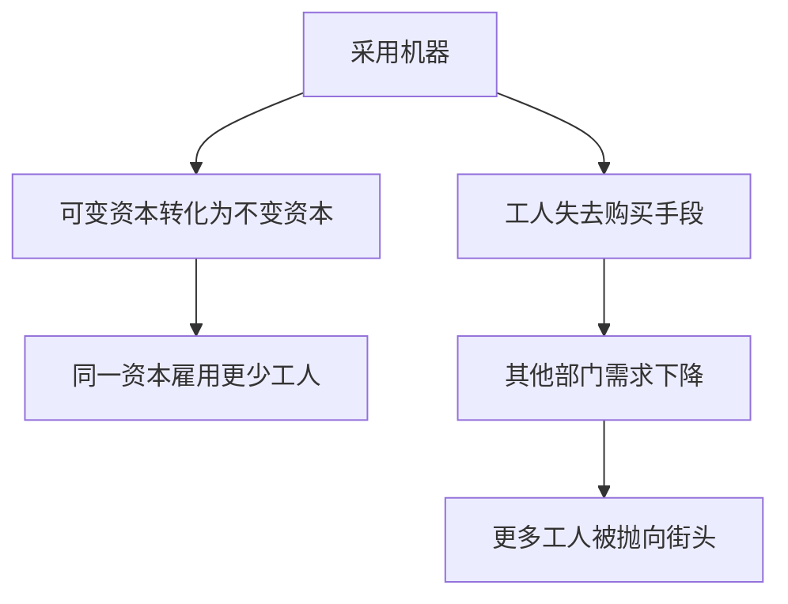

## 前置

- [[故事/资本论/分工和工场手工业]]

---

## 机器的发展

### 机器的三个组成部分

发达的机器由三个本质上不同的部分组成：

- **发动机**：产生动力，或接受水、风等现成自然力的推动；
- **传动机构**：调节、分配并传送运动；
- **工具机或工作机**：抓住劳动对象，并按一定目的改变它。

### 机器的应用条件

如果生产一台机器所费的劳动，与使用该机器所节省的劳动相等，那就只是劳动的变换，生产力并没有提高。机器的生产率，由它代替人类劳动力的程度来衡量。

设生产机器所费劳动为 $L_m$，它所代替的劳动为 $L_a$，社会地使用机器的界限是：

$$
L_m < L_a
$$

对资本说来，这个界限更窄。资本支付的不是所使用的劳动，而是劳动力的价值。因此，只有在机器的价值 $M$ 小于它所代替的劳动力价值 $V_a$ 时，资本才会使用机器：

$$
M < V_a
$$

## 机器生产对工人的直接影响

### 妇女劳动和儿童劳动

机器使肌肉力成为多余，于是资本主义使用机器的第一个口号，就是妇女劳动和儿童劳动。代替劳动的手段，立即变成使工人家庭全体成员都受资本直接统治的手段。

劳动力的价值本来决定于维持工人家庭所必需的劳动时间。机器把全家人抛到劳动市场上，就把男劳动力的价值分摊到全家人身上。购买一家几个劳动力，也许比以前购买家长一个劳动力花费更多，但现在多个工作日代替原来的一个工作日，劳动力价格下降，一家人必须提供更多剩余劳动。机器在扩大剥削材料的同时，也提高了剥削程度。

### 工作日的延长

延长工作日的动机：

- 机器执行职能的时间越长，分担其价值的产品量越大，加到单个商品上的价值越小；
- 有形损耗既来自使用，也来自闲置；延长使用可以减少后一种损耗；
- 更好或更便宜的机器一经出现，原有机器就会遭受无形损耗；工作日越长，总价值的再生产越快，这种危险越小；
- 延长工作日可以扩大生产规模，而不必把投在机器和厂房上的资本增加一倍。

### 劳动的强化

工作日的延长威胁到社会的生命根源时，会引起法律的限制。一旦剩余价值不能再靠延长工作日来增加，资本就加快发展机器体系，并改变相对剩余价值的性质：它不仅靠提高生产力使商品便宜，还迫使工人在同样时间内增加劳动消耗，使劳动凝缩。

劳动强化主要通过两种方法达到：

- 提高机器的速度；
- 扩大同一个工人看管的机器数量。

## 对补偿理论的批判

资产阶级经济学断言，排挤工人的机器总是同时游离出相应的资本，去如数雇用这些被排挤的工人。这个补偿理论包含三层谬论：

1. **可变资本被游离，会如数再雇工人。** 资本家解雇一部分工人，用相应的资本购买机器。这时可变资本不是被游离出来，而是转化为不再同劳动力相交换的不变资本。机器每改良一次，这笔资本雇用的工人就再减少一次。即使制造新机器会雇用一些机械工人，人数在最好的情况下也少于被排挤的工人；机器一经制成，在报废以前并不需要不断更新。
2. **工人的生活资料被游离，会变成他们的就业基金。** 这些生活资料从来不是同被解雇工人对立的资本，而是他们用工资购买的商品。机器切断的是购买手段，使他们从买者变成非买者。若减少了的需求得不到补偿，生产这些生活资料的部门也会解雇工人。机器因此不仅在采用它的部门，而且在没有采用它的部门把工人抛向街头。
3. **被抛出的工人迟早会在别处与资本重新会合。** 即使他们在另一部门找到职业，媒介也是新追加的资本，而不是已经转化成机器的旧资本。由于分工而变得畸形的劳动力，离开原来的劳动范围就不值钱，往往只能进入人员充斥、工资微薄的低级部门。

机器本身对于把工人从生活资料中游离出来没有责任。同机器的资本主义应用不可分离的矛盾，不是从机器本身产生的：

| 机器本身         | 机器的资本主义应用 |
| ---------------- | ------------------ |
| 缩短劳动时间     | 延长工作日         |
| 减轻劳动         | 提高劳动强度       |
| 人对自然力的胜利 | 人受自然力奴役     |
| 增加生产者的财富 | 使生产者变成贫民   |

## 性质

1. **工厂对工人等级制度的的影响**: 使用劳动工具的技巧，同劳动工具一起转到了机器上面。工场手工业专业工人的等级制度趋于消失，代之而起的主要是年龄和性别的自然差别。工厂里重新出现的分工，首先是把工人分配到各种专门机器上去。重大差别存在于实际操作工作机的工人和单纯下手之间；此外还有少数检查和修理机器的人员，他们不属于工厂工人的范围。
2. **工人和机器之间的斗争**: 劳动资料一作为机器出现，立刻就成了工人本身的竞争者。分工使劳动力片面化，只具有操纵局部工具的特定技能；一旦工具由机器来操纵，劳动力的交换价值就随同它的使用价值一起消失。一部分工人被变成过剩人口：他们或者在力量悬殊的斗争中毁灭，或者涌向较易进入的部门，把劳动力价格压到价值以下。
3. **国际分工**: 一旦工厂制度达到一定广度和成熟程度，特别是一旦机器本身也用机器来生产，这种生产方式就获得一种突然跳跃式扩展的能力，只有原料和销售市场才是它的限制。机器产品的便宜和交通运输的变革，成为夺取国外市场的武器，并迫使这些市场变成原料产地。一种新的国际分工由此产生：地球的一部分成为主要从事农业的生产地区，以服务于另一部分主要从事工业的生产地区。
4. **廉价劳动**: 机器生产的原则是把生产过程分解为各个组成阶段，并应用自然科学来解决问题。只要可行，分工的计划总是把基点放在妇女劳动、儿童劳动和非熟练劳动上，也就是放在“廉价劳动”上。
