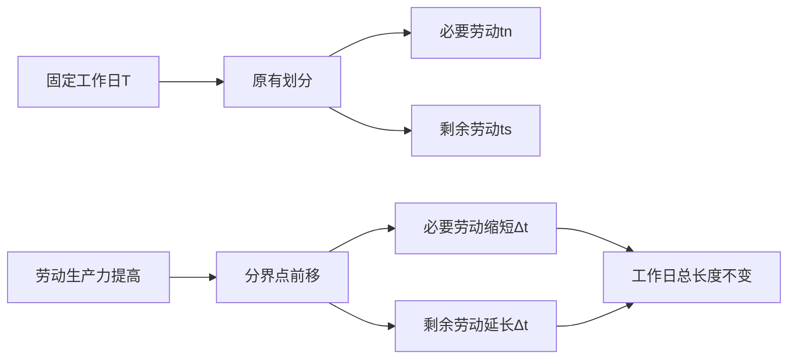
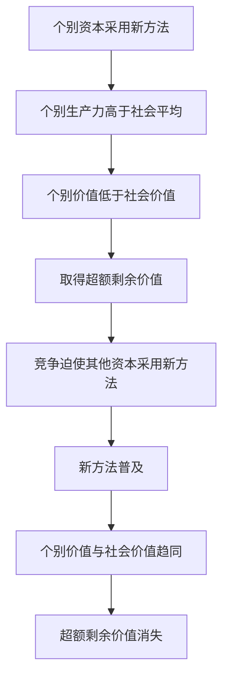

## 前置

- [[故事/资本论/剩余价值率和剩余价值量]]

---

此前对剩余价值的考察，把必要劳动时间看作已定量，通过延长工作日来增加剩余劳动。本章改变问题的条件：如果工作日总长度不变，资本怎样增加剩余价值？

## 固定工作日内重新划分劳动时间

设：

- $T$：工作日总长度；
- $t_n$：必要劳动时间，即再生产劳动力价值所需的时间；
- $t_s$：剩余劳动时间；
- $\Delta t$：必要劳动时间缩短的量。

工作日由必要劳动与剩余劳动组成：

$$
T=t_n+t_s
$$

当 $T$ 不变时，剩余劳动不能越过工作日的终点继续延长。它只能把必要劳动的一部分转化为剩余劳动：

$$
t_n'=t_n-\Delta t
$$

$$
t_s'=t_s+\Delta t
$$

因此：

$$
t_n'+t_s'=T
$$

改变的不是工作日的长度，而是必要劳动和剩余劳动在工作日中所占的比例。

## 为什么不能靠压低工资

劳动力价值由再生产劳动力所必需的劳动时间决定。若资本把工资压到劳动力价值以下，工人能够支配的生活资料就会减少，劳动力只能得到萎缩的再生产。

这种做法在现实工资运动中十分重要，但不属于这里所讨论的机制。本章继续假定包括劳动力在内的一切商品都按其价值买卖。因此：

- 工资低于劳动力价值，只是资本少支付了一部分既定价值；
- 劳动力价值真正降低，意味着再生产同样劳动力所需的社会必要劳动时间减少；
- 固定工作日内的剩余劳动增加，必须来自必要劳动时间的真实缩短。

## 绝对剩余价值与相对剩余价值

| 比较             | 绝对剩余价值         | 相对剩余价值                     |
| ---------------- | -------------------- | -------------------------------- |
| 工作日总长度     | 延长                 | 保持不变                         |
| 必要劳动时间     | 可以视为不变         | 缩短                             |
| 剩余劳动增加方式 | 向工作日终点以外延伸 | 把必要劳动的一部分转化为剩余劳动 |
| 对生产方式的要求 | 可以沿用既有生产方式 | 必须提高劳动生产力               |
| 直接手段         | 延长劳动持续时间     | 改变工作日内部比例               |

**绝对剩余价值**是通过延长工作日生产的剩余价值；**相对剩余价值**是通过缩短必要劳动时间、相应延长剩余劳动时间生产的剩余价值。

## 生产力如何降低劳动力价值

在劳动力按价值买卖的前提下，必要劳动时间只有通过劳动力价值下降才能缩短。劳动力价值又取决于再生产劳动力所需生活资料的价值。

因此，相对剩余价值的生产要求劳动过程的技术条件或社会条件发生变化：

提高劳动生产力，意味着生产同量使用价值所需的社会必要劳动时间减少，或者同量劳动能够生产更多使用价值。它不同于单纯增加劳动强度或延长劳动时间，而是要求生产方式本身发生变化。

### 哪些生产部门会影响劳动力价值

劳动力价值可以抽象地写为必要生活资料价值的总和：

$$
v=\sum_i q_iw_i
$$

其中：

- $q_i$：劳动力再生产所需的某类生活资料数量；
- $w_i$：该类生活资料的单位价值。

生产力提高是否降低劳动力价值，取决于它发生在哪里：

| 生产力提高的部门                 | 对劳动力价值的影响                 |
| -------------------------------- | ---------------------------------- |
| 生产必要生活资料的部门           | 直接降低劳动力价值                 |
| 为必要生活资料提供生产资料的部门 | 通过降低投入价值间接降低劳动力价值 |
| 与劳动力再生产无关的部门         | 不直接改变劳动力价值               |

单类生活资料变得便宜，只会按照它在劳动力再生产资料总额中的比重降低劳动力价值。一般剩余价值率的提高，是所有相关部门中劳动时间节约的综合结果。

## 个别价值与超额剩余价值

相对剩余价值是资本一般的结果，但生产力革新首先通常由个别资本采用。设：

- $w_i$：采用新方法后商品的个别价值；
- $w_s$：由社会平均生产条件决定的社会价值；
- $p$：商品的售价。

率先提高生产力的资本，以少于社会平均水平的劳动生产商品，因而：

$$
w_i<w_s
$$

只要售价满足：

$$
w_i<p<w_s
$$

商品售价就高于其个别价值，同时低于其社会价值。个别资本既能扩大销路，又能实现个别价值与售价之间的差额，这个差额形成**超额剩余价值**。

商品的现实价值不是由个别生产者实际耗费的劳动时间决定，而是由社会必要劳动时间决定。在新方法尚未普及时，生产力较高的劳动在同一时间内表现为较多的社会劳动，仿佛是自乘的劳动；新方法一旦普及，这种特殊优势便不复存在。

## 个别资本的动机与资本的一般趋势

必须区分个别资本的直接动机和资本的一般结果：

| 层次     | 直接目标                           | 结果               |
| -------- | ---------------------------------- | ------------------ |
| 个别资本 | 降低商品个别价值，取得超额剩余价值 | 推动新生产方法扩散 |
| 资本一般 | 缩短必要劳动，扩大剩余劳动         | 提高一般剩余价值率 |

个别资本提高生产力时，并不必然以降低劳动力价值为自觉目的。即使它生产的商品与劳动力再生产无关，它仍会因个别价值低于社会价值而获得超额剩余价值。

只有当生产力提高扩展到决定劳动力价值的部门，必要生活资料及其生产资料普遍变得便宜时，劳动力价值才会下降，一般剩余价值率才会提高。

## 生产力、商品价值与相对剩余价值

在其他条件不变时，单位商品中新加入的价值与劳动生产力反向变化：

$$
\ell_u\propto\frac{1}{P},
\qquad
w=c_u+\ell_u
$$

其中 $P$ 表示劳动生产力，$\ell_u$ 表示单位商品中新加入的价值，$c_u$ 表示转移到单位商品中的生产资料价值，$w$ 表示单位商品价值。因此，生产资料价值等条件不变时，生产力提高会使单位商品价值下降。

劳动力价值由必要生活资料的价值决定，因而也会随着相关部门生产力的提高而下降。工作日总长度不变时：

$$
m'=\frac{t_s}{t_n}
$$

$t_n$ 的缩短同时使 $t_s$ 延长，所以相对剩余价值及剩余价值率随相关生产力的提高而上升：

这解释了一个表面矛盾：资本关心商品中能够实现的剩余价值，却持续追求降低商品的价值。对资本来说，使商品便宜与增加剩余价值并不矛盾；当商品变便宜能够降低劳动力价值时，同一个过程会同时压低商品价值并提高相对剩余价值。

## 节约劳动的资本主义目的

劳动生产力的发展能够缩短生产一定量商品所需的劳动时间，但这并不自动缩短工人的工作日。在资本主义生产中，节约劳动的直接目的不是让工人获得更多自由时间，而是：

$$
\text{缩短必要劳动}
\longrightarrow
\text{延长剩余劳动}
$$

生产力越高，工人在较短时间内越能再生产自身劳动力的价值；但资本仍可以让他劳动完整的工作日，甚至继续追求工作日的延长。

因此，相对剩余价值生产的核心不是一般意义上的技术进步，而是资本利用生产力的发展，缩短工人为自己劳动的部分，扩大工人无偿为资本劳动的部分。
