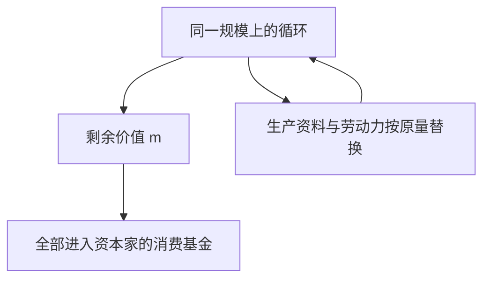

## 前置

- [[故事/资本论/工资的国民差异]]

---

## 考察积累的方法

一个货币额转化为生产资料和劳动力，是价值执行资本职能的第一个运动。生产过程结束时，商品价值大于其组成部分，即原预付资本加上剩余价值。商品必须再投入流通，实现为货币，并重新转化为资本。这种周而复始的循环，就是资本流通。

积累的第一个条件，是资本家卖掉商品，并把由此得到的绝大部分货币再转化为资本。

---

## 生产即再生产

一个社会不能停止消费，也就不能停止生产。每一个社会生产过程，从它的连续和更新来看，同时就是再生产过程。

若剩余价值周期地获得，又周期地全部消费掉，其他条件不变，这就是**简单再生产**。它只是原有规模上的重复，但连续性会剥去孤立过程的假象。

---

工人今天的劳动，是用他上星期的劳动来支付的。从阶级来看，货币形式造成的错觉立即消失：资本家阶级发给工人阶级货币凭据，让他们领取由工人阶级自己生产、却为资本家阶级所占有的产品中的一部分。

可变资本不过是劳动基金的一种历史形式。这种基金在一切社会生产制度下都必须由劳动者自己生产和再生产。它所以不断以支付手段的形式流回工人手里，只是因为工人自己的产品不断以资本的形式离开工人。

---

资本家消费掉预付资本的等价物之后，手中资本的价值不过代表他无偿占有的剩余价值总额。原有资本的任何一个价值原子都不复存在。

因此，撇开积累不说，简单再生产经过或长或短的时期，必然使任何资本转化为积累的资本，即资本化的剩余价值。即使资本最初是使用者本人挣得的财产，它迟早也要成为不付等价物而被占有的价值。

---

## 资本关系本身被再生产出来

货币转化为资本的前提，是双方作为买者和卖者相对立：一方占有生产资料和生活资料，另一方除劳动力外一无所有。劳动产品与劳动本身的分离，是资本主义生产事实上的起点。

起初仅仅是起点的东西，通过简单再生产，就作为资本主义生产本身的结果不断重新生产出来，并且永久化了。

- 生产过程不断地把物质财富转化为资本，转化为资本家的增殖手段和消费品。
- 工人不断地像进入过程时那样走出过程：是财富的人身源泉，却被剥夺了实现这种财富的一切手段。
- 工人把客观财富当作同他相异化的、统治他的权力来生产；资本家把工人当作雇佣工人来生产。

工人的消费有两种：

|          | 生产消费                         | 个人消费                             |
| -------- | -------------------------------- | ------------------------------------ |
| 内容     | 通过劳动消费生产资料，转化为产品 | 用工资购买生活资料                   |
| 归属     | 工人作为资本的动力，属于资本家   | 表面上属于工人自己                   |
| 直接结果 | 资本家的生存                     | 工人自己的生存                       |
| 社会角度 | 价值增殖                         | 在必要限度内，再生产可供剥削的劳动力 |

从单个工人看，个人消费发生在工厂之外，仿佛与资本无关。从资本家阶级和工人阶级看，用来交换劳动力的生活资料再转化为可供重新剥削的劳动力。这种消费是资本家最不可少的生产资料——工人本身——的生产和再生产。资本家可以放心地让工人维持自己和繁殖后代的本能去实现这个条件，他所操心的只是把个人消费限制在必要范围之内。

对工人自己，个人消费是非生产的，因为它只再生产贫困的个人；对资本家和国家，它是生产的，因为它生产了创造别人财富的力量。

从社会角度看，工人阶级即使在直接劳动过程以外，也同死的劳动工具一样是资本的附属物。罗马的奴隶由锁链系住；雇佣工人则由看不见的线系在所有者手里。独立的假象，是由雇主的更换和契约的法律虚构来保持的。

资本主义生产过程在自身的进行中，再生产出劳动力和劳动条件的分离，从而使剥削条件永久化。它不断迫使工人为了生活而出卖劳动力，又不断使资本家能够为了致富而购买劳动力。工人在把自己出卖给资本家以前，就已经属于资本了。

---

可见，把资本主义生产过程作为再生产过程来考察，它不仅生产商品，不仅生产剩余价值，而且还生产和再生产资本关系本身：一方面是资本家，另一方面是雇佣工人。
