## 前置

- [[故事/资本论/计时工资]]

---

## 定义

**计件工资**无非是计时工资的转化形式，正如计时工资是劳动力的价值或价格的转化形式一样。

乍看起来，工人出卖的似乎不是劳动力的职能，而是已经物化在产品中的劳动；劳动的价格似乎也不再由

$$\text{劳动价格} = \frac{\text{劳动力的日价值}}{\text{工作日}}$$

决定，而由生产者的工作效率决定。然而支付形式的区别毫不改变工资的本质

---

## 同一剥削关系的三种说法

假定普通工作日 12 小时，其中 6 小时有酬、6 小时无酬。价值产品 6 先令，从而一劳动小时的价值产品为 6 便士。平均熟练的工人 12 小时提供 24 件产品（可分离的产品，或连续制品中可分别计量的部分）。扣除不变资本后，24 件的价值为 6 先令，每件 3 便士。工人每件得 \(1\frac{1}{2}\) 便士，12 小时得 3 先令。

| 说法         | 有酬部分                           | 无酬部分                             |
| ------------ | ---------------------------------- | ------------------------------------ |
| **工作日**   | 6 小时必要劳动                     | 6 小时剩余劳动                       |
| **计时工资** | 每小时一半为自己                   | 每小时一半为资本家                   |
| **计件工资** | 每件一半有酬，或前 12 件补偿劳动力 | 每件一半无酬，或后 12 件体现剩余价值 |

三种说法没有区别。计件工资同计时工资一样不合理：两件商品扣除生产资料后作为一劳动小时的产品值 6 便士，工人只得 3 便士。这里不是商品价值由其中的劳动时间来计量，相反，工人耗费的劳动由产品件数来计量。计时工资由劳动的持续时间计量，计件工资由一定时间内劳动所凝结成的产品数量计量。

计件工资只是计时工资的转化形式：

$$\text{计件工资} = \frac{\text{劳动力的日价值}}{\text{日产品件数}}$$

```mermaid
gantt
    title 计件工资：剩余价值被分散到每件产品
    dateFormat HH:mm
    axisFormat %H件
    todayMarker off

    section 实际关系
    补偿劳动力 :done, n0, 00:00, 12h
    剩余价值 :crit, s0, after n0, 12h

    section 计件工资假象
    有酬 :done, n1, 00:00, 30m
    无酬 :crit, s1, after n1, 30m
    有酬 :done, n2, after s1, 30m
    无酬 :crit, s2, after n2, 30m
    有酬 :done, n3, after s2, 30m
    无酬 :crit, s3, after n3, 30m
    有酬 :done, n4, after s3, 30m
    无酬 :crit, s4, after n4, 30m
    有酬 :done, n5, after s4, 30m
    无酬 :crit, s5, after n5, 30m
    有酬 :done, n6, after s5, 30m
    无酬 :crit, s6, after n6, 30m
    有酬 :done, n7, after s6, 30m
    无酬 :crit, s7, after n7, 30m
    有酬 :done, n8, after s7, 30m
    无酬 :crit, s8, after n8, 30m
    有酬 :done, n9, after s8, 30m
    无酬 :crit, s9, after n9, 30m
    有酬 :done, n10, after s9, 30m
    无酬 :crit, s10, after n10, 30m
    有酬 :done, n11, after s10, 30m
    无酬 :crit, s11, after n11, 30m
    有酬 :done, n12, after s11, 30m
    无酬 :crit, s12, after n12, 30m
    有酬 :done, n13, after s12, 30m
    无酬 :crit, s13, after n13, 30m
    有酬 :done, n14, after s13, 30m
    无酬 :crit, s14, after n14, 30m
    有酬 :done, n15, after s14, 30m
    无酬 :crit, s15, after n15, 30m
    有酬 :done, n16, after s15, 30m
    无酬 :crit, s16, after n16, 30m
    有酬 :done, n17, after s16, 30m
    无酬 :crit, s17, after n17, 30m
    有酬 :done, n18, after s17, 30m
    无酬 :crit, s18, after n18, 30m
    有酬 :done, n19, after s18, 30m
    无酬 :crit, s19, after n19, 30m
    有酬 :done, n20, after s19, 30m
    无酬 :crit, s20, after n20, 30m
    有酬 :done, n21, after s20, 30m
    无酬 :crit, s21, after n21, 30m
    有酬 :done, n22, after s21, 30m
    无酬 :crit, s22, after n22, 30m
    有酬 :done, n23, after s22, 30m
    无酬 :crit, s23, after n23, 30m
    有酬 :done, n24, after s23, 30m
    无酬 :crit, s24, after n24, 30m
```

---

## 特点

1. **质量由产品本身控制。** 产品须具有平均质量，计件价格才能得到完全支付。
2. **强度有确定的尺度。** 只有体现在预先规定、由经验确定的商品量中的劳动时间，才被看作社会必要劳动时间并据以付酬。
3. **监督大部分成为多余。** 质量与强度既由工资形式本身控制，计件工资便成为现代家庭劳动的基础，也成为层层剥削的基础：包工制（血汗制度）中，中间人的利润来自资本家支付的劳动价格与实际付给工人的差额；工头按件承包后再自行招募帮手。资本对工人的剥削通过工人对工人的剥削来实现。
4. **个人利益推动强度与工时。** 工人为提高日工资或周工资而尽量紧张地发挥劳动力、延长工作日。这会引起计时工资章已经指出的反作用；即使计件单价不变，工作日延长本身也包含着劳动价格的下降。
5. **个人收入分化，一般关系不变。** 计时工资对同样职能通常支付同样工资；计件工资下，日工资或周工资因技能、体力、精力、耐力而有很大差别。就整个工场而言，个人差别互相抵销，总产品与总工资仍是本行业的平均量；各人提供的剩余价值量同各自的工资相适应，工资与剩余价值的比例仍旧不变。计件给个性以较大活动场所，促进独立性与自我监督，也促进工人之间的竞争。
6. **最适合资本主义生产方式的工资形式。** 计件工资是计时制的主要支柱。它并非新事物，十四世纪已与计时工资一并列入英法劳工法；真正工场手工业时期才获得广阔场所，大工业狂飙时期则成为延长劳动时间和降低工资的手段。在受工厂法约束、资本只能从强度方面扩大，一般都采用计件工资。

---

## 生产率提高与计件单价

计件工资是一定劳动时间的价格表现。设劳动力日价值为 $v$，日产品件数为 $n$，则单价

$$w=\frac{v}{n}$$

生产率提高使 $n$ 增加、每件所含劳动时间减少，$w$ 按同一比例下降，日工资 $nw=v$ 不变。变动虽是名义上的，仍会引起斗争：资本家借机压低劳动价格；生产力提高往往伴随强度提高。
