## 前置

- [[故事/资本论/劳动力的价值或价格转化为工资]]

---

## 定义

```mermaid
gantt
    title 计时工资：剩余价值被分散到每个小时
    dateFormat HH:mm
    axisFormat %H时
    todayMarker off

    section 实际关系
    必要劳动 :done, n0, 00:00, 6h
    剩余劳动 :crit, s0, after n0, 6h

    section 计时工资假象
    有酬 :done, n1, 00:00, 30m
    无酬 :crit, s1, after n1, 30m
    有酬 :done, n2, after s1, 30m
    无酬 :crit, s2, after n2, 30m
    有酬 :done, n3, after s2, 30m
    无酬 :crit, s3, after n3, 30m
    有酬 :done, n4, after s3, 30m
    无酬 :crit, s4, after n4, 30m
    有酬 :done, n5, after s4, 30m
    无酬 :crit, s5, after n5, 30m
    有酬 :done, n6, after s5, 30m
    无酬 :crit, s6, after n6, 30m
    有酬 :done, n7, after s6, 30m
    无酬 :crit, s7, after n7, 30m
    有酬 :done, n8, after s7, 30m
    无酬 :crit, s8, after n8, 30m
    有酬 :done, n9, after s8, 30m
    无酬 :crit, s9, after n9, 30m
    有酬 :done, n10, after s9, 30m
    无酬 :crit, s10, after n10, 30m
    有酬 :done, n11, after s10, 30m
    无酬 :crit, s11, after n11, 30m
    有酬 :done, n12, after s11, 30m
    无酬 :crit, s12, after n12, 30m
```

劳动力按一定时期出卖，其日价值、周价值的转化形式就是**计时工资**。交换价值与生活资料量的区别，表现为**名义工资**与**实际工资**的区别。

1. 工资总额 ≠ 劳动价格
   名义工资是一定时期内得到的货币额。同额日工资可对应极不相同的**劳动价格**——对同量劳动所支付的货币额。
   $$\text{劳动价格} = \frac{\text{劳动力的日价值}}{\text{工作日}}$$
1. 小时价格以满工作日为分母。就业不足，工人便无法再生产劳动力价值。若取消日工资、周工资义务，只按实际小时付酬，有酬劳动与无酬劳动的联系被切断。资本家可在不足必要劳动时间的情况下仍榨取剩余劳动，并使过度劳动与失业交替；也可在「正常劳动价格」的借口下延长工作日而不予补偿。
1. 工作日超出普通长度时，日工资可升而劳动价格不变甚至下降。劳动力的损耗使日价值比工作日增长更快。
   习惯上把达到一定点的工作日当作**正常工作日**，超出部分付以额外报酬，但往往很低。正常时间内的低价迫使工人加班。
1. 劳动价格越低，工作日越长；工作日延长又压低劳动价格。一人完成多人的工作，即使劳动力供给不变，劳动供给仍增加，工人竞争使劳动价格下降，劳动时间再被延长。
1. 资本家只承认额外时间，不承认正常工作日已含无酬劳动。对他来说，剩余劳动时间这个范畴并不存在，因为后者仿佛已在日工资中支付。额外报酬与普通小时价格一样，仍包含着无酬劳动。
