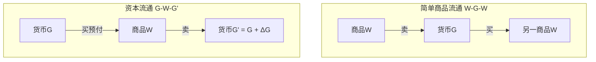
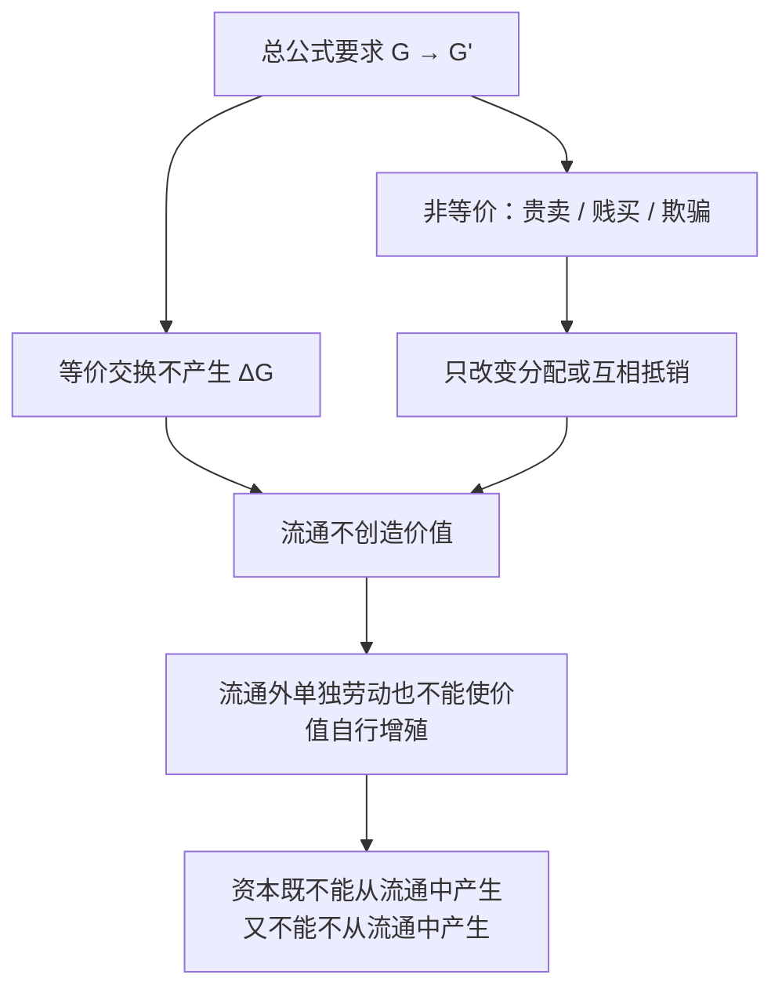

## 前置

- [[故事/货币代理]]

---

**记号说明**：$G—W—G$ 标流通**形态**（先买后卖、两极皆货币、货币须流回）；$G—W—G'$ 标价值**增殖**（$G'=G+\Delta G$），即资本的总公式。下文谈形态用不加撇，谈增殖用加撇。

---

## 资本总公式

- **简单商品流通**：$W—G—W$，为买而卖；目的是使用价值（消费、满足需要）。
- **资本流通**：$G—W—G$，为卖而买；货币经此运动转化为资本。其完全形态为 $G—W—G'$。
- **剩余价值**：超过原预付价值的余额 $\Delta G$。
- **资本家**：价值增殖运动的有意识承担者；其主观目的与流通的客观内容（价值增殖）一致。

1. 若 $G—W—G$ 只是等额货币互换（如 100 换 100），过程便毫无内容；其所以有内容，不在两极有质的区别（都是货币），而在量的不同：$G'=G+\Delta G$。
2. 在 $W—G—W$ 中，货币支出与流回无关；在 $G—W—G$ 中，流回由支出的性质本身决定——买进的商品必须再卖掉，否则过程中断。
3. $W—G—W$ 的两极可以是价值相等的不同使用价值，等价反而是正常条件；价值差额对这一形式本身是偶然的。$G—W—G'$ 则以价值增殖为内容。
4. $G—W—G'$ 的**循环终结自然成为新循环开端。资本运动本身就是目的，因而是没有限度的**。
5. 资本家的直接目的不是使用价值，也不是一次利润，而是谋取利润的无休止运动。货币贮藏者竭力把货币救出流通；精明的资本家则不断把货币重新投入流通以达到无休止的增殖。
6. 在 $G—W—G'$ 中，商品与货币只是价值的不同存在方式：货币是一般存在方式，商品是特殊（化了装）的存在方式。价值交替采取两种形式、改变自己的量，作为过程的主体自行增殖。
7. $G—W—G'$ 表面上像商人资本特有的形式；产业资本同样是货币→商品→更多货币；生息资本则简化为无中介的 $G—G'$。因此，$G—W—G'$ 是直接在流通领域内表现出来的**资本的总公式**。

|             | $W—G—W$         | $G—W—G$              |
| ----------- | --------------- | -------------------- |
| 起点 / 终点 | 商品 → 另一商品 | 货币 → 货币          |
| 媒介        | 货币            | 商品                 |
| 次序        | 先卖后买        | 先买后卖             |
| 货币的命运  | 最终花掉        | 预付出去，并流回起点 |
| 两次换位者  | 同一块货币      | 同一件商品           |
| 目的        | 使用价值、消费  | 交换价值本身         |
| 运动限度    | 以满足需要为限  | 没有止境             |

---

## 总公式的矛盾

- **问题**：货币羽化为资本的流通形式，与商品、价值、货币及流通本身的规律相矛盾。买卖次序颠倒，何以能使价值增殖？

1. 总公式的矛盾：等价交换不产生剩余价值；非等价交换也不产生剩余价值。流通或商品交换不创造价值。资本不能从流通中产生，又不能不从流通中产生；
   1. 如果交换都是等价值的，则颠倒的形式（$G—W—G$）本身不意味着价值增殖：
      1. **对第三者而言次序并未颠倒**：资本家从 A 买、向 B 卖；对 A、B 来说，交易仍是普通买卖。把序列弄颠倒，并未越出简单商品流通领域。
      2. **就使用价值看**，交换双方可以都得到好处（让渡自己不需要的、取得自己需要的；分工还可提高效率）。**就交换价值看**，等价交换并不使任何一方的价值增多。
      3. **抽象地考察**，简单商品流通只引起形态变化：商品→货币→商品；同一价值量只变换形式，不改变大小。纯粹形态下是等价物交换，不是增大价值的手段。
   2. 若交换是非等价的：
      1. 假设人既卖又买：
         1. **普遍贵卖无效**：若人人都能贵卖，作为卖者赚得的，作为买者又会失去；名义加价不改变商品间价值比例。
         2. **普遍贱买无效**：若人人都能贱买，则买者特权在他此前作为卖者时已被抵销。
      2. 假设人只卖，或只买：而且我们假定社会已经充分分工，以至于人无法只靠自己的劳动维持生活。
         1. **考虑只买不卖的消费者阶级**：只买不卖意味着其只消费不生产，因此其货币必定是抢来的。
         2. **考虑只卖不买的消费者阶级**：只卖不买意味着其只消费自己生产的产品，根据分工假设，注定无法维持其生存。
   3. **个别欺骗**：A 骗 B，只改变总价值在 A、B 之间的分配，流通中的价值总量并不增大。一国资本家阶级不能靠欺骗自己发财。
   4. **商品所有者只同自己的商品发生关系时**，只能把一定劳动量物化为商品价值，不能使价值表现为大于自身的价值。制靴使皮子+劳动成为更大价值，但皮子原有价值并未自行增殖。不同其他商品所有者接触，也不能使货币或商品转化为资本。

---

## 劳动力的买和卖

- **劳动力（劳动能力）**：人的身体即活的人体中存在的、每当人生产某种使用价值时就运用的体力和智力的总和。
- **自由工人（双重含义）**：
  1. 是自由人，能把自己的劳动力当作商品支配（只出卖一定时间，不放弃所有权，否则会变成奴隶）；
  2. 没有别的商品可卖，自由得一无所有，不具备实现劳动力所需的生产资料与生活资料。
- **劳动力的价值**：由生产从而再生产劳动力所必需的劳动时间决定，可归结为维持劳动力所有者所需生活资料的价值。包括：
  - 劳动者本人在正常状况下的生活资料；
  - 工人子女的生活资料（种族在市场上的延续）；
  - 教育或训练费用（随劳动力复杂程度而不同）。

1. 必要需要的范围取决于气候、文化水平以及工人阶级形成时的习惯与生活要求；但在一定国家、一定时期，必要生活资料的平均范围是一定的。
2. **增殖发生在何处**：变化不可能发生在货币本身上，也不可能发生在商品再度出卖上；必发生在 $G—W$ 所购商品的**使用**上。货币所有者必须找到这样一种商品：其使用价值本身具有成为价值源泉的属性，而价值的本质为社会必要劳动时间，因此这个商品一定是劳动能力，因为只有劳动能力才能产生价值。
3. **资本产生的历史条件**：有了商品流通和货币流通，并不等于具备资本存在的条件。只有当生产资料与生活资料的所有者在市场上找到出卖劳动力的自由工人时，资本才产生；这一条件本身包含着一部世界史。
4. **劳动力日价值的量的规定**（示意）：
   - 设每天、每周、每季等所需生活资料量分别为 $A,B,C,\ldots$，则每天平均需要量
     $$
     \frac{365A+52B+4C+\cdots}{365}
     $$
   - 若该平均量包含半个社会工作日的劳动，则劳动力日价值等于半日社会平均劳动所表现的货币额。按此价格出卖，即按价值出售。
5. **最低限度**：维持身体所必不可少的生活资料的价值。价格降到此限以下，劳动力只能在萎缩状态下维持和发挥。
6. 劳动能力不卖出去，对工人毫无用处；“不卖出去，就等于零”。
7. **使用价值让渡与实现在时间上分离**：缔结契约时，使用价值尚未实际转到买者手中；消费（劳动）之后才实现。资本主义下工资常在劳动周结束后支付——工人把劳动力的使用价值预付给资本家，即工人给资本家以信贷。
8. **离开流通**：劳动力消费所需原料等由货币所有者按价值购入；劳动力的消费过程在市场以外进行。
9. **流通领域的表象**：劳动力买卖界限内，是“天赋人权的真正乐园”——自由、平等、所有权、利己心。
