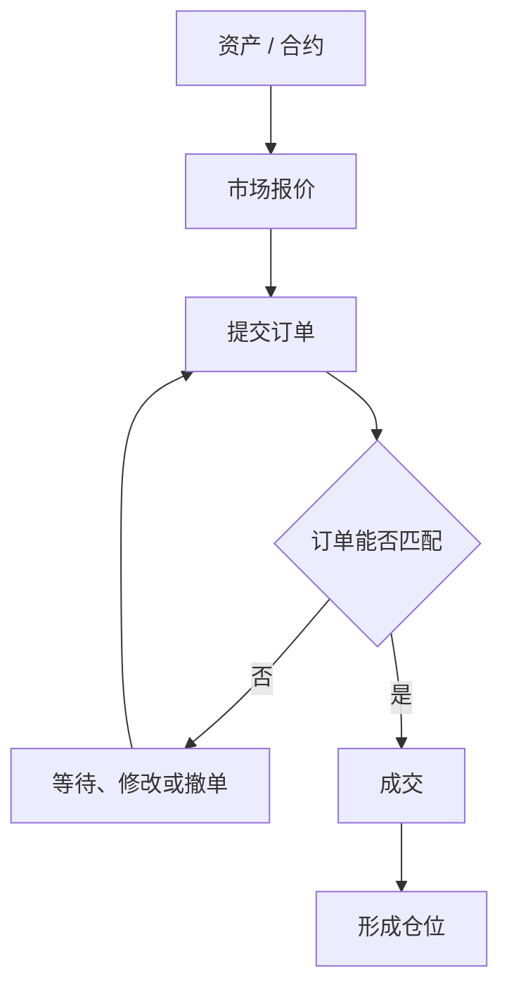
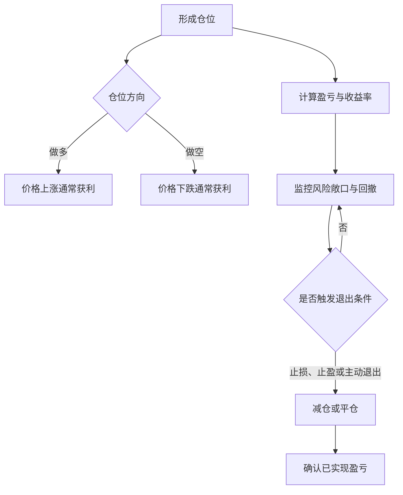
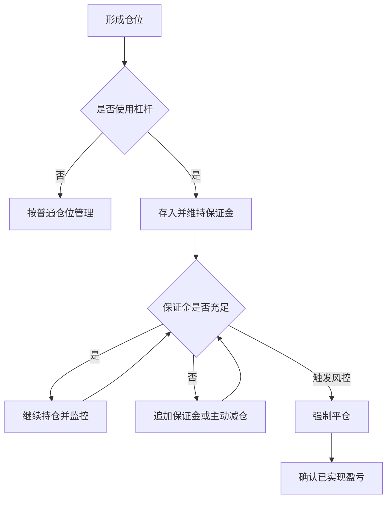

## 前置

- [[故事/货币代理]]

## 交易对象

- **资产（Asset）**：能够被持有、转让并具有经济价值的资源。
- **现金（Cash）**：可直接用于支付或结算的货币资金。
- **合约（Contract）**：约定交易双方权利与义务的协议。
- **标的资产（Underlying Asset）**：合约价值所依据的资产、利率、指数或其他变量。
- **现货（Spot）**：按当前约定价格在较短结算期内交割资产的交易。
- **衍生品（Derivative）**：价值取决于标的资产的合约，例如期货、期权和互换。
  - 远期合约：交易双方私下订立的、在未来特定日期以约定价格买卖特定资产的协议。
  - 期货：在交易所公开交易的、标准化的远期协议。
  - 期权：期权是一种非对称的权利交易：买方支付权利金，获得未来以约定价格买入或卖出标的资产的权利，但不承担必须行权的义务；卖方收取权利金，承担在买方行权时履约的义务。
    - 看涨期权：买方有权以约定价格买入标的资产。买方预期标的资产价格上涨。到期时，若市价高于行权价，买方行权获利；若市价低于行权价，买方放弃行权，最大损失为权利金。
    - 看跌期权：买方有权以约定价格卖出标的资产。买方预期标的资产价格下跌。到期时，若市价低于行权价，买方行权获利；若市价高于行权价，买方放弃行权，最大损失为权利金。
- **投资组合（Portfolio）**：同一投资者持有的一组资产与合约。

## 市场与价格

- **交易场所（Trading Venue）**：撮合买卖意向并形成成交的交易所或其他市场设施。
- **交易时段（Trading Session）**：交易场所按规则接受交易的一段时间。
- **开盘（Market Open）**：一个交易时段开始接受连续交易的时点。
- **收盘（Market Close）**：一个交易时段结束的时点。
- **报价（Quote）**：市场参与者公开表达的买入或卖出价格及数量。
- **买价（Bid Price）**：当前报价中买方愿意支付的最高价格。
- **卖价（Ask Price / Offer Price）**：当前报价中卖方愿意接受的最低价格。
- **买卖价差（Bid-Ask Spread）**：卖价与买价之差，是常见的隐性交易成本。
- **订单（Order）**：向交易场所提交的买卖指令，通常包含方向、数量、价格条件和有效期。
- **市价单（Market Order）**：按当前可成交的最优报价尽快执行的订单；通常能较快成交，但不保证成交价格。
- **限价单（Limit Order）**：限定最高买入价格或最低卖出价格的订单；可以控制价格，但不保证成交。
- **成交（Execution / Fill）**：订单与相反方向的订单匹配并完成交易。
- **成交价（Execution Price）**：一笔成交实际采用的价格。
- **滑点（Slippage）**：预期成交价与实际成交价之间的差异。
- **流动性（Liquidity）**：资产在不显著影响成交价的情况下快速成交的能力。
- **市场深度（Market Depth）**：不同报价档位上可供成交的订单数量。
- **成交量（Trading Volume）**：一定期间内成交的资产或合约数量。
- **成交额（Trading Value / Turnover）**：一定期间内各笔成交价与成交数量乘积的总和。
- **开盘价（Opening Price）**：一个交易时段的第一笔成交价，或交易场所按规则确定的起始价格。
- **收盘价（Closing Price）**：交易时段结束时按交易场所规则确定的价格，不一定等于最后一笔成交价。
- **最高价（High）**：某个统计周期内的最高成交价。
- **最低价（Low）**：某个统计周期内的最低成交价。

## 方向与仓位

- **买入（Buy）**：支付现金或承担结算义务以取得资产或合约。
- **卖出（Sell）**：转让资产或合约并取得现金或相应债权。
- **仓位 / 头寸（Position）**：投资者当前持有的资产或合约的数量和方向。
- **做多（Long）**：建立价格上涨时通常获利、价格下跌时通常亏损的仓位。
- **做空（Short）**：建立价格下跌时通常获利、价格上涨时通常亏损的仓位。
- **卖空（Short Selling）**：卖出借入的资产以建立做空仓位，之后通常需要买回并归还。
- **回补（Cover）**：买入资产以减少或结束做空仓位。
- **开仓（Open a Position）**：通过买入或卖出建立新的仓位。
- **平仓（Close a Position）**：通过反向交易结束已有仓位。
- **加仓（Scale In）**：在原有方向上增加仓位。
- **减仓（Scale Out）**：通过卖出或回补减少仓位。
- **头寸规模（Position Size）**：一个仓位使用的资金、资产数量或预设风险额度。
- **持仓成本（Cost Basis）**：取得当前仓位所付对价及相关费用形成的成本基础。

## 收益与风险

- **盈利与亏损（Profit and Loss, P&L）**：仓位价值变化及相关现金流形成的收益或损失。
- **未实现盈亏（Unrealized P&L）**：尚未平仓的仓位按当前价格估算的盈利或亏损。
- **已实现盈亏（Realized P&L）**：仓位平仓后确认的盈利或亏损。
- **收益率（Return）**：收益相对于投入资金的比例；使用时应明确期间、费用及是否包含分红。
- **净值（Net Asset Value, NAV）**：投资组合的资产价值减去负债后的价值。
- **波动率（Volatility）**：衡量收益率波动幅度的指标，不能与实际亏损画等号。
- **回撤（Drawdown）**：净值从此前阶段性高点下降的幅度。
- **最大回撤（Maximum Drawdown）**：给定期间内所有回撤中的最大值。
- **风险敞口（Exposure）**：仓位或投资组合对某类资产、行业、货币或市场因子变化的敏感程度。
- **对冲（Hedge）**：建立能够抵消部分风险敞口的仓位，以降低特定风险。
- **止损（Stop-Loss）**：价格或亏损达到预设条件时减仓或平仓的风险控制规则。
- **止盈（Take-Profit）**：收益达到预设条件时减仓或平仓的退出规则。
- **风险收益比（Risk-Reward Ratio）**：一笔交易的预期亏损与预期收益之间的比例。

## 杠杆与保证金

- **杠杆（Leverage）**：通过借贷或衍生品，使风险敞口大于自有资金的机制。
- **保证金（Margin）**：为建立和维持杠杆仓位而存入的担保资金。
- **初始保证金（Initial Margin）**：建立杠杆仓位时最低需要存入的保证金。
- **维持保证金（Maintenance Margin）**：维持杠杆仓位所需的最低保证金水平。
- **保证金率（Margin Ratio）**：保证金或账户权益相对于仓位价值的比例；具体口径依交易场所而异。
- **追加保证金通知（Margin Call）**：保证金低于规定水平时，要求投资者补充资金或降低仓位的通知。
- **强制平仓（Forced Liquidation）**：保证金不足或触发风控条件时，由经纪商或交易场所减仓或平仓。
- **爆仓（Liquidation）**：杠杆仓位因保证金不足而被强制平仓的通俗说法；它不一定意味着账户余额归零。

## 流程图

### 订单与成交

### 仓位与风险管理

### 杠杆与保证金管理

## 价格的确定与变动

交易软件显示的“当前价格”通常是最新成交价（Last Traded Price），即最近一笔成交采用的价格。不过，不同软件也可能显示买价、卖价、中间价或延迟行情，因此应以行情字段的具体定义为准。

### 微观

在采用订单簿交易的市场中，订单簿（Order Book）记录尚未成交的买卖限价单，撮合引擎（Matching Engine）按价格优先、时间优先等规则撮合订单。价格不是由某个主体单独指定的，而是在买卖双方不断报价和成交的过程中形成的。

#### 挂单提供流动性

未要求立即成交的交易者可以提交限价单。买方限价单形成各档买价，卖方限价单形成各档卖价；每个价位可成交的数量共同构成市场深度。最优买价与最优卖价之间的距离就是买卖价差。

#### 主动成交消耗流动性

要求立即成交的市价单，以及价格跨过买卖价差的激进限价单，会与订单簿中已有的挂单成交。

- **价格上涨**：主动买单先与最低卖价成交。如果买入数量超过该价位的可卖数量，剩余订单会继续与更高卖价成交，最新成交价随之上移。
- **价格下跌**：主动卖单先与最高买价成交。如果卖出数量超过该价位的可买数量，剩余订单会继续与更低买价成交，最新成交价随之下移。

因此，短期价格变化更准确地说是主动订单与有限市场深度相互作用的结果，而不只是买方和卖方人数的多少。撤单、新增限价单以及不同交易场所之间的套利，也会改变价格路径。

### 宏观

微观机制描述价格变化的传导过程；信息、资金流和情绪则影响交易者愿意在哪个价格买卖，以及是否急于成交。

#### 信息与预期重估

资产价格反映市场对其未来经济利益及风险的判断。财报、产品进展、行业政策、利率和经济数据等新信息，会改变这一判断。交易者据此调整估值和订单，价格则在成交中寻找新的平衡。由于参与者掌握的信息和使用的模型不同，市场不会自动得到唯一的“合理价格”。

#### 资金流与供需冲击

即使基本面没有明显变化，资金流也可能改变短期供需。例如，基金申购会带来买入需求；基金赎回、指数调仓、风险限额收紧或强制平仓则可能产生集中卖出。订单规模相对于市场深度越大，价格冲击和滑点通常越明显。

#### 情绪与行为反馈

交易者并非始终完全理性。害怕错过（FOMO）、损失厌恶、从众行为和被迫止损，可能使主动买入或卖出相互强化。价格上涨吸引更多买盘、价格下跌触发更多卖盘时，就会形成短期反馈循环；但情绪能够影响价格，并不意味着它能长期脱离现金流和风险。
