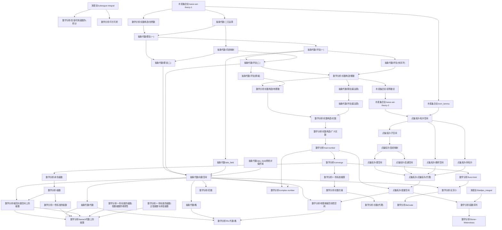

```mermaid
graph TD
1["抽象代数/向量空间"] --> 0["数学分析/有限维赋范线性空间"]
2["点集拓扑/度量空间"] --> 0["数学分析/有限维赋范线性空间"]
4["抽象代数/代数"] --> 3["数学分析/Rn-代数-格"]
5["抽象代数/格"] --> 3["数学分析/Rn-代数-格"]
0["数学分析/有限维赋范线性空间"] --> 3["数学分析/Rn-代数-格"]
7["数学分析/非负级数"] --> 6["数学分析/级数"]
9["数学分析/赋范向量空间上的级数"] --> 8["数学分析/banach代数上的级数"]
4["抽象代数/代数"] --> 8["数学分析/banach代数上的级数"]
10["数学分析/一些标准的级数"] --> 8["数学分析/banach代数上的级数"]
9["数学分析/赋范向量空间上的级数"] --> 8["数学分析/banach代数上的级数"]
11["数学分析/一些标准的级数|指数级数的收敛性"] --> 8["数学分析/banach代数上的级数"]
12["数学分析/一些标准的级数|正弦级数与余弦级数"] --> 8["数学分析/banach代数上的级数"]
14["数学分析/实数次幂"] --> 13["数学分析/实数(代理)"]
6["数学分析/级数"] --> 10["数学分析/一些标准的级数"]
16["数学分析/converge"] --> 15["数学分析/一些标准极限"]
18["数学分析/无穷小"] --> 17["数学分析/derivate"]
19["数学分析/real-number"] --> 16["数学分析/converge"]
15["数学分析/一些标准极限"] --> 14["数学分析/实数次幂"]
16["数学分析/converge"] --> 7["数学分析/非负级数"]
1["抽象代数/向量空间"] --> 20["数学分析/范数"]
22["测度论/Lebesgue-integral"] --> 21["数学分析/复值可测函数的L积分"]
1["抽象代数/向量空间"] --> 18["数学分析/无穷小"]
23["数学分析/funct-limit"] --> 18["数学分析/无穷小"]
1["抽象代数/向量空间"] --> 9["数学分析/赋范向量空间上的级数"]
6["数学分析/级数"] --> 9["数学分析/赋范向量空间上的级数"]
16["数学分析/converge"] --> 23["数学分析/funct-limit"]
19["数学分析/real-number"] --> 25["数学分析/complex-number"]
1["抽象代数/向量空间"] --> 25["数学分析/complex-number"]
26["数学分析/实数构造/广义实数"] --> 19["数学分析/real-number"]
2["点集拓扑/度量空间"] --> 27["数学分析/函数序列"]
28["测度论/Stieltjes_integral"] --> 27["数学分析/函数序列"]
22["测度论/Lebesgue-integral"] --> 29["数学分析/平方可积"]
27["数学分析/函数序列"] --> 30["数学分析/Stone–Weierstrass"]
32["数学分析/实数构造/有理数"] --> 31["数学分析/实数构造/实数"]
33["抽象代数/环论(幂运算)"] --> 31["数学分析/实数构造/实数"]
34["数学分析/实数构造/整数"] --> 32["数学分析/实数构造/有理数"]
35["抽象代数/环论(商域)"] --> 32["数学分析/实数构造/有理数"]
31["数学分析/实数构造/实数"] --> 26["数学分析/实数构造/广义实数"]
37["朴素集合论/naive-set-theory-1"] --> 36["数学分析/实数构造/自然数"]
38["抽象代数/环论(二)"] --> 34["数学分析/实数构造/整数"]
39["抽象代数/环论(有序环)"] --> 34["数学分析/实数构造/整数"]
40["抽象代数/环论(一)"] --> 38["抽象代数/环论(二)"]
41["抽象代数/同态映射"] --> 38["抽象代数/环论(二)"]
40["抽象代数/环论(一)"] --> 39["抽象代数/环论(有序环)"]
42["抽象代数/群论(一)"] --> 40["抽象代数/环论(一)"]
36["数学分析/实数构造/自然数"] --> 42["抽象代数/群论(一)"]
43["抽象代数/二元运算"] --> 42["抽象代数/群论(一)"]
37["朴素集合论/naive-set-theory-1"] --> 43["抽象代数/二元运算"]
43["抽象代数/二元运算"] --> 41["抽象代数/同态映射"]
38["抽象代数/环论(二)"] --> 35["抽象代数/环论(商域)"]
44["抽象代数/群论(幂运算)"] --> 33["抽象代数/环论(幂运算)"]
34["数学分析/实数构造/整数"] --> 44["抽象代数/群论(幂运算)"]
19["数学分析/real-number"] --> 2["点集拓扑/度量空间"]
45["点集拓扑/点集拓扑(代理)"] --> 2["点集拓扑/度量空间"]
46["点集拓扑/紧空间"] --> 45["点集拓扑/点集拓扑(代理)"]
47["点集拓扑/连通空间"] --> 45["点集拓扑/点集拓扑(代理)"]
48["点集拓扑/乘积空间"] --> 45["点集拓扑/点集拓扑(代理)"]
49["点集拓扑/序拓扑"] --> 45["点集拓扑/点集拓扑(代理)"]
50["点集拓扑/连续映射"] --> 46["点集拓扑/紧空间"]
50["点集拓扑/连续映射"] --> 47["点集拓扑/连通空间"]
51["点集拓扑/拓扑空间"] --> 48["点集拓扑/乘积空间"]
51["点集拓扑/拓扑空间"] --> 49["点集拓扑/序拓扑"]
52["朴素集合论/naive-set-theory-2"] --> 51["点集拓扑/拓扑空间"]
53["朴素集合论/zorn_lemma"] --> 51["点集拓扑/拓扑空间"]
54["朴素集合论/初等数论"] --> 52["朴素集合论/naive-set-theory-2"]
37["朴素集合论/naive-set-theory-1"] --> 53["朴素集合论/zorn_lemma"]
34["数学分析/实数构造/整数"] --> 54["朴素集合论/初等数论"]
55["点集拓扑/子空间"] --> 50["点集拓扑/连续映射"]
51["点集拓扑/拓扑空间"] --> 55["点集拓扑/子空间"]
56["抽象代数/群论(二)"] --> 1["抽象代数/向量空间"]
38["抽象代数/环论(二)"] --> 1["抽象代数/向量空间"]
57["抽象代数/abs_field"] --> 1["抽象代数/向量空间"]
58["抽象代数/abs_field|带绝对值的域"] --> 1["抽象代数/向量空间"]
42["抽象代数/群论(一)"] --> 56["抽象代数/群论(二)"]
41["抽象代数/同态映射"] --> 56["抽象代数/群论(二)"]
40["抽象代数/环论(一)"] --> 57["抽象代数/abs_field"]
1["抽象代数/向量空间"] --> 4["抽象代数/代数"]
1["抽象代数/向量空间"] --> 5["抽象代数/格"]
```
