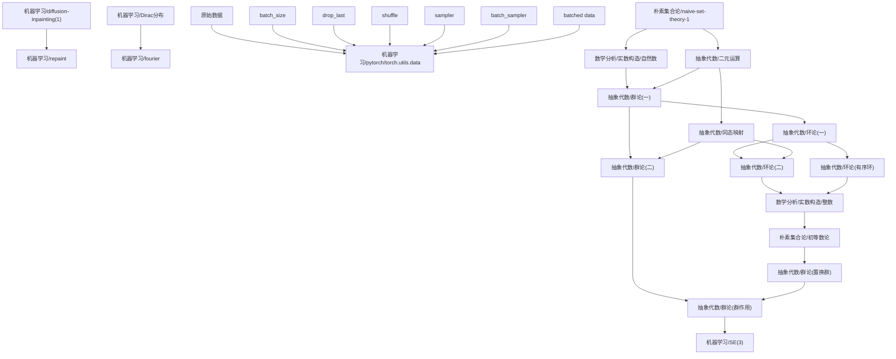

```mermaid
graph TD
1["机器学习/diffusion-inpainting(1)"] --> 0["机器学习/repaint"]
3["抽象代数/群论(群作用)"] --> 2["机器学习/SE(3)"]
5["机器学习/Dirac分布"] --> 4["机器学习/fourier"]
8["原始数据"] --> 7["机器学习/pytorch/torch.utils.data"]
9["batch_size"] --> 7["机器学习/pytorch/torch.utils.data"]
10["drop_last"] --> 7["机器学习/pytorch/torch.utils.data"]
11["shuffle"] --> 7["机器学习/pytorch/torch.utils.data"]
12["sampler"] --> 7["机器学习/pytorch/torch.utils.data"]
13["batch_sampler"] --> 7["机器学习/pytorch/torch.utils.data"]
14["batched data"] --> 7["机器学习/pytorch/torch.utils.data"]
15["抽象代数/群论(二)"] --> 3["抽象代数/群论(群作用)"]
16["抽象代数/群论(置换群)"] --> 3["抽象代数/群论(群作用)"]
17["抽象代数/群论(一)"] --> 15["抽象代数/群论(二)"]
18["抽象代数/同态映射"] --> 15["抽象代数/群论(二)"]
19["朴素集合论/初等数论"] --> 16["抽象代数/群论(置换群)"]
20["数学分析/实数构造/整数"] --> 19["朴素集合论/初等数论"]
21["抽象代数/环论(二)"] --> 20["数学分析/实数构造/整数"]
22["抽象代数/环论(有序环)"] --> 20["数学分析/实数构造/整数"]
23["抽象代数/环论(一)"] --> 21["抽象代数/环论(二)"]
18["抽象代数/同态映射"] --> 21["抽象代数/环论(二)"]
23["抽象代数/环论(一)"] --> 22["抽象代数/环论(有序环)"]
17["抽象代数/群论(一)"] --> 23["抽象代数/环论(一)"]
24["数学分析/实数构造/自然数"] --> 17["抽象代数/群论(一)"]
25["抽象代数/二元运算"] --> 17["抽象代数/群论(一)"]
26["朴素集合论/naive-set-theory-1"] --> 24["数学分析/实数构造/自然数"]
26["朴素集合论/naive-set-theory-1"] --> 25["抽象代数/二元运算"]
25["抽象代数/二元运算"] --> 18["抽象代数/同态映射"]
```