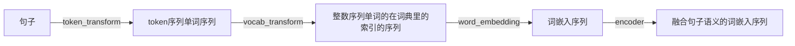

- [transformer 结构](#transformer-结构)
- [transformer 的掩码](#transformer-的掩码)
- [transformer 中 dropout 出现的地方](#transformer-中-dropout-出现的地方)
- [transformer 中 layer\_norm 出现的地方](#transformer-中-layer_norm-出现的地方)
- [torch.nn.Transformer 的 mask 使用](#torchnntransformer-的-mask-使用)
- [句子的处理流程](#句子的处理流程)

# transformer 结构

```plantuml
(src_word_embedding) --> (src_position_embdedding)
rectangle EncoderBlock{
(src_position_embdedding) --> (src_in_dropout)
(src_in_dropout) --> (src_add_att_embed)
(src_in_dropout) --> (src_layer1_norm)
(src_layer1_norm) --> (src_linear_q)
(src_layer1_norm) --> (src_linear_k)
(src_layer1_norm) --> (src_linear_v)
(src_linear_q) --> (src_mult_q_k')
(src_linear_k) --> (src_mult_q_k'):transpose
(src_mult_q_k') --> (src_masking)
(src_masking) --> (src_softmax)
(src_softmax) --> (src_softmax_dropout)
(src_softmax_dropout) --> (src_mult_att_v)
(src_linear_v) --> (src_mult_att_v)
(src_mult_att_v) --> (src_linear_att_out)
(src_linear_att_out) --> (src_att_out_dropout)
(src_att_out_dropout) --> (src_add_att_embed)

(src_add_att_embed) --> (src_add_ff_embed)
(src_add_att_embed) --> (src_layer2_norm)
(src_layer2_norm) --> (src_feed_forward)
(src_feed_forward) --> (src_add_ff_embed)
}

(src_add_ff_embed) --> (...EncoderBlock):...

(tgt_word_embedding) --> (tgt_position_embdedding)
(tgt_position_embdedding) --> (tgt_in_dropout)

rectangle DecoderBlock{
rectangle target_attention-block{
(tgt_in_dropout) --> (tgt_add_att_embed)
(tgt_in_dropout) --> (tgt_layer1_norm)
(tgt_layer1_norm) --> (tgt_linear_q)
(tgt_layer1_norm) --> (tgt_linear_k)
(tgt_layer1_norm) --> (tgt_linear_v)
(tgt_linear_q) --> (tgt_mult_q_k')
(tgt_linear_k) --> (tgt_mult_q_k'):transpose
(tgt_mult_q_k') --> (tgt_masking)
(tgt_masking) --> (tgt_softmax)
(tgt_softmax) --> (tgt_softmax_dropout)
(tgt_softmax_dropout) --> (tgt_mult_att_v)
(tgt_linear_v) --> (tgt_mult_att_v)
(tgt_mult_att_v) --> (tgt_linear_att_out)
(tgt_linear_att_out) --> (tgt_att_out_dropout)
(tgt_att_out_dropout) --> (tgt_add_att_embed)
}

rectangle memory-attention-block{
(tgt_add_att_embed) --> (mem_add_att_embed)
(tgt_add_att_embed) --> (mem_layer1_norm)
(mem_layer1_norm) --> (mem_linear_q)
(...EncoderBlock) --> (mem_linear_k)
(...EncoderBlock) --> (mem_linear_v)
(mem_linear_q) --> (mem_mult_q_k')
(mem_linear_k) --> (mem_mult_q_k'):transpose
(mem_mult_q_k') --> (mem_masking)
(mem_masking) --> (mem_softmax)
(mem_softmax) --> (mem_softmax_dropout)
(mem_softmax_dropout) --> (mem_mult_att_v)
(mem_linear_v) --> (mem_mult_att_v)
(mem_mult_att_v) --> (mem_linear_att_out)
(mem_linear_att_out) --> (mem_att_out_dropout)
(mem_att_out_dropout) --> (mem_add_att_embed)
}

(mem_add_att_embed) --> (mem_add_ff_embed)
(mem_add_att_embed) --> (mem_layer2_norm)
(mem_layer2_norm) --> (mem_feed_forward)
(mem_feed_forward) --> (mem_add_ff_embed)
}

(mem_add_ff_embed) --> (...DecoderBlock):...

(...DecoderBlock) --> (linear)
```

# transformer 的掩码

| 注意力方式 | 掩码                                   |
| ---------- | -------------------------------------- |
| 自注意力   | src_mask = src_att_mask + src_pad_mask |
| 自注意力   | tgt_mask = tgt_att_mask + tgt_pad_mask |
| 交叉注意力 | mem_mask = mem_att_mask + mem_pad_mask |

| 掩码类型     | 作用                                                                         |
| ------------ | ---------------------------------------------------------------------------- |
| \*\_pad_mask | 为了让当前单词不注意到填充的单词.                                            |
| \*\_att_mask | 为了让当前单词不注意到它“不该”注意到的单词。例如 tgt_att_mask 为上三角矩阵。 |

| 掩码类型 | 初始形状              | 拓展后的形状                         |
| -------- | --------------------- | ------------------------------------ |
| src_mask | (batch_size, src_len) | (batch_size, head, src_len, src_len) |
| tgt_mask | (batch_size, tgt_len) | (batch_size, head, tgt_len, tgt_len) |
| mem_mask | (batch_size, src_len) | (batch_size, head, tgt_len, src_len) |

# transformer 中 dropout 出现的地方

1. 位置嵌入之后。

2. 注意力 softmax 之后。

3. 多头注意力之后的线性变换后。

4. feed_forward 第二个线性层之后。

# transformer 中 layer_norm 出现的地方

1. 残差块之前（或之后）

2. （最后一个 Decoder 之后）

# torch.nn.Transformer 的 mask 使用

Binary and float masks are supported. For a binary mask, a `True` value indicates that the corresponding position is not allowed to attend. For a float mask, the mask values will be added to the attention weight.
If both attn_mask and key_padding_mask are supplied, their types should match.

# 句子的处理流程


