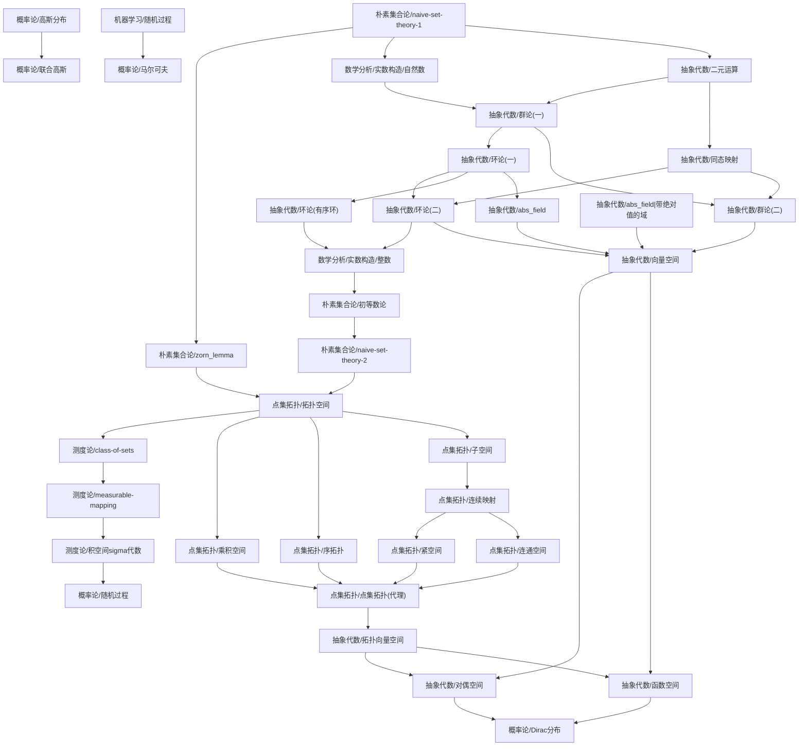

```mermaid
graph TD
1["概率论/高斯分布"] --> 0["概率论/联合高斯"]
3["机器学习/随机过程"] --> 2["概率论/马尔可夫"]
5["抽象代数/对偶空间"] --> 4["概率论/Dirac分布"]
6["抽象代数/函数空间"] --> 4["概率论/Dirac分布"]
8["测度论/积空间sigma代数"] --> 7["概率论/随机过程"]
9["测度论/measurable-mapping"] --> 8["测度论/积空间sigma代数"]
10["测度论/class-of-sets"] --> 9["测度论/measurable-mapping"]
11["点集拓扑/拓扑空间"] --> 10["测度论/class-of-sets"]
12["朴素集合论/naive-set-theory-2"] --> 11["点集拓扑/拓扑空间"]
13["朴素集合论/zorn_lemma"] --> 11["点集拓扑/拓扑空间"]
14["朴素集合论/初等数论"] --> 12["朴素集合论/naive-set-theory-2"]
15["朴素集合论/naive-set-theory-1"] --> 13["朴素集合论/zorn_lemma"]
16["数学分析/实数构造/整数"] --> 14["朴素集合论/初等数论"]
17["抽象代数/环论(二)"] --> 16["数学分析/实数构造/整数"]
18["抽象代数/环论(有序环)"] --> 16["数学分析/实数构造/整数"]
19["抽象代数/环论(一)"] --> 17["抽象代数/环论(二)"]
20["抽象代数/同态映射"] --> 17["抽象代数/环论(二)"]
19["抽象代数/环论(一)"] --> 18["抽象代数/环论(有序环)"]
21["抽象代数/群论(一)"] --> 19["抽象代数/环论(一)"]
22["数学分析/实数构造/自然数"] --> 21["抽象代数/群论(一)"]
23["抽象代数/二元运算"] --> 21["抽象代数/群论(一)"]
15["朴素集合论/naive-set-theory-1"] --> 22["数学分析/实数构造/自然数"]
15["朴素集合论/naive-set-theory-1"] --> 23["抽象代数/二元运算"]
23["抽象代数/二元运算"] --> 20["抽象代数/同态映射"]
24["抽象代数/向量空间"] --> 5["抽象代数/对偶空间"]
25["抽象代数/拓扑向量空间"] --> 5["抽象代数/对偶空间"]
24["抽象代数/向量空间"] --> 6["抽象代数/函数空间"]
25["抽象代数/拓扑向量空间"] --> 6["抽象代数/函数空间"]
26["抽象代数/群论(二)"] --> 24["抽象代数/向量空间"]
17["抽象代数/环论(二)"] --> 24["抽象代数/向量空间"]
27["抽象代数/abs_field"] --> 24["抽象代数/向量空间"]
28["抽象代数/abs_field|带绝对值的域"] --> 24["抽象代数/向量空间"]
29["点集拓扑/点集拓扑(代理)"] --> 25["抽象代数/拓扑向量空间"]
30["点集拓扑/紧空间"] --> 29["点集拓扑/点集拓扑(代理)"]
31["点集拓扑/连通空间"] --> 29["点集拓扑/点集拓扑(代理)"]
32["点集拓扑/乘积空间"] --> 29["点集拓扑/点集拓扑(代理)"]
33["点集拓扑/序拓扑"] --> 29["点集拓扑/点集拓扑(代理)"]
34["点集拓扑/连续映射"] --> 30["点集拓扑/紧空间"]
34["点集拓扑/连续映射"] --> 31["点集拓扑/连通空间"]
11["点集拓扑/拓扑空间"] --> 32["点集拓扑/乘积空间"]
11["点集拓扑/拓扑空间"] --> 33["点集拓扑/序拓扑"]
35["点集拓扑/子空间"] --> 34["点集拓扑/连续映射"]
11["点集拓扑/拓扑空间"] --> 35["点集拓扑/子空间"]
21["抽象代数/群论(一)"] --> 26["抽象代数/群论(二)"]
20["抽象代数/同态映射"] --> 26["抽象代数/群论(二)"]
19["抽象代数/环论(一)"] --> 27["抽象代数/abs_field"]
```