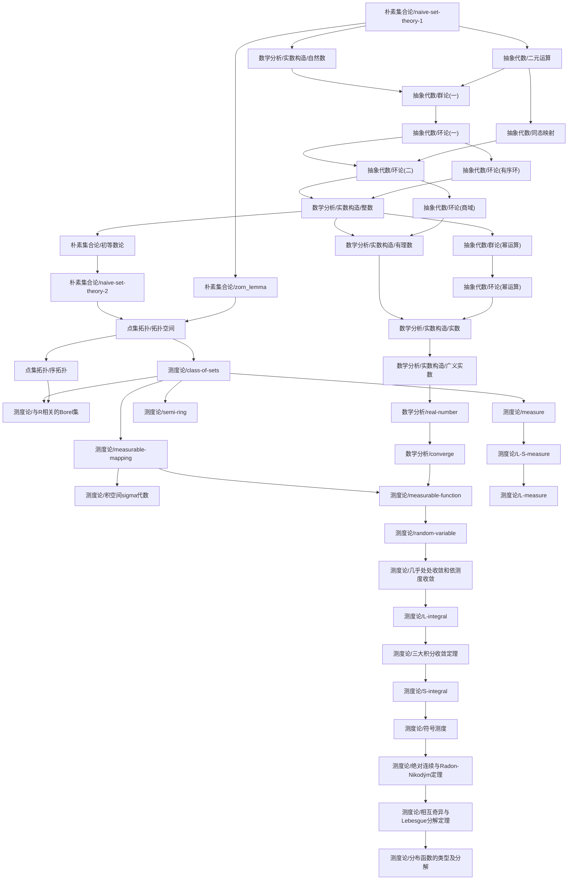

```mermaid
graph TD
1["点集拓扑/拓扑空间"] --> 0["测度论/class-of-sets"]
3["测度论/S-integral"] --> 2["测度论/符号测度"]
5["测度论/measurable-mapping"] --> 4["测度论/积空间sigma代数"]
0["测度论/class-of-sets"] --> 5["测度论/measurable-mapping"]
0["测度论/class-of-sets"] --> 6["测度论/与R相关的Borel集"]
7["点集拓扑/序拓扑"] --> 6["测度论/与R相关的Borel集"]
5["测度论/measurable-mapping"] --> 8["测度论/measurable-function"]
9["数学分析/converge"] --> 8["测度论/measurable-function"]
8["测度论/measurable-function"] --> 10["测度论/random-variable"]
12["测度论/measure"] --> 11["测度论/L-S-measure"]
0["测度论/class-of-sets"] --> 13["测度论/semi-ring"]
15["测度论/L-integral"] --> 14["测度论/三大积分收敛定理"]
2["测度论/符号测度"] --> 17["测度论/绝对连续与Radon-Nikodým定理"]
0["测度论/class-of-sets"] --> 12["测度论/measure"]
10["测度论/random-variable"] --> 18["测度论/几乎处处收敛和依测度收敛"]
11["测度论/L-S-measure"] --> 19["测度论/L-measure"]
14["测度论/三大积分收敛定理"] --> 3["测度论/S-integral"]
17["测度论/绝对连续与Radon-Nikodým定理"] --> 20["测度论/相互奇异与Lebesgue分解定理"]
18["测度论/几乎处处收敛和依测度收敛"] --> 15["测度论/L-integral"]
20["测度论/相互奇异与Lebesgue分解定理"] --> 21["测度论/分布函数的类型及分解"]
22["数学分析/real-number"] --> 9["数学分析/converge"]
23["数学分析/实数构造/广义实数"] --> 22["数学分析/real-number"]
24["数学分析/实数构造/实数"] --> 23["数学分析/实数构造/广义实数"]
26["朴素集合论/naive-set-theory-1"] --> 25["数学分析/实数构造/自然数"]
28["抽象代数/环论(二)"] --> 27["数学分析/实数构造/整数"]
29["抽象代数/环论(有序环)"] --> 27["数学分析/实数构造/整数"]
27["数学分析/实数构造/整数"] --> 30["数学分析/实数构造/有理数"]
31["抽象代数/环论(商域)"] --> 30["数学分析/实数构造/有理数"]
30["数学分析/实数构造/有理数"] --> 24["数学分析/实数构造/实数"]
32["抽象代数/环论(幂运算)"] --> 24["数学分析/实数构造/实数"]
33["抽象代数/群论(幂运算)"] --> 32["抽象代数/环论(幂运算)"]
27["数学分析/实数构造/整数"] --> 33["抽象代数/群论(幂运算)"]
28["抽象代数/环论(二)"] --> 31["抽象代数/环论(商域)"]
34["抽象代数/环论(一)"] --> 28["抽象代数/环论(二)"]
35["抽象代数/同态映射"] --> 28["抽象代数/环论(二)"]
36["抽象代数/群论(一)"] --> 34["抽象代数/环论(一)"]
37["抽象代数/二元运算"] --> 35["抽象代数/同态映射"]
26["朴素集合论/naive-set-theory-1"] --> 37["抽象代数/二元运算"]
25["数学分析/实数构造/自然数"] --> 36["抽象代数/群论(一)"]
37["抽象代数/二元运算"] --> 36["抽象代数/群论(一)"]
34["抽象代数/环论(一)"] --> 29["抽象代数/环论(有序环)"]
1["点集拓扑/拓扑空间"] --> 7["点集拓扑/序拓扑"]
38["朴素集合论/naive-set-theory-2"] --> 1["点集拓扑/拓扑空间"]
39["朴素集合论/zorn_lemma"] --> 1["点集拓扑/拓扑空间"]
40["朴素集合论/初等数论"] --> 38["朴素集合论/naive-set-theory-2"]
26["朴素集合论/naive-set-theory-1"] --> 39["朴素集合论/zorn_lemma"]
27["数学分析/实数构造/整数"] --> 40["朴素集合论/初等数论"]
```