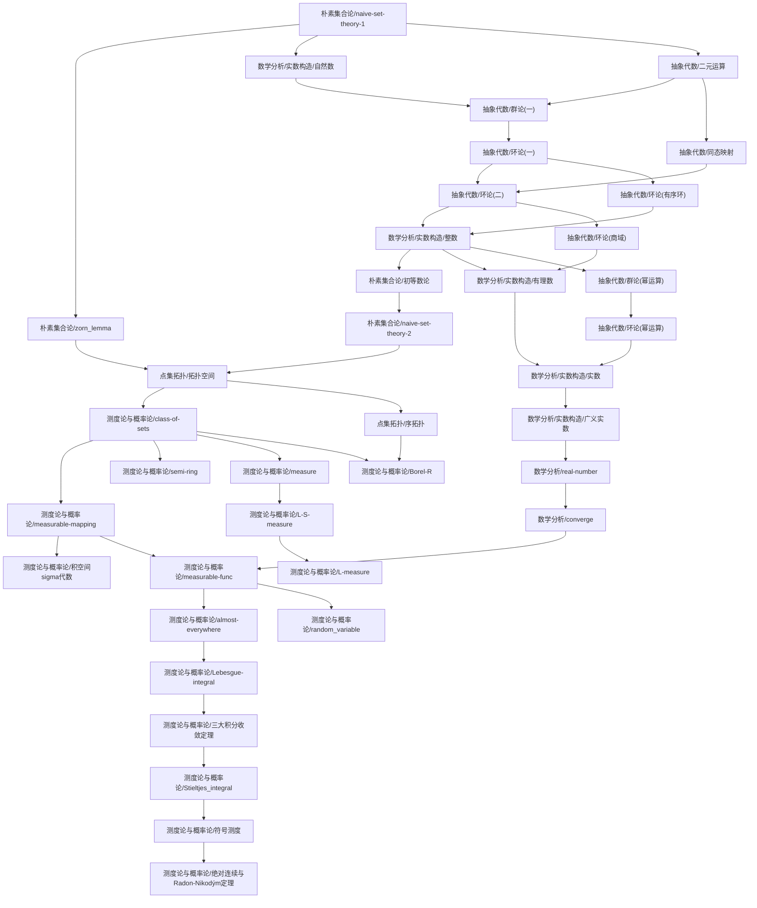

```mermaid
graph TD
1["点集拓扑/拓扑空间"] --> 0["测度论与概率论/class-of-sets"]
3["测度论与概率论/almost-everywhere"] --> 2["测度论与概率论/Lebesgue-integral"]
5["测度论与概率论/Stieltjes_integral"] --> 4["测度论与概率论/符号测度"]
7["测度论与概率论/measurable-mapping"] --> 6["测度论与概率论/积空间sigma代数"]
8["测度论与概率论/三大积分收敛定理"] --> 5["测度论与概率论/Stieltjes_integral"]
0["测度论与概率论/class-of-sets"] --> 7["测度论与概率论/measurable-mapping"]
10["测度论与概率论/measure"] --> 9["测度论与概率论/L-S-measure"]
7["测度论与概率论/measurable-mapping"] --> 11["测度论与概率论/measurable-func"]
12["数学分析/converge"] --> 11["测度论与概率论/measurable-func"]
0["测度论与概率论/class-of-sets"] --> 13["测度论与概率论/semi-ring"]
2["测度论与概率论/Lebesgue-integral"] --> 8["测度论与概率论/三大积分收敛定理"]
11["测度论与概率论/measurable-func"] --> 3["测度论与概率论/almost-everywhere"]
11["测度论与概率论/measurable-func"] --> 14["测度论与概率论/random_variable"]
4["测度论与概率论/符号测度"] --> 16["测度论与概率论/绝对连续与Radon-Nikodým定理"]
0["测度论与概率论/class-of-sets"] --> 10["测度论与概率论/measure"]
9["测度论与概率论/L-S-measure"] --> 17["测度论与概率论/L-measure"]
0["测度论与概率论/class-of-sets"] --> 18["测度论与概率论/Borel-R"]
19["点集拓扑/序拓扑"] --> 18["测度论与概率论/Borel-R"]
1["点集拓扑/拓扑空间"] --> 19["点集拓扑/序拓扑"]
20["朴素集合论/naive-set-theory-2"] --> 1["点集拓扑/拓扑空间"]
21["朴素集合论/zorn_lemma"] --> 1["点集拓扑/拓扑空间"]
22["朴素集合论/初等数论"] --> 20["朴素集合论/naive-set-theory-2"]
23["朴素集合论/naive-set-theory-1"] --> 21["朴素集合论/zorn_lemma"]
24["数学分析/实数构造/整数"] --> 22["朴素集合论/初等数论"]
25["抽象代数/环论(二)"] --> 24["数学分析/实数构造/整数"]
26["抽象代数/环论(有序环)"] --> 24["数学分析/实数构造/整数"]
27["抽象代数/环论(一)"] --> 25["抽象代数/环论(二)"]
28["抽象代数/同态映射"] --> 25["抽象代数/环论(二)"]
27["抽象代数/环论(一)"] --> 26["抽象代数/环论(有序环)"]
29["抽象代数/群论(一)"] --> 27["抽象代数/环论(一)"]
30["数学分析/实数构造/自然数"] --> 29["抽象代数/群论(一)"]
31["抽象代数/二元运算"] --> 29["抽象代数/群论(一)"]
23["朴素集合论/naive-set-theory-1"] --> 30["数学分析/实数构造/自然数"]
23["朴素集合论/naive-set-theory-1"] --> 31["抽象代数/二元运算"]
31["抽象代数/二元运算"] --> 28["抽象代数/同态映射"]
32["数学分析/real-number"] --> 12["数学分析/converge"]
33["数学分析/实数构造/广义实数"] --> 32["数学分析/real-number"]
34["数学分析/实数构造/实数"] --> 33["数学分析/实数构造/广义实数"]
24["数学分析/实数构造/整数"] --> 35["数学分析/实数构造/有理数"]
36["抽象代数/环论(商域)"] --> 35["数学分析/实数构造/有理数"]
35["数学分析/实数构造/有理数"] --> 34["数学分析/实数构造/实数"]
37["抽象代数/环论(幂运算)"] --> 34["数学分析/实数构造/实数"]
38["抽象代数/群论(幂运算)"] --> 37["抽象代数/环论(幂运算)"]
24["数学分析/实数构造/整数"] --> 38["抽象代数/群论(幂运算)"]
25["抽象代数/环论(二)"] --> 36["抽象代数/环论(商域)"]
```
