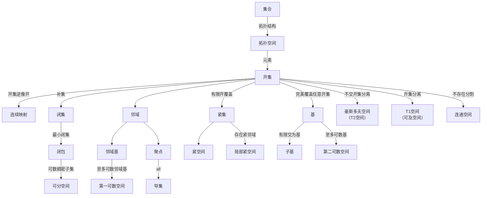

## 拓扑空间

称$(X,\tau)$为一个拓扑空间，若其满足以下性质，其中$X$ 是一个集合，$\tau$ 是 $X$ 的子集族：

1. $\emptyset, X \in \tau$
2. $\tau$中元素任意并仍在$\tau$中
3. $\tau$中元素有限交仍在$\tau$中

称$U$为$X$的开集(open set)，若$X$的子集$U$满足$U \in \tau$

称$x$为$A\subseteq X$的聚点(accumulation point)，若$x$的任意邻域都含有$A$中异于$x$的点，即$\forall U \in \mathcal{N}_x, A \setminus \{x\} \bigcap N \not= \emptyset$

称$A^d$为$A$的导集(derived set)，若$A^d = \{x \in X \mid x$为$A$的聚点$\}$

称$\bar{A}$为$A$的闭包(closure)，若$\bar{A}=\bigcap{\{F \subseteq X \mid F \text{是包含} A \text{的闭集}\}}$，即包含 $A$ 的最小闭集

称$A$为紧集(compact set)，若$A$的任意开覆盖都有有限子覆盖，即若$A \subseteq \bigcup_{i \in I} U_i$，其中$U_i \in \tau$,存在有限集$J \subseteq I$，使得$A \subseteq \bigcup_{i \in J} U_i$

称$X$为紧空间(compact space)，若$X$为紧集

称$F$为$X$的闭集，若$X$的子集$F$满足$(X \setminus F) \in \tau$

称$U$ 是 $x$ 的邻域(neighborhood)，若存在开集 $V$ 使得 $x \in V \subseteq U$

称$\mathcal{N}_x$是$x$的邻域系(neighborhood system)，若$\mathcal{N}_x$是$x$的所有邻域构成的集合

称$\mathcal{B}\subseteq \tau$ 是拓扑空间$X$的基(base), 若$\forall U\in \tau, \exists \mathcal{B}_U \subseteq \mathcal{B}$ 使得 $U = \bigcup \mathcal{B}_U$

称$\mathcal{S}$ 是拓扑空间$X$的子基(subbase)，若$\mathcal{S}$的有限交集族是$X$的基

称$\{x_n\}_{n=1}^\infty$收敛到$x$，若对于任意$x$的邻域$U$，存在$N$，使得$x_n \in U, \forall n \geq N$

称$f:(X,\tau_X) \to (Y,\tau_Y)$为连续映射(continuous map)，若对$Y$的任意开集$V$，$f^{-1}(V)$是$X$的开集

称$\mathcal{B}_x \subseteq \mathcal{N}_x$是$x$的邻域基(neighborhood base)，若$\forall N \in \mathcal{N}_x, \exists V \in \mathcal{B}_x$ 使得 $V \subseteq U$

称$X$为第一可数空间(first countable space)，若$X$的每个点都有至多可数的邻域基

称$X$为第二可数空间(second countable space)，若$X$的拓扑空间有可数基

称$B$在$A$中稠密(dense)，若$A\subseteq \bar{B}$，即$A$中每一点的任意邻域中都有$B$中的点。

称$X$为可分(separable)空间，若$X$有可数稠密子集，即存在序列$\{x_n\}_{n=1}^\infty$ 使得 对于 $X$ 中的任意非空开集$U$,都有$\{x_n\}_{n=1}^\infty \cap U \neq \emptyset$

称$X$为豪斯多夫空间(Hausdorff space)，又称分离空间或$T_2$空间（separated space or $T_2$ space），若$X$中任意两点$x,y$，存在$x$的开集$U$和$y$的开集$V$，使得$x \in U, y \in V, U \cap V = \emptyset$

称$X$为$T_1$空间(Fréchet space)，又称为可及空间(accessible space)，若$X$中任意两点$x,y$，存在$x$的开集$U$和$y$的开集$V$，使得$x \in U, y \notin U, y \in V, x \notin V$，即任意两点可分离

称$(Y,\tau')$为$(X,\tau)$的子空间(relative topology)，若$\tau'=Y\cap \tau$

称$(Y,\tau')$为乘积空间(product space)，若$Y=\prod_{t \in T} Y_t$，其中$(Y_t,\tau_t)$为拓扑空间，$\tau'$为以$S=\{\pi_t^{-1}(G_t)\} \mid G_t \in \tau_t, t \in T\}$为子基的唯一拓扑。

称$X$与$Y$同胚(homeomorphic)，若存在双连续函数$f$使得$Y=f[X]$，双连续函数是指$f$是双射、连续、且$f^{-1}$连续。

称$f:X\rightarrow Y$为拓扑嵌入(topological embedding)， 若 $f$为单射且$X$的相对拓扑$f[X]$与 X 同胚

称$f:X\rightarrow Y$为拓扑浸入(topological immersion)，若对任一$x\in X$,都存在$N\in \mathcal{N}_x$,使得$f|_N$为拓扑嵌入

称$X$为正规空间(normal space)，若$X$中任意两个不交闭集$A,B$，存在不交开集$U,V$，使得$A\subseteq U,B\subseteq V$，即$A\cap B=\emptyset$

称$X$为 Lindelöf 空间(Lindelöf space)，若$X$中任意开覆盖都有可数子覆盖

称$X$为可数紧空间(countably compact space)，若$X$中任意可数开覆盖都有有限子覆盖

称$A\subseteq X$为列紧集(sequentially compact set)，若$A$中任意序列都有收敛的子序列（极限不必在$A$中）

称$\delta>0$为$\mathcal{A}$的 Lebesgue 数(Lebesgue number)，度量空间中，$\mathcal{A}$是$A$的开覆盖，若$A$的任何子集$B$的直径 $d(U)<\delta$，存在$U\in \mathcal{A}$，使得$B\subseteq U$

称$B$是$A$的$\epsilon$网(epsilon net)，度量空间中，若存在$\epsilon>0$使得$A\subseteq \bigcup_{b\in B} B(b,\epsilon)$

称$A$是完全有界的(totally bounded)，度量空间中，若$\forall \epsilon>0$，$A$总有有限$\epsilon$网，有限集的大小可随$\epsilon$变化

称$U,V$为$(X,\tau)$的分割(separation)，若$U\in \tau \wedge V\in \tau \wedge U\cap V=\emptyset \wedge U\cup V=X$

称$(X,\tau)$为连通空间(connected space)，若$(X,\tau)$不存在分割

称$Y\subseteq X$为连通子集(连通子空间，connected subspace)，若$(Y,Y\cap \tau)$为连通空间

称$X$为局部紧空间(locally compact space)，若对于任意$x\in X$，存在开集$U$和紧集$K$，使得$x\in U \subseteq K \subseteq X$

称$A$在$X$中是预紧的(precompact)，若$A$的闭包在$X$中是紧集

#### 拓扑空间的性质

1. $U$ 是开集的等价定义 $\Leftrightarrow$ 对于任意$x\in U$,$U$ 是 $x$ 的邻域
2. $\mathcal{B}$ 是基 $\Leftrightarrow$ 对于任意$x\in U \in \tau$，存在$B\in \mathcal{B}$，使得$x\in B\subseteq U$
3. $f:X \to Y$是连续映射 $\Leftrightarrow$ $\forall N \in \mathcal{N}_{f(x)}, f^{-1}(N) \in \mathcal{N}_x$
4. $\mathcal{S}$ 是 $Y$ 的子基，$f:X,\to Y$，$\mathcal{S}$是连续映射, $\Leftrightarrow$ $\forall S \in \mathcal{S}, f^{-1}(S) \in \tau_X$
5. $\mathcal{B}$ 是基，$f:X \to Y$，$\mathcal{B}$是连续映射, $\Leftrightarrow$ $\forall B \in \mathcal{B}, f^{-1}(B) \in \tau_X$
6. $\bar{A}=A\cup A^d$
7. 拓扑空间中有序列收敛到$x$ $\Leftrightarrow$ x 为聚点。
8. $f:X \to Y$连续 $\Rightarrow$ 对于任意序列$\{x_n\}_{n=1}^\infty$，若$\{x_n\}_{n=1}^\infty$收敛到$x$，则$\{f(x_n)\}_{n=1}^\infty$收敛到$f(x)$
9. 若$X$为非空集合，$B\subseteq X$，如果$\mathcal{B}$是$B$的$X$上的某个拓扑的基，则 1)$\bigcup_{B\in \mathcal{B}}B=X$，2)$\forall B_1,B_2 \in \mathcal{B}$，$x\in B_1 \cap B_2 \Rightarrow \exists B_3 \in \mathcal{B}$，使得$x\in B_3 \subseteq B_1 \cap B_2$. 如果$\mathcal{E}$满足性质 1)和 2),则存在唯一拓扑$\tau=\{G\subseteq X \mid \exists \mathcal{E}_G \subseteq \mathcal{E}, G=\bigcup \mathcal{E}_G\}$以$\mathcal{E}$为基。
10. 若$X$为非空集合，$\mathcal{S}\subseteq \mathcal{P}(X) \wedge X = \bigcup_{S\in \mathcal{S}} S$，则存在唯一拓扑以 $\mathcal{S}$ 为子基。
11. 连续映射复合连续映射为连续映射
12. 坐标映射$\pi_t:Y=\prod_{t \in T} Y_t \to Y_t$为连续映射
13. $f:(X,\tau)\rightarrow (\prod_{t \in T} Y_t, \prod_{t \in T} \tau_t)$为连续映射 $\Leftrightarrow$ 对任意$t \in T$，$f_t = \pi_t \circ f:(X,\tau)\rightarrow (Y_t,\tau_t)$为连续映射
14. 对于双射$f:X \to Y$，以下三个命题等价：1) $f$为同胚；2) $f$为连续开映射；3) $f$为连续闭映射
15. 若$X$为第一可数空间，则$x\in X^d \Leftrightarrow A\backslash\{x\}$中有序列收敛于$x$
16. $N\in \mathcal{N}_x \Leftrightarrow \exists N_1 \in \mathcal{N}_x, N_1 \subseteq N$
17. 若$X$为第一可数空间，$f:X \to Y$为连续映射 $\Leftrightarrow$ 对于$X$中的序列$\{x_n\}_{n=1}^\infty$，若$\{x_n\}_{n=1}^\infty$收敛到$x$，则$\{f(x_n)\}_{n=1}^\infty$收敛到$f(x)$
18. 第二可数空间都是第一可数空间
19. 至多可数个第二可数空间的积空间仍为第二可数空间
20. 第二可数空间都是可分空间
21. 第一可数空间的子空间都为第一可数空间
22. 第二可数空间的子空间都为第二可数空间
23. 拓扑空间$X$为$T_1$空间 $\Leftrightarrow$ $X$的任意单点集为闭集。
24. $T_1$空间中，$A\subseteq X,x\in A^d \Leftrightarrow \forall U\in \mathcal{N}_x,U\cap A \text{是无限集}$
25. 拓扑空间为 Hausdorff 空间 $\Leftrightarrow$ 对角线$\Delta = \{(x,x) \mid x \in X\}$为闭集
26. Hausdorff 空间中极限唯一
27. $X,Y$为拓扑空间，且$Y$为 Hausdorff 空间，$f,g:X \to Y$为连续映射，则$A=\{x \in X \mid f(x)=g(x)\}$为闭集
28. $X,Y$为拓扑空间，且$Y$为 Hausdorff 空间，$f:D \to Y$为连续映射,$D$ 是$X$的稠密子集，则$f$唯一延拓到$X$上
29. $X$为紧空间 $\Leftrightarrow$ 具有有限交性质的闭集族的交不空
30. 设$X$为 Hausdorff 空间，$K$和$L$为$X$的紧集，且$K\cap L=\emptyset$，则存在$U,V$，使得$K\subseteq U,L\subseteq V,U\cap V=\emptyset$
31. 连续映射将紧集映射到紧集
32. Tychonoff 定理：任意紧空间的积空间为紧空间(未证明)
33. 第二可数空间都是 Lindelöf 空间
34. $X$为拓扑空间，$A\subseteq X$，$A$为可数紧的 $\Leftrightarrow$ 相对拓扑$A$的任意开覆盖都有可数子覆盖
35. $X$为可数紧空间，$A$是$X$的无限子集，则$A^d\not= \emptyset$
36. $K$紧，$U$开，则$K\backslash U$紧
37. 紧集的闭子集为紧集
38. 可数紧集的闭子集为可数紧集
39. 紧集都是列紧的
40. 紧 Hausdorff 空间为 正规空间
41. Hausdorff 空间中，紧集都是闭集
42. 设$X$为 Hausdorff 空间，$K$为$X$的紧集，$U_1,U_2$均为$X$的开集，且$K\subseteq U_1 \cup U_2$，则存在紧集$K_1,K_2$，使得$K_1 \subseteq U_1,K_2 \subseteq U_2,K=K_1 \cup K_2$
43. 第一可数空间中，紧 $\Rightarrow$ 列紧
44. 度量空间中，任何列紧闭集都存在 Lebesgue 数
45. 度量空间中$X$，$A\subseteq X$，$A$完全有界 $\Leftrightarrow$ $A$包含基本子序列(Cauchy sequence)
46. 度量空间中，紧 $\Leftrightarrow$ 列紧闭
47. 第二可数空间的任何基都存在一个子集为可数基
48. $X$不连通 $\Leftrightarrow$ $X$存在既开又闭的非空真子集
49. 若$C,D$是$X$的分割，$Y$是$X$的连通子集，则$Y\subseteq C \vee Y\subseteq D$
50. 设$\mathcal{A}=\{A_\alpha|\alpha \in J\}$为$X$的连通子集族，且$\bigcap_{\alpha \in J} A_\alpha \not= \emptyset$，则$\bigcup_{\alpha \in J} A_\alpha$为连通子集
51. $A,B\subseteq X$,$A\subseteq B$,则$A$在$B$中连通等价于$A$在$X$中连通
52. 连续映射将连通集映射为连通集
53. $(X_0,X_0 \cap \tau)$中的(诱导、相对)开集是$X_0$的开集 $\Leftrightarrow$ $X_0$是$X$的开集
54. Hausdorff 空间中,以下三个命题等价
    (a) $X$为局部紧空间
    (b)$X$中任意一点都存在预紧开邻域
    (c)$X$上存在一个预紧基(由预紧开集构成的基)
55. $X$ 为 Hausdorff 空间，若$X$在点$x$处局部紧，则对于$x$的任意开邻域$U_x$,都存在$x$的开邻域$V_x$，使得$\overline{V}_x \subseteq U_x$且$V_x$为紧集
56. 若$X$为 局部紧 Hausdorff 空间，$A$为$X$中的开集或闭集，则子空间$A$为局部紧 Hausdorff 空间
