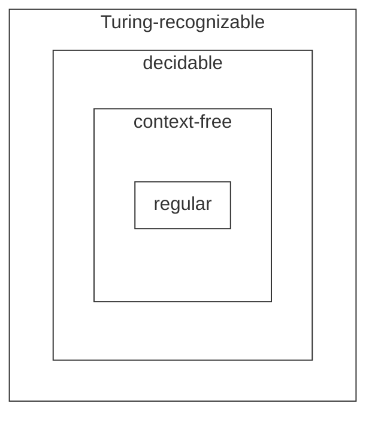

#### Turing machine

A $\textit{Turing machine}$ is a 7-tuple, $(Q,\Sigma,\Gamma,\delta,q_0,q_{\text{accept}},q_{\text{reject}})$, where $Q,\Sigma,\Gamma$ are all finite sets and

1. $Q$ is the set of states,
2. $\Sigma$ is the input alphabet not containing the $\textit{blank symbol}$ $\sqcup$,
3. $\Gamma$ is the tape alphabet, where $\sqcup \in \Gamma$ and $\Sigma \subseteq \Gamma$,
4. $\delta: Q \times \Gamma \longrightarrow Q \times \Gamma \times \{L,R\}$ is the transition function,
5. $q_0 \in Q$ is the start state,
6. $q_{\text{accept}} \in Q$ is the accept state, and
7. $q_{\text{reject}} \in Q$ is the reject state, where $q_{\text{reject}} \neq q_{\text{accept}}$.

A Turing machine $M$ **accepts** input $w$ if a sequence of configurations $C_1, C_2, \cdots, C_k$ exists, where

1. $C_1$ is the start configuration of $M$ on input $w$,
2. each $C_i$ yields $C_{i+1}$, and
3. $C_k$ is an accepting configuration.

The collection of strings that $M$ accepts is the language of $M$, or the language recognized by $M$, denoted $L(M)$.

If a Turing machine can always enter the accepting state or the rejecting state after a finite number of state transitions for all inputs, then the Turing machine is called **decider**.

A decider that recognizes some language also is said to **decide** that language. Call a language **Turing-decidable** or simply **decidable** if some Turing machine decides it.

