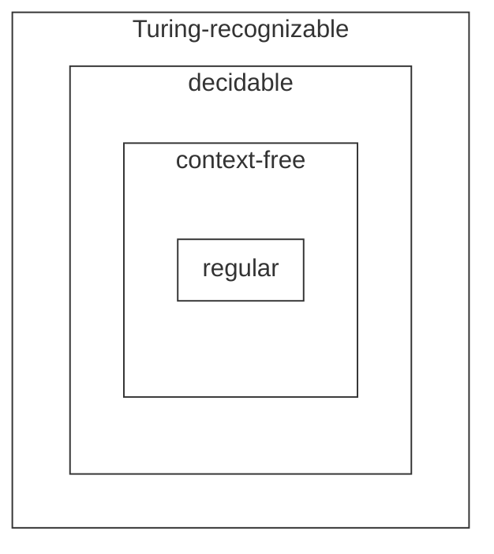

- [Turing machine](#turing-machine)
  - [1. 图灵机（普通图灵机）](#1-图灵机普通图灵机)
  - [2. 图灵机的(等价)变体：逗留(stay)图灵机](#2-图灵机的等价变体逗留stay图灵机)
- [非确定性图灵机](#非确定性图灵机)
  - [3. 形式定义](#3-形式定义)
  - [4. 非确定性转移函数](#4-非确定性转移函数)
  - [5. 配置与计算树](#5-配置与计算树)
  - [6. 接受、拒绝与判定](#6-接受拒绝与判定)

# Turing machine

## 1. 图灵机（普通图灵机）

A $\textit{Turing machine}$ is a 7-tuple, $(Q,\Sigma,\Gamma,\delta,q_0,q_{\text{accept}},q_{\text{reject}})$, where $Q,\Sigma,\Gamma$ are all finite sets and

1. $Q$ is the set of states,
2. $\Sigma$ is the input alphabet not containing the $\textit{blank symbol}$ $\sqcup$,
3. $\Gamma$ is the tape alphabet, where $\sqcup \in \Gamma$ and $\Sigma \subseteq \Gamma$,
4. $\delta: Q \times \Gamma \longrightarrow Q \times \Gamma \times \{L,R\}$ is the transition function,
5. $q_0 \in Q$ is the start state,
6. $q_{\text{accept}} \in Q$ is the accept state, and
7. $q_{\text{reject}} \in Q$ is the reject state, where $q_{\text{reject}} \neq q_{\text{accept}}$.

input string belongs to $\Sigma^*$

A Turing machine $M$ **accepts** input $w$ if a sequence of configurations $C_1, C_2, \cdots, C_k$ exists, where

1. $C_1$ is the start configuration of $M$ on input $w$,
2. each $C_i$ yields $C_{i+1}$, and
3. $C_k$ is an accepting configuration.

The collection of strings that $M$ accepts is the language of $M$, or the language recognized by $M$, denoted $L(M)$.

If a Turing machine can always enter the accepting state or the rejecting state after a finite number of state transitions for all inputs, then the Turing machine is called **decider**.

A decider that recognizes some language also is said to **decide** that language. Call a language **Turing-decidable** or simply **decidable** if some Turing machine decides it.

```mermaid
flowchart TD
    subgraph Turing-recognizable
        subgraph decidable
            subgraph context-free
                subgraph regular
                end
            end
        end
    end

    style Turing-recognizable fill:none,stroke:#333
    style decidable fill:none,stroke:#333
    style context-free fill:none,stroke:#333
    style regular fill:none,stroke:#333
```

## 2. 图灵机的(等价)变体：逗留(stay)图灵机

A $\textit{Turing machine}$ is a 7-tuple, $(Q,\Sigma,\Gamma,\delta,q_0,q_{\text{accept}},q_{\text{reject}})$, where $Q,\Sigma,\Gamma$ are all finite sets and

1. $Q$ is the set of states,
2. $\Sigma$ is the input alphabet not containing the $\textit{blank symbol}$ $\sqcup$,
3. $\Gamma$ is the tape alphabet, where $\sqcup \in \Gamma$ and $\Sigma \subseteq \Gamma$,
4. $\delta: Q \times \Gamma \longrightarrow Q \times \Gamma \times \{L,R,S\}$ is the transition function,
5. $q_0 \in Q$ is the start state,
6. $q_{\text{accept}} \in Q$ is the accept state, and
7. $q_{\text{reject}} \in Q$ is the reject state, where $q_{\text{reject}} \neq q_{\text{accept}}$.

任意逗留图灵机都可由一个普通图灵机模拟。

构造等价的普通图灵机：

$\pi$表示投影映射，$\pi_i$表示取第一个分量

例如，若$\delta(q,a)=(q',b,R)$，则$\pi_1(\delta(q,a))=\pi_1(q',b,R)=q'$

$I_Q$表示$Q$的指标集

对于任意状态 $q_i\in Q$ 和符号 $a\in\Gamma$，定义新状态 $q_{i,a,S}$。转移函数如下：

- 对任意 $a,x\in\Gamma$ 和 $i\in I_Q$，令 $\delta'(q_{i,a,S},x):=(\pi_1(\delta(q_i,a)),x,L)$。
- 若 $\delta(q_i,a)=(q_j,b,S)$，则
  - $\delta'(q_i,a):=(q_{i,a,S},b,R)$。
- 若 $\delta(q_i,a)=(q_j,b,L)$，则
  - $\delta'(q_i,a):=(q_j,b,L)$。
- 若 $\delta(q_i,a)=(q_j,b,R)$，则
  - $\delta'(q_i,a):=(q_j,b,R)$。

# 非确定性图灵机

## 3. 形式定义

非确定性图灵机（nondeterministic Turing machine，NTM）$M$ 是一个 7-元组

$$
M=(Q,\Sigma,\Gamma,\delta,q_0,q_{\text{accept}},q_{\text{reject}}),
$$

其中：

1. $Q$ 是有限状态集；
2. $\Sigma$ 是不包含空白符 $\sqcup$ 的输入字母表；
3. $\Gamma$ 是纸带字母表，满足 $\sqcup\in\Gamma$ 且 $\Sigma\subseteq\Gamma$；
4. $\delta$ 是转移函数；
5. $q_0\in Q$ 是起始状态；
6. $q_{\text{accept}}\in Q$ 是接受状态；
7. $q_{\text{reject}}\in Q$ 是拒绝状态，且 $q_{\text{reject}}\ne q_{\text{accept}}$。

## 4. 非确定性转移函数

确定性图灵机的每个“状态—纸带符号”对恰好确定一个后继动作；非确定性图灵机则允许有限个可能的后继动作。其转移函数定义为

$$
\delta:Q\times\Gamma
\longrightarrow
\mathcal P\bigl(Q\times\Gamma\times\{L,R\}\bigr),
$$

其中 $\mathcal P(S)$ 表示集合 $S$ 的幂集。因为 $Q$ 和 $\Gamma$ 都是有限集，所以 $\delta(q,a)$ 也是有限集。

若机器当前处于状态 $q\in Q$，读写头扫描到符号 $a\in\Gamma$，则每个

$$
(q',b,D)\in\delta(q,a)
$$

都表示一种合法的后继动作：进入状态 $q'$，将当前位置改写为 $b$，并令读写头向方向 $D\in\{L,R\}$ 移动一格。一次具体计算只选择其中一个动作；不同选择形成不同的计算分支。

## 5. 配置与计算树

- **配置（configuration）**：与确定性图灵机相同，一个配置由当前状态、纸带内容和读写头位置组成。
- **一步产生关系（yield）**：若应用 $\delta$ 中的某个合法动作可使配置 $C_1$ 一步变为 $C_2$，则记作

  $$
  C_1\vdash_M C_2.
  $$

- **计算分支（computation branch）**：从初始配置开始，连续选择合法后继配置所得到的配置序列。
- **计算树（computation tree）**：给定输入 $w$，以初始配置为根、以所有合法后继配置为子节点形成的树。它同时描述 $M$ 在 $w$ 上的所有可能计算分支。

## 6. 接受、拒绝与判定

对于输入 $w\in\Sigma^*$：

- 若计算树中**至少存在一条**有限分支到达 $q_{\text{accept}}$，则称 $M$ 接受 $w$；
- 若所有计算分支都在有限步内停机且没有任何分支接受（通常均到达 $q_{\text{reject}}$），则称 $M$ 拒绝 $w$；
- 若所有计算分支都会在有限步内停机，则称 $M$ 为非确定性判定器。

$M$ 所识别的语言定义为

$$
L(M)=\{w\in\Sigma^*\mid M\text{ 接受 }w\}.
$$

因此，非确定性的接受语义是“存在一个接受分支”，而不是要求所有分支都接受。
