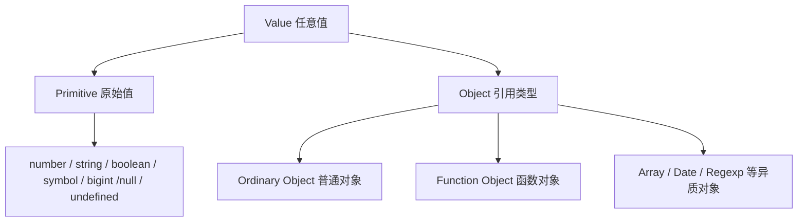
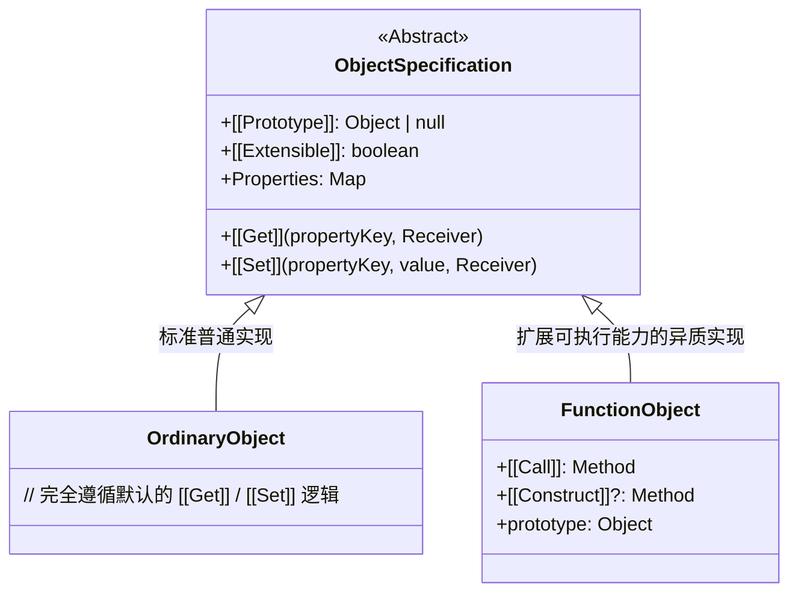

## 类型

### 值的分类

在语言的类型系统层面，所有的“值（Value）”被严格划分为两大类别：

- 原始值（Primitives）
  * **类型本质**：直接存储在栈内存中的**只读不可变数据**。
  * **无状态性**：原始值**没有任何属性与方法**。
  * **自动装箱（Auto-boxing）**
- 对象（Objects）
  * **类型本质**：存储在堆内存中的**可变键值对映射表**。
  * **TypeScript 中的类型表达**：
  * **`object`**（小写）：表示“所有非原始值类型”。
  * **`Object`**（大写）：表示包含 `Object.prototype` 方法的包装类型（包含可装箱的原始值）。
  * **`{}`**（空对象类型）：表示除 `null` 和 `undefined` 外的任意值。

### 属性描述符

属性描述符（Property Descriptor）是 JavaScript 中用于定义和控制**对象**属性行为的底层元数据配置对象。

| 配置项             | 属性类型 | 默认值*     | 作用描述                                                                    |
| ------------------ | -------- | ----------- | --------------------------------------------------------------------------- |
| **`value`**        | 数据     | `undefined` | 属性存储的具体值                                                            |
| **`writable`**     | 数据     | `false`     | 是否允许修改属性的值（`true` 表示可修改）                                   |
| **`get`**          | 存取器   | `undefined` | 读取属性时调用的 Getter 函数                                                |
| **`set`**          | 存取器   | `undefined` | 设置属性时调用的 Setter 函数                                                |
| **`enumerable`**   | 共享     | `false`     | 是否可枚举（`true` 表示可通过 `for...in` 或 `Object.keys()` 遍历）          |
| **`configurable`** | 共享     | `false`     | 是否可配置（`true` 表示允许用 `delete` 删除该属性，或重新修改该描述符本身） |

### 函数对象

- 普通对象（Ordinary Object）：仅拥有属性映射与 `[[Prototype]]` 内部槽。用于纯粹的数据存储与组织，**不具备可执行能力**。

- 函数对象（Function Object）：数是**可执行的对象**。它比普通对象多出了两个能力：
  * **`[[Call]]` 内部槽**：使其能够被 `()` 运算符调用执行。有 `[[Call]]` 的对象，`typeof` 才会返回 `"function"`。
  * **`[[Construct]]` 内部槽**：使其能够配合 `new` 操作符作为构造函数使用，创建新的对象实例。

| 指针类型                                      | 拥有者                   | 作用                                                        |
| --------------------------------------------- | ------------------------ | ----------------------------------------------------------- |
| **`prototype`（显式原型）**                   | **仅函数/类对象**        | 作为共享属性与方法的**仓库**，供通过 `new` 产生的实例继承。 |
| **`[[Prototype]]` / `__proto__`（隐式原型）** | **所有对象（包括函数）** | 指向创建该对象的构造函数的 `prototype`，形成查找链条。      |

- Prototype (原型对象) 里主要包含：
  - 共享的方法 (绝大多数函数/方法都存在这里)
  - 共享的常量或静态配置
  - 指向构造函数自身的反向指针
  - 指向上一级原型对象 (Object.prototype)

### TS 类型系统

- TS 类型系统
  - 基础类型与字面量类型
    - 基础原始类型：
      - number
      - string
      - boolean
      - symbol
      - bigint
      - null
      - undefined
    - 特殊类型
      - unknown
      - void
    - 字面量类型
  - 联合类型
    - |
  - 交叉类型
    - &
  - interface / type 定义的类型
    - interface 定义的类型
    - interface 继承的类型
    - type 定义的类型
    - type通过&继承的类型

  - 函数类型

### TS 泛型

- 泛型函数
- 泛型接口
- 泛型类
- 泛型约束
  - `extends`：类型参数必须具备指定结构

### 工具类型

利用泛型对类型进行转换：

- 修饰属性
  - `Partial<T>`：全可选
  - `Required<T>`：全必填
  - `Readonly<T>`：全只读
- 挑选 / 排除
  - `Pick<T, K>`：挑属性
  - `Omit<T, K>`：删属性
- 构造映射
  - `Record<K, T>`：键 `K` → 值 `T`
